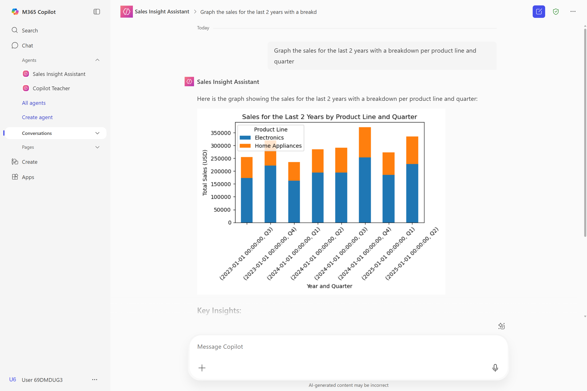

# Create your own SharePoint-based AI assistant with the lite experience of Copilot Studio in Microsoft 365 Copilot (formerly Copilot Studio agent builder)

Build an intelligent sales admin assistant that analyzes SharePoint data using code interpreter and image generation features in Copilot Studio Lite.

---

## 🧭 Lab Details

| Level | Persona | Duration | Purpose |
| ----- | ------- | -------- | ------- |
| 200   | Intermediate Maker | 20 minutes | After completing this lab, attendees will be able to create a Copilot agent that integrates SharePoint documents, uses code interpreter for data analysis, and generates visual content to support sales operations. |

---

## 📚 Table of Contents

- [Introduction](#-introduction)
- [Prerequisites](#-prerequisites)
- [Summary of Targets](#-summary-of-targets)
- [Use Cases Covered](#-use-cases-covered)
- [Instructions by Use Case](#️-instructions-by-use-case)
  - [Use Case #1: Access SharePoint documents](#-use-case-1-access-sharepoint-documents)
  - [Use Case #2: Create your Sales Admin Assistant agent](#-use-case-2-create-your-sales-admin-assistant-agent)
  - [Use Case #3: Test advanced AI capabilities](#-use-case-3-test-advanced-ai-capabilities)
- [Summary of Learnings](#-summary-of-learnings)

---

## 🌐 Introduction

This lab builds on the Copilot Studio Lite experience by integrating SharePoint documents and enabling advanced AI capabilities. You'll create a Sales Admin Assistant that can analyze Excel data, reference policy documents, generate charts through code interpretation, and create visual content.

> [!NOTE]  
> This lab assumes familiarity with the basic Copilot Studio lite concepts covered in the [web-based agent builder lab](../agent-builder-web/README.md).

---

## ✅ Prerequisites

- Access to Microsoft 365 Copilot or Copilot Chat
- Access to a SharePoint site with sample sales data
- Ability to create and configure Copilot agents

---

## 🎯 Summary of Targets

By the end of the lab, your Sales Admin Assistant will be able to:

- Access and analyze data from SharePoint Excel files
- Reference sales policies from SharePoint documents
- Generate dynamic charts and graphs using code interpreter
- Create visual content with image generation capabilities
- Provide insights on sales trends and performance metrics

---

## 🧩 Use Cases Covered

| Step | Use Case | Value added | Effort |
|------|----------|-------------|--------|
| 1 | [Access SharePoint documents](#-use-case-1-access-sharepoint-documents) | Establish data sources for the agent | 5 min |
| 2 | [Create your Sales Admin Assistant agent](#-use-case-2-create-your-sales-admin-assistant-agent) | Build an agent with SharePoint integration and advanced capabilities | 10 min |
| 3 | [Test advanced AI capabilities](#-use-case-3-test-advanced-ai-capabilities) | Validate code interpreter, image generation, and data analysis features | 5 min |

---

## 🛠️ Instructions by Use Case

---

## 📁 Use Case #1: Access SharePoint documents

Prepare the SharePoint documents that will serve as knowledge sources for your Sales Admin Assistant.

### Step-by-step instructions

#### Navigate to SharePoint

1. Navigate to your organization's SharePoint site
    - Go to the **Documents** tab 
    - Open the **Sales** folder 

> [!IMPORTANT]
>  The URL of the SharePoint site is available in **Lab Resources** (specific per training).

2. Locate the following sample files:
   - **Sales Excel file**: A spreadsheet containing sales data with columns for dates, product lines, revenue, and quarters
   - **Sales policy document**: A Word document containing sales policies, procedures, and guidelines

3. Open the **Excel file**. Look at the data structure:
   - Ensure it contains sales data across multiple quarters/years
   - Verify product line categorization

4. Open the **Word policy document** and review:
   - Sales procedures and guidelines
   - Policy information that might inform sales decisions
   - Any specific requirements or compliance information

---

## 🤖 Use Case #2: Create your Sales Admin Assistant agent

Build a specialized agent with SharePoint integration and advanced AI capabilities.

### Step-by-step instructions

#### Create the agent

1. Navigate to [Microsoft 365 Copilot Chat](https://m365.cloud.microsoft/chat/?auth=2&home=1) and go to the **Chat** tab.

2. On the side pane, expand **Agents** and select **Create agent**.

3. When prompted to **describe the agent**, use this specific prompt:

```
You are a Sales Admin Assistant. Your job is to help sales managers track revenue and identify trends across product lines. You understand product hierarchies, time periods (e.g. quarters, fiscal years), and sales metrics. Users can ask questions like 'Graph the sales for the last 2 years with a breakdown per product line and quarter'. You always respond in a friendly and professional tone, aiming to be helpful and insightful.
```

4. **Confirm** the suggested agent name when prompted.

5. Go to the **Configure** tab

<!--

Commented out; screenshots need update due to CPS updates.  Last minute change to labs required so will do at a later date
> [!TIP]
> If you can't see the files you just opened, an alternative approach is just to **paste** and **add** the SharePoint URL of the Sales folder.
> 
>    
-->

6. Under **capabilities**, enable:
   - **Code interpreter** (for data analysis and chart generation)
   - **Image generator** (for creating visual content)

#### Finalize configuration

6. Navigate to the **Configure** tab to review and refine:
   - Agent name and description
   - Instructions
   - Starter prompts

#### Configure knowledge sources

7. Now head over to the **Knowledge** section
   - Under **Knowledge**, select the **Search bar**
   - Go to the **Files** tab.
   - Select both the **Sales Policy Document** and **Sales** documents
   - You will see them being added as SharePoint documents
  
> [!TIP]
> - If you can't see the files you just opened, an alternative approach is to **paste** and **add** the SharePoint URL of the Sales folder.
> - Another alternative approach is to **download** the files locally and **upload** them to your agent.

8. When satisfied with the configuration, select **Create**.

---

## 🧪 Use Case #3: Test advanced AI capabilities

Validate your agent's ability to work with SharePoint data and advanced AI features.

### Step-by-step instructions

#### Test policy knowledge

1. Select **Go to agent** to start testing.

2. First, test the agent's **knowledge** of your sales policy:

```
What are the key guidelines in our sales policy regarding customer discounts?
```

3. Verify the agent references your SharePoint policy document and provides accurate information.

#### Test code interpreter with data analysis

4. **Start a new chat** and test the **code interpreter** capability with a data analysis request:

```
How are sales trending for home appliances?
```

5. *If* offered to get a visual chart of this breakdown, **confirm**.





6. **Observe** how the agent:
   - Accesses your Excel data
   - Uses code interpreter to process the data
   - Generates dynamic charts and visualizations
   - Provides insights based on the analysis

#### Test image generation

7. **Start a new chat** and test the **image generation** capability with a relevant request:

```
Design a professional badge for the first place winner of our 2026 sales contest. It should look modern and premium, with gold colors, the text '1st Place – Sales Contest 2026', and a ribbon or trophy element.
```


> [!TIP]
> Notice how you can also invoke a specific agent by using **@** in the standard **Chat** area.

#### Update your agents and explore additional capabilities

8. Select **...** next to your agent name in the side bar navigation, and choose **Edit**

9. Select the Sales agent you created

10. In the **Configure** tab, explore additional **knowledge** capabilities:
   - All **Websites** (or specific websites)
   - All **SharePoint** data (or specific files or sites)
   - All **Teams** data (or data from specific group chats, meetings, or channels)
   - Your **Emails**
   - Knowledge sources enabled by your organization at the tenant level, through **Copilot Connectors** (e.g., ServiceNow)

###  🏅 Congratulations! You've created an advanced SharePoint-integrated Copilot agent!

---

## 🔁 Summary of Learnings

Key achievements and insights from this lab:

### Technical Capabilities Mastered
- **SharePoint Integration** – Connected agent to organizational documents and data sources
- **Code Interpreter** – Enabled dynamic data analysis and chart generation.
- **Image Generation** – Created relevant visual content for business presentations

### Business Value Delivered
- **Data-Driven Insights** – Transform raw sales data into actionable intelligence
- **Policy Compliance** – Ensure sales activities align with organizational guidelines
- **Professional Presentations** – Generate presentation-ready visuals and charts
- **Operational Efficiency** – Streamline sales reporting and analysis workflows

### Best Practices Applied
- **Specific Instructions** – Tailored agent behavior to sales management needs
- **Relevant Knowledge Sources** – Grounded responses in actual business documents
- **Advanced Features** – Leveraged code interpreter and image generation appropriately
- **Professional Tone** – Maintained business-appropriate communication style

---
