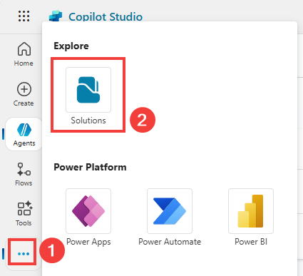

# Create an 'Ask me anything' agent for your employees

Empower employees with answers that matter – Build an intelligent agent that connects to your knowledge and data.

---

## 🧭 Lab Details

| Level | Persona | Duration | Purpose |
| ----- | ------- | -------- | ------- |
| 200 | Maker | 30 minutes | After completing this lab, participants will be able to create an intelligent "Ask me anything" agent that connects to multiple knowledge sources including SharePoint, ServiceNow, and custom knowledge bases. Participants will deploy agents to Microsoft 365 Copilot, use multi-agent orchestration to query a child agent to connect to ServiceNow to retrieve ticket status. |

---

## 📚 Table of Contents

- [Why This Matters](#-why-this-matters)
- [Why Start with ALM?](#-why-start-with-alm)
- [ALM Introduction](#-alm-introduction)
- [Core ALM Concepts Overview](#-core-alm-concepts-overview)
- [Lab Introduction](#-lab-introduction)
- [Core Concepts Overview](#-core-concepts-overview)
- [Documentation and Additional Training Links](#-documentation-and-additional-training-links)
- [Prerequisites](#-prerequisites)
- [Summary of Targets](#-summary-of-targets)
- [Use Cases Covered](#-use-cases-covered)
- [Instructions by Use Case](#️-instructions-by-use-case)
  - [Use Case #1: Create a solution and custom publisher](#-use-case-1-create-a-solution-and-custom-publisher)
  - [Use Case #2: Create connection references](#-use-case-2-create-connection-references)
  - [Use Case #3: Create an 'Ask Me Anything' Agent with SharePoint Knowledge](#-use-case-3-create-an-ask-me-anything-agent-and-add-sharepoint-knowledge-source)
  - [Use Case #4: Configure Suggested Prompts](#-use-case-4-configure-suggested-prompts)
  - [Use Case #5: Create a child IT Support Agent](#-use-case-5-create-a-child-it-support-agent)
  - [Use Case #6: Deploy to Microsoft 365 Copilot](#-use-case-6-deploy-to-microsoft-365-copilot)

---

## 🤔 Why This Matters

**Makers and IT professionals** - Tired of employees constantly asking the same questions about policies, benefits, or system status? Frustrated by scattered knowledge across multiple systems?

Think of your organization's knowledge like a library:

- **Without an intelligent agent**: Employees waste hours searching through SharePoint folders, submitting IT tickets for simple questions, and interrupting colleagues for information that should be readily available
- **With an intelligent agent**: Employees get instant, accurate answers from a single conversational interface that automatically searches across all your knowledge sources with proper citations

**Common challenges solved by this lab:**

- "I can't find the leave policy for my country in our SharePoint site"
- "What's the status of my ServiceNow incident?"
- "I need information from multiple systems but don't know where to look"

**This 30-minute investment will save your organization countless hours and improve employee satisfaction by providing instant access to knowledge.**

---

## 🤔 Why Start with ALM?

**New to Power Platform or Copilot Studio?** You might be eager to start building agents right away, but taking a few minutes to set up Application Lifecycle Management (ALM) first will save you hours of headaches later!

Think of ALM as preparing your kitchen before cooking a complex meal:

- **Without ALM**: Ingredients scattered across counters, no recipe plan, impromptu grocery trips mid-cooking
- **With ALM**: Ingredients organized, recipe prepared, everything measured and ready

**Common beginner challenges solved by ALM:**

- "I built something great in dev, but can't easily move it to production"
- "Someone changed my agent and now it's broken - who did it and how do I fix it?"
- "I need to update my agent but I'm afraid of breaking what works"
- "My team members keep overwriting each other's changes"

**The few minutes ALM setup in this lab prevents all these problems!**

---

## 🌐 ALM Introduction

Application Lifecycle Management (ALM) ensures that your solutions evolve safely and efficiently as they move from development to production. This lab will walk you through the foundational best practices of ALM in Microsoft Copilot Studio—from structuring your solution to managing configurations and source control.

**Real-world example:** Imagine you've built a great customer service agent in your development environment. Without proper ALM:

1. Moving to production means manually recreating all your work
2. If something breaks, you can't easily roll back to a working version
3. When multiple team members make changes, work gets overwritten

With the ALM practices in this lab, you'll avoid these pitfalls and set yourself up for success!

---

## 🎓 Core ALM Concepts Overview

| Concept                  | Why it matters                                                                                                                                                                                                                                                                                                                                                                                                         |
| ------------------------ | ---------------------------------------------------------------------------------------------------------------------------------------------------------------------------------------------------------------------------------------------------------------------------------------------------------------------------------------------------------------------------------------------------------------------- |
| **Solution**             | A standard way in Microsoft Power Platform to package and ship components—including Microsoft Copilot Studio agent components like topics, knowledge sources, and tools—across environments alongside flows, prompts, environment variables, connection references, and any other solution-aware component types.                                                                                                      |
| **Publisher**            | A metadata element that identifies the creator of solution components. Using a custom publisher improves traceability and supports cleaner prefixes in naming conventions.                                                                                                                                                                                                                                             |
| **Environment**          | A workspace in Power Platform where no-code, low-code, or pro-code artifacts—such as agents, flows, and data—reside. ALM best practices typically involve multiple environments (e.g., dev, test, prod) to manage lifecycle stages. For admins, environments also provide governance controls to limit what makers can do, which connectors or knowledge sources can be used, and how assets are secured and deployed. |
| **Connection reference** | An abstraction that links connectors (e.g., SharePoint, Dataverse, ServiceNow, etc.) to credentials and environment-specific settings—allowing reuse and cleaner ALM processes.                                                                                                                                                                                                                                        |

---

## 🌐 Lab Introduction

In today's fast-paced business environment, employees need quick access to accurate information from multiple sources. Whether it's HR policies, IT incident status, or custom knowledge bases, information is often scattered across different systems, making it difficult for employees to find what they need efficiently.

**Real-world example:** Imagine Sarah, a new employee, needs to understand her health benefits. Currently, she might spend 30 minutes navigating through SharePoint folders, trying different search terms, or even asking HR colleagues. With an intelligent *Ask me anything* agent, Sarah simply types `What are the Northwind Health Plus Benefit plans?` and instantly receives the accurate policy document with proper citations, saving time and reducing frustration. She can also check on her ServiceNow incidents instantly using the same agent.  

This lab teaches you to build a comprehensive solution that transforms how employees interact with organizational knowledge, creating a single conversational interface that intelligently routes questions to the right knowledge sources and provides contextual, accurate responses.

---

## 🎓 Core Concepts Overview

| Concept | Why it matters |
|---------|----------------|
| **Knowledge Source Integration** | Connects your agent to multiple data sources (SharePoint, ServiceNow, custom APIs) so employees get comprehensive answers from a single interface, eliminating the need to search multiple systems. |
| **Microsoft 365 Copilot Deployment** | Makes your agent available where employees already work, integrating seamlessly into their daily Microsoft 365 workflow for maximum adoption and convenience. |
| **Multi-agent orchestration** | Rather than relying on a single agent to do everything, build a multi-agent system where the main agent delegates tasks to a child agent. |

---

## 📄 Documentation and Additional Training Links

- [Microsoft Copilot Studio Documentation](https://learn.microsoft.com/en-us/microsoft-copilot-studio/ )
- [Knowledge Sources in Copilot Studio](https://learn.microsoft.com/en-us/microsoft-copilot-studio/nlu-boost-conversations)
- [Create child agents in Copilot Studio (preview)](https://learn.microsoft.com/en-us/microsoft-copilot-studio/authoring-add-other-agents)
- [Deploy Copilot Studio agents to Microsoft 365](https://learn.microsoft.com/en-us/microsoft-copilot-studio/publication-connect-bot-to-custom-application)
- [ServiceNow connector for Power Platform](https://learn.microsoft.com/en-us/connectors/service-now/)

---

## ✅ Prerequisites

- Access to Microsoft Copilot Studio with appropriate licensing.
- A Microsoft Power Platform environment with at least an Environment Maker security role.
- Access to SharePoint Online with sample knowledge content.
- ServiceNow access for incident management integration (demo environment provided).
- Understanding of basic conversational AI concepts and Microsoft 365 administration.

---

## 🎯 Summary of Targets

In this lab, you'll start with an ALM foundation for working with Microsoft Copilot Studio like a pro. Then you will build a comprehensive "Ask me anything" agent that serves as a central knowledge hub for your organization. By the end of the lab, you will:

- Create and configure a structured solution for your customizations.
- Set up a custom publisher to track ownership and maintain ALM hygiene.
- Add connection references for better portability.
- Configure suggested prompts for better user guidance.
- Create an 'Ask me Anything' agent and add SharePoint as a knowledge source.
- Add ServiceNow incidents integration for real-time ticket status.
- Deploy to Microsoft 365 Copilot for seamless integration.

---

## 🧩 Use Cases Covered

| Step | Use Case | Value added | Effort |
|------|----------|-------------|---------|
| 1 | [Create a solution and custom publisher](#-use-case-1-create-a-solution-and-custom-publisher) | Structure your success – Group, manage, and deploy all your agent components with clarity and control. | 5 mins |
| 2 | [Create connection references](#-use-case-2-create-connection-references) | Adapt with flexibility – manage credentials and services cleanly across dev, test, and prod. | 5 mins |
| 3 | [Create an 'Ask Me Anything' Agent and Add SharePoint Knowledge Source](#-use-case-3-create-an-ask-me-anything-agent-and-add-sharepoint-knowledge-source) | Establishes foundational agent with SharePoint knowledge integration and grounded AI responses | 5 mins |
| 4 | [Configure Suggested Prompts](#-use-case-4-configure-suggested-prompts) | Guides users toward the agent's best capabilities through strategic prompt suggestions | 3 mins |
| 5 | [Create a child IT Support Agent](#-use-case-5-create-a-child-it-support-agent) | Discover how scoping for knowledge and tools can also be done through the multi-agent capabilities. | 10 mins |
| 6 | [Deploy to Microsoft 365 Copilot](#-use-case-6-deploy-to-microsoft-365-copilot) | Makes the agent available in Microsoft 365 Copilot for seamless user access | 2 mins |

---

## 🛠️ Instructions by Use Case

---

## 🧱 Use Case #1: Create a solution and custom publisher

Use a structured container to group all agents components for better lifecycle management.

| Use case | Value added | Estimated effort |
|----------|-------------|------------------|
| Create a solution and custom publisher | Structure your success – Group, manage, and deploy all your agent components with clarity and control. | 5 minutes |

**Summary of tasks**

In this section, you'll learn how to access the Solutions area of Copilot Studio, create a new solution, new publisher, and set the solution as default.

**Scenario:** Properly setup your development environment so that you can later easily package and deploy your agents to other environments.

### Objective

Set up your development environment by creating a solution and custom publisher in Microsoft Copilot Studio.

---

### Step by step instructions

#### Open the Solutions area

1. Go to the [https://copilotstudio.microsoft.com](https://copilotstudio.microsoft.com/).

2. Confirm you are in the correct environment (top-right corner).  In these labs, the environment name should start by **'DEV - \<your current User Name\>'**.

> [!TIP]
>
> - When you requested for a new user account using the **Training Assistant** agent, we auto provisioned a new Developer Environment with **'DEV - \<your current User Name\>'** as the name of the environment.

#### Create a solution

3. In the left navigation (under the `...` menu), select **Solutions**

    

4. Select **New solution**.

5. Enter **Training Workshop Agents** (or any other name you may choose) as the **Display name**. It will automatically add a **Name** for the solution (without the spaces).

> [!TIP]
>
> - Avoid names like `DEV`, `TEST`, `PROD`, `POC`, `MVP` or anything tied to a project lifecycle phase, as the same solution will move to different environments as part of the ALM process.
> - Use a descriptive, project-based name.
> - For example, if this is specific to this training and lab, use `Training Workshop Agents`

#### Create a publisher

6. If this is your first solution, click **+ New publisher** to create one. You can use **MCS Lab** as the Display Name, **MCSLab** as the Name, and **mcslab** as the Prefix and **Save**.

> [!TIP]
>
> - You may use your organization’s name.
> - While the **Display name** may contain spaces, the **Name** can't contain special characters and spaces.
> - Define a short prefix for use in technical names.

> [!IMPORTANT]
> Avoid using the default publisher or the default solution. Custom publishers ensure cleaner component names and better ALM hygiene.

#### Set and create

7. Check **Set as your preferred solution** (so any new component goes into it by default).
8. Click **Create**.

> [!TIP]
>
> - If you missed to set the solution as the preferred solution in the previous step, you can click **Back** to go to the Solutions page, select the new solution using the checkbox on the left, and use the **Set preferred solution** on the top nav.  

---

### 🏅 Congratulations! You've created your solution and completed Use Case #1

---

### Test your understanding

**Key takeaways:**

- **Solutions first** – Solutions help manage your agent and related components across environments.
- **Lifecycle readiness** – Structuring up front simplifies governance, updates, and deployment.
- **Naming matters** – Use clean, environment-agnostic names.

**Lessons learned & troubleshooting tips:**

- Avoid names like `Dev` or `Test` in your solution name—they’re misleading.
- If save fails, ensure publisher name is unique and valid.
- Keep solution names business-focused, not technical-phase focused.

**Challenge: Apply this to your own use case**

- What would you name your solution?
- How might you use solutions to organize future agent components?
- Try making another solution for a separate department or use case.

---

## 🧩 Use Case #2: Create connection references

Use connection abstractions for seamless multi-environment deployments.

| Use case | Value added | Estimated effort |
|----------|-------------|------------------|
| Create  connection references | Adapt with flexibility – manage credentials and services cleanly across dev, test, and prod. | 5 minutes |

### Summary of tasks

In this section, you'll learn how to create connection references in your solution.

**Scenario:** Configure your environment by anticipating future elements that will need to be updated as your solution moves from development to production.

### Step-by-step instructions

1. Open the solution you created in Use Case #1.

2. Select **+ New**, then go to **More** and choose **Connection Reference**.


3. In the solution, select **New**, then go to **More** and choose **Connection reference**.

4. Use the connector name (e.g., `Service Now`) as the name. Optionally, prefix with your project name.

5. Select the connector (e.g., **ServiceNow**).

6. In the connection dropdown, choose **New connection** if none exists.

> [!TIP]
>
> - If the **Create** button is grayed out, it's just because you pasted the display name. Type an extra character in the display name field and remove it to be able to create.

> [!IMPORTANT]
>
> - For **ServiceNow** configuration values, use the provided values in the <a href="https://aka.ms/MCSWorkshopLabAssets" target="_blank">**Lab Resources**</a> web page.
> - For **ServiceNow**'s `Instance` configuration, be sure to scroll down in the connection screen.

7. Log in through Power Apps in a new tab if needed, then close the tab to return to Copilot Studio.

12. Above the **Connection** dropdown, select **Refresh** and choose the newly created connection and click on **Create** to create the connection reference.

13. Repeat steps for the following connector:

    - `SharePoint` - *Use the Connect-directly (cloud-services) option and use the same user credentials that you got for this lab*

> [!TIP]
>
> - These connection references will be used later in the lab to connect to the two connection instances we created in the environment. When we export the solution and import in another environment, or use pipelines to deploy the solution, the same connection references can point to different connections configured for that environment (for e.g. Test, UAT or Prod environments).
>
---

### 🏅 Congratulations! You've created connection references for the project

---

## 🧱 Use Case #3: Create an 'Ask Me Anything' Agent and Add SharePoint Knowledge Source

Create a foundational intelligent agent with SharePoint integration for grounded AI responses.

| Use case | Value added | Estimated effort |
|----------|-------------|------------------|
| Create an 'Ask Me Anything' Agent and Add SharePoint Knowledge Source | Establishes foundational agent with SharePoint knowledge integration and grounded AI responses | 5 minutes |

**Summary of tasks**

In this section, you'll learn how to access the Solutions area of Copilot Studio, create a new agent, and integrate SharePoint as a knowledge source.

**Scenario:** Properly setup your development environment so that you can later easily package and deploy your agents to other environments. Your organization has extensive knowledge stored in SharePoint that needs to be accessible through conversational AI.

### Objective

Create a new agent with SharePoint knowledge integration that provides grounded, cited responses.

---

### Step-by-step instructions

1. Navigate to the Copilot Studio home page at [copilotstudio.microsoft.com](https://copilotstudio.microsoft.com/)

2. Go to the Solutions menu (located in the left-hand menu under the ellipsis …)

3. Select the solution you had created

4. Select **New**, and choose **Agent**

5. Select **Skip to configure**

6. Name your agent `Ask Me Anything`

7. Click **Create**

8. Go to **Knowledge**

  

9. Select **SharePoint**, and paste the SharePoint Knowledge URL and select **Add**.

> [!IMPORTANT]
>
> - For configuration, use the provided values in the <a href="https://aka.ms/MCSWorkshopLabAssets" target="_blank">**Lab Resources**</a> web page.

10. Choose **Add**  

11. Test your agent with this question:

```
What's the Northwind Health Plus Benefits plan?
```

> [!TIP]
>
> - Notice how relevant it is, and how the citations are accurate. This demonstrates the power of grounded AI responses.

---

### 🏅 Congratulations! You've completed Use Case #3

---

### Test your understanding

**Key takeaways:**

- **Solution Management** – Using solutions ensures proper environment management and deployment capabilities
- **Knowledge Integration** – SharePoint integration provides immediate access to organizational documents with proper citations
- **Grounded AI** – The agent automatically provides source citations, ensuring transparency and trust in responses

---


## 🔄 Use Case #4: Configure Suggested Prompts

Guide users toward your agent's best capabilities through strategic prompt suggestions.

| Use case | Value added | Estimated effort |
|----------|-------------|------------------|
| Configure Suggested Prompts | Guides users toward the agent's best capabilities through strategic prompt suggestions | 3 minutes |

**Summary of tasks**

Suggest things your agent can do to your end-users through carefully crafted prompts.

**Scenario:** Help users discover the full capabilities of your agent by providing clear, actionable suggestions that demonstrate different use cases.

### Step-by-step instructions

1. Go to the **overview** tab for your agent

2. Add suggested prompts:

| Title                     | Prompt                                           |
|---------------------------|--------------------------------------------------|
| `Ask me about benefits`     | `What's the Northwind Health Plus Benefits plan?` |
| `Check on an incident`      | `What's the status of INC0007001?`                |

3. **Save** the prompts

> [!TIP]
>
> - Prompts are visibile to the end-user when the agent is deployed as a Copilot agent.

---

### 🏅 Congratulations! You've completed Use Case #4

---

### Test your understanding

- How do suggested prompts improve user adoption and engagement with your agent?
- What makes an effective suggested prompt versus a generic one?

---

## 🔄 Use Case #5: Create a child IT Support Agent

Integrate real-time incident management for comprehensive support capabilities and demonstrate agent scoping techniques.

| Use case | Value added | Estimated effort |
|----------|-------------|------------------|
| Add ServiceNow Incidents | Integrates real-time incident management for comprehensive support capabilities with agent scoping best practices | 10 minutes |

**Summary of tasks**

In this section, you'll configure the connection to ServiceNow to retrieve incident details, and learn how to scope agent capabilities for specific domains. This demonstrates how specialized tools can be integrated to create domain-specific expertise within your agent.

**Scenario:** Employees need quick access to their ServiceNow incident status without navigating to the ServiceNow portal. By integrating ServiceNow directly into your agent, you're creating a specialized IT support capability that showcases agent scoping - where specific tools and knowledge are targeted for particular use cases, improving productivity and reducing support burden.

### Understanding Agent Scoping with ServiceNow Integration

This use case demonstrates **agent scoping** principles:

- **Specialized Tools**: ServiceNow integration provides domain-specific capabilities
- **Contextual Routing**: IT-related queries automatically leverage ServiceNow tools
- **Unified Experience**: Users get comprehensive support from a single agent interface

### Step-by-step instructions

#### Create a child agent

1. Go to your Ask Me Anything agent

2. Go to the **Agents** tab, and **+ Add an agent**

    

3. Update
    - Its **Name** to: `IT Support Agent`
    - Its **Description** to:

      ```
      Use this agent for queries related to IT (e.g., knowledge base frequently asked questions, incident updates, etc.) 
      The agent can multiple multiple questions and queries at once.
      ```

    - Its **Instructions** to:

      ```
      Use knowledge for problem/how-to/questions.
      Use the Get ServiceNow ticket details tool to get the status of incidents.
      ```

#### Add knowledge to the child agent

4. Select **+ Add** in the **Knowledge** section of the child agent

5. Select **ServiceNow**

6. Choose the **ServiceNow** connection in **Created by my admin**

7. Select **Add**

#### Add ServiceNow ticket details as a Tool to the child agent

1. Still within the **IT Support Agent**

2. Scroll down to **Tools** and **+ Add a tool**

3. Search for  `ServiceNow List records`

4. Select **Add to Agent**, then **Save** your child agent, and scroll down to the **Tools** section and select the **List records** tool you just added.

> [!TIP]
> In case of issues, refresh the page with CTRL + F5.

5. **Rename** to `Get ServiceNow ticket details`

6. Change **description** to `Gets the details of an incident using its incident number. Use this tool when users ask about ServiceNow tickets, incident status, or IT support requests.`

> [!TIP]
> The description will help the AI know when to use that tool, so it's important to have clear instructions WHEN and WHEN NOT to use this tool. This is a key aspect of agent scoping - being specific about tool usage.

7. Under **Additional details**, change **Authentication** to **Maker-provided credentials**

> [!IMPORTANT]
> In production scenarios, you may want to use the user context when making the connection to ServiceNow. Here, your context (as the author) is used by end-users of your agent when searching for incidents.

8. For **Record Type**, set a **Custom value** and choose `Incident`

9. Select **+ Add input** and choose **Query**

10. Select **Customize** and use this for **Description**:

    ```
    The output of this variable is the concatenation of numberCONTAINS and the incident number. E.g., 'numberCONTAINSINC0007001'. Only the incident number should be prompted and obtained from the user (e.g., INC0007001)
    ```

> [!TIP]
> Again, these instructions will be used by AI to understand how determine how to pass that information to the ServiceNow connector. In this case, how to use the very specific OData formatting of ServiceNow queries.

11. Select **+ Add input** and choose **Limit**

12. Select **Custom Value** and set **1**

13. Select **Save**

#### Test your IT Support Agent

28. **Test** your agent:

    ```
    My USB port is no longer working on my PC... what can I do? While you're here, can you also share an update for case INC0000059? It's been quite a while since I've opened them... thanks!!
    ```

> [!TIP]
> Notice how the agent automatically:
>
> - Uses the appropriate ServiceNow tool based on the query type
> - Handles multiple tickets in a single request (e.g., if you ask for both cases INC0000059 and INC0000060)
> - Creates user-friendly responses with proper formatting
> - Combines ServiceNow data with other knowledge sources when needed

  

29. **Observe** how your agent now demonstrates scoped capabilities:
    - **Tool Selection**: Automatically chooses the right ServiceNow tool based on user intent
    - **Context Preservation**: Maintains conversation flow while using specialized tools
    - **Domain Expertise**: Provides IT-specific guidance and next steps
    - **Unified Experience**: Seamlessly integrates ServiceNow capabilities with other knowledge sources

> [!IMPORTANT]
> This integration showcases how agents can be scoped for specific domains while maintaining a unified user experience. The ServiceNow knowledge and tools are automatically triggered for IT-related queries, demonstrating intelligent capability routing within a single agent.

---

### 🏅 Congratulations! You've completed Use Case #5

---

### Test your understanding

- How does ServiceNow integration enhance the employee experience compared to traditional ticket lookup methods?
- What other enterprise systems could benefit from similar agent integration?

---

## 🔄 Use Case #6: Deploy to Microsoft 365 Copilot

Make the agent available in Microsoft 365 Copilot for seamless user access.

| Use case | Value added | Estimated effort |
|----------|-------------|------------------|
| Deploy to Microsoft 365 Copilot | Makes the agent available in Microsoft 365 Copilot for seamless user access | 2 minutes |

**Summary of tasks**

Make the agent available in Microsoft 365 Copilot for your users.

**Scenario:** Deploy your agent where employees already work, ensuring maximum adoption by integrating directly into their daily Microsoft 365 workflow.

### Step-by-step instructions

1. Go to the agent and select **Publish**

2. Go to **Channels**

3. Select **Teams and Microsoft 365 Copilot**

4. Select **Add channel** (at the bottom right corner)

5. **Close** the channel pane

6. **Publish** the agent again.

7. Select **Teams and Microsoft 365 Copilot** channel tile

8. Select **See agent in Microsoft 365**

   

9. In the **Microsoft 365 Copilot** experience, the agent description will pop up. Select **Add**

> [!TIP]
>
> - You may need to give it a few tries/minutes the first time you deploy to Microsoft 365 Copilot so it deploys correctly.
> - If this doesn't work, try in Teams instead:
>   - Choose **See agents in Teams** instead. If you can
>   - In the new window, if prompted *This site is trying to open Microsoft Teams*, select **Cancel**, and the select **use the web app instead**

10. Test the agent with the benefits prompt

> [!TIP]
> If deploying to Teams,  prompts won't be available, so paste the below question:
>
> ```
> What's the Northwind Health Plus Benefits plan?
> ```

---

### 🏅 Congratulations! You've completed Use Case #6

---

### Test your understanding

- Why is deploying to Microsoft 365 Copilot more effective than standalone deployment for enterprise scenarios?
- What considerations should you have when choosing deployment channels?

---

## 🏆 Summary of learnings

True learning comes from doing, questioning, and reflecting—so let's put your skills to the test.

To maximize the impact of your "Ask me anything" agent:

- **Knowledge Integration** – Connect multiple data sources to provide comprehensive answers from a single conversational interface, eliminating information silos
- **Seamless Deployment** – Deploy to Microsoft 365 Copilot to meet employees where they already work, maximizing adoption and convenience
- **Multi-agent orchestration** - Rather than relying on a single agent to do everything, build a multi-agent system where the main agent delegates tasks to a child agent.

---

### Conclusions and recommendations

**Ask me anything agent golden rules:**

- Start with high-value, frequently asked questions to demonstrate immediate ROI
- Implement proper authentication and permissions to ensure knowledge security
- Use suggested prompts to guide users toward the agent's best capabilities
- Design context-aware experiences that reduce user input while increasing relevance
- Maintain human oversight for critical processes while automating routine tasks
- Monitor and analyze conversation patterns to identify knowledge gaps and improvement opportunities

By following these principles, you'll create an intelligent knowledge hub that transforms how employees access information, reduces support burden, and improves organizational efficiency through conversational AI.

---
