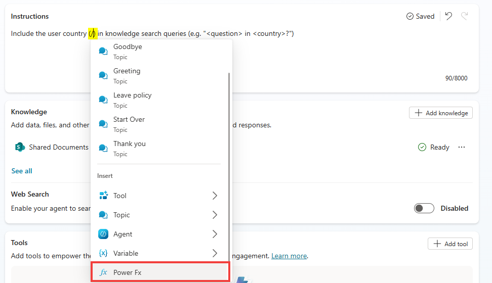
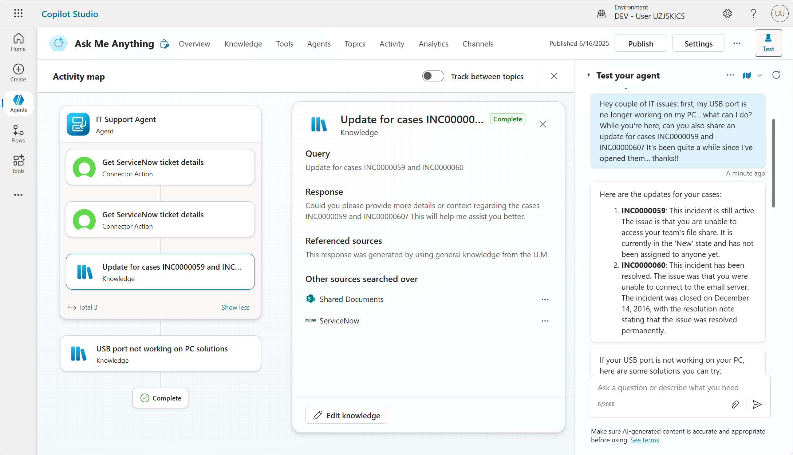
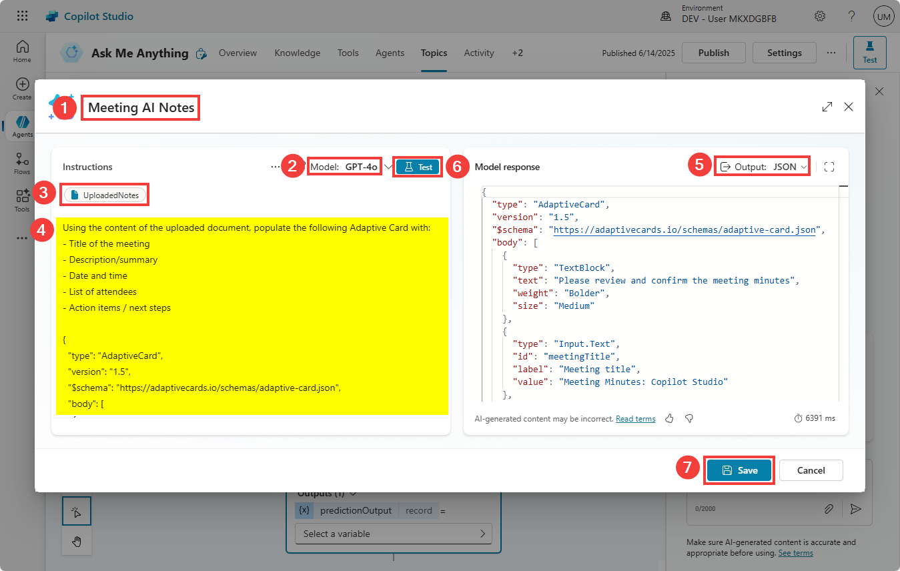

# Create an 'Ask me anything' agent for your employees

Empower employees with answers that matter – Build an intelligent agent that connects to your knowledge and data.

---

## 🧭 Lab Details

| Level | Persona | Duration | Purpose |
| ----- | ------- | -------- | ------- |
| 200 | Maker | 40 minutes | After completing this lab, participants will be able to create an intelligent "Ask me anything" agent that connects to multiple knowledge sources including SharePoint, ServiceNow, and custom knowledge bases. Participants will learn to configure knowledge prioritization, deploy agents to Microsoft 365 Copilot, and implement AI-powered document analysis with human review workflows. |

---

## 📚 Table of Contents

- [Why This Matters](#-why-this-matters)
- [Introduction](#-introduction)
- [Core Concepts Overview](#-core-concepts-overview)
- [Documentation and Additional Training Links](#-documentation-and-additional-training-links)
- [Prerequisites](#-prerequisites)
- [Summary of Targets](#-summary-of-targets)
- [Use Cases Covered](#-use-cases-covered)
- [Instructions by Use Case](#️-instructions-by-use-case)
  - [Use Case #1: Create an 'Ask Me Anything' Agent and Add SharePoint Knowledge Source](#-use-case-1-create-an-ask-me-anything-agent-and-add-sharepoint-knowledge-source)
  - [Use Case #2: Configure Suggested Prompts](#-use-case-2-configure-suggested-prompts)
  - [Use Case #3: Deploy to Microsoft 365 Copilot](#-use-case-3-deploy-to-microsoft-365-copilot)
  - [Use Case #4: Knowledge Prioritization Techniques](#-use-case-4-knowledge-prioritization-techniques)
  - [Use Case #5: Create a child IT Support Agent](#-use-case-5-create-a-child-it-support-agent)
  - [Use Case #6: Add Custom Knowledge](#-use-case-6-add-custom-knowledge)
  - [Use Case #7: AI Summary and Review of Meeting Notes](#-use-case-7-ai-summary-and-review-of-meeting-notes)

---

## 🤔 Why This Matters

**Makers and IT professionals** - Tired of employees constantly asking the same questions about policies, benefits, or system status? Frustrated by scattered knowledge across multiple systems?

Think of your organization's knowledge like a library:
- **Without an intelligent agent**: Employees waste hours searching through SharePoint folders, submitting IT tickets for simple questions, and interrupting colleagues for information that should be readily available
- **With an intelligent agent**: Employees get instant, accurate answers from a single conversational interface that automatically searches across all your knowledge sources with proper citations

**Common challenges solved by this lab:**
- "I can't find the leave policy for my country in our SharePoint site"
- "What's the status of my ServiceNow incident?"
- "Can someone help me structure these meeting notes properly?"
- "I need information from multiple systems but don't know where to look"

**This 40-minute investment will save your organization countless hours and improve employee satisfaction by providing instant access to knowledge.**

---

## 🌐 Introduction

In today's fast-paced business environment, employees need quick access to accurate information from multiple sources. Whether it's HR policies, IT incident status, or custom knowledge bases, information is often scattered across different systems, making it difficult for employees to find what they need efficiently.

**Real-world example:** Imagine Sarah, a new employee in Germany, needs to understand her leave entitlements. Currently, she might spend 30 minutes navigating through SharePoint folders, trying different search terms, or even asking HR colleagues. With an intelligent "Ask me anything" agent, Sarah simply types "What's the leave policy for Germany?" and instantly receives the accurate policy document with proper citations, saving time and reducing frustration.

This lab teaches you to build a comprehensive solution that transforms how employees interact with organizational knowledge, creating a single conversational interface that intelligently routes questions to the right knowledge sources and provides contextual, accurate responses.

---

## 🎓 Core Concepts Overview

| Concept | Why it matters |
|---------|----------------|
| **Knowledge Source Integration** | Connects your agent to multiple data sources (SharePoint, ServiceNow, custom APIs) so employees get comprehensive answers from a single interface, eliminating the need to search multiple systems. |
| **Context-Aware Knowledge Prioritization** | Intelligently routes questions to the most relevant knowledge sources based on user context (location, role, etc.), ensuring employees get personalized and accurate information. |
| **Microsoft 365 Copilot Deployment** | Makes your agent available where employees already work, integrating seamlessly into their daily Microsoft 365 workflow for maximum adoption and convenience. |
| **AI-Powered Document Analysis** | Automates the processing and structuring of unstructured content like meeting notes, reducing manual work while maintaining human oversight for accuracy and approval. |

---

## 📄 Documentation and Additional Training Links

* [Microsoft Copilot Studio Documentation](https://learn.microsoft.com/en-us/microsoft-copilot-studio/)
* [Knowledge Sources in Copilot Studio](https://learn.microsoft.com/en-us/microsoft-copilot-studio/nlu-boost-conversations)
* [Deploy Copilot Studio agents to Microsoft 365](https://learn.microsoft.com/en-us/microsoft-copilot-studio/publication-connect-bot-to-custom-application)
* [ServiceNow connector for Power Platform](https://learn.microsoft.com/en-us/connectors/service-now/)
* [Adaptive Cards for Interactive Experiences](https://learn.microsoft.com/en-us/adaptive-cards/)

---

## ✅ Prerequisites

* Access to Microsoft Copilot Studio with appropriate licensing.
* Access to SharePoint Online with sample knowledge content.
* ServiceNow access for incident management integration (demo environment provided).
* Understanding of basic conversational AI concepts and Microsoft 365 administration.

---

## 🎯 Summary of Targets

In this lab, you'll build a comprehensive "Ask me anything" agent that serves as a central knowledge hub for your organization. By the end of the lab, you will:

* Create an 'Ask me Anything' agent and add SharePoint as a knowledge source.
* Configure suggested prompts for better user guidance.
* Deploy to Microsoft 365 Copilot for seamless integration.
* Learn to prioritize knowledge sources based on user context.
* Add ServiceNow incidents integration for real-time ticket status.
* Add custom knowledge sources via HTTP requests.
* Implement AI summary and review of meeting notes with human oversight.

---

## 🧩 Use Cases Covered

| Step | Use Case | Value added | Effort |
|------|----------|-------------|--------|
| 1 | [Create an 'Ask Me Anything' Agent and Add SharePoint Knowledge Source](#-use-case-1-create-an-ask-me-anything-agent-and-add-sharepoint-knowledge-source) | Establishes foundational agent with SharePoint knowledge integration and grounded AI responses | 5 min |
| 2 | [Configure Suggested Prompts](#-use-case-2-configure-suggested-prompts) | Guides users toward the agent's best capabilities through strategic prompt suggestions | 3 min |
| 3 | [Deploy to Microsoft 365 Copilot](#-use-case-3-deploy-to-microsoft-365-copilot) | Makes the agent available in Microsoft 365 Copilot for seamless user access | 5 min |
| 4 | [Knowledge Prioritization Techniques](#-use-case-4-knowledge-prioritization-techniques) | Implements context-aware knowledge routing for personalized and relevant responses | 8 min |
| 5 | [Use Case #5: Create a child IT Support Agent](#-use-case-5-create-a-child-it-support-agent) | Discover how scoping for knowledge and tools can also be done through the multi-agent capabilitis. | 5 min |
| 6 | [Add Custom Knowledge](#-use-case-6-add-custom-knowledge) | Extends knowledge base with custom HTTP endpoints for enterprise system integration | 7 min |
| 7 | [AI Summary and Review of Meeting Notes](#-use-case-7-ai-summary-and-review-of-meeting-notes) | Automates document analysis with human review workflows for accuracy and approval | 7 min |

---

## 🛠️ Instructions by Use Case

---

## 🧱 Use Case #1: Create an 'Ask Me Anything' Agent and Add SharePoint Knowledge Source

Create a foundational intelligent agent with SharePoint integration for grounded AI responses.

| Use case | Value added | Estimated effort |
|----------|-------------|------------------|
| Create an 'Ask Me Anything' Agent and Add SharePoint Knowledge Source | Establishes foundational agent with SharePoint knowledge integration and grounded AI responses | 5 minutes |

**Summary of tasks**

In this section, you'll learn how to access the Solutions area of Copilot Studio, create a new agent, and integrate SharePoint as a knowledge source.

**Scenario:** Properly setup your development environment so that you can later easily package and deploy your agents to other environments. Your organization has extensive knowledge stored in SharePoint that needs to be accessible through conversational AI.

### Objective

Create a new agent with SharePoint knowledge integration that provides grounded, cited responses.

---

### Step-by-step instructions

1. Navigate to the Copilot Studio home page at [copilotstudio.microsoft.com](https://copilotstudio.microsoft.com/)

2. Go to the Solutions menu (located in the left-hand menu under the ellipsis …)

3. Select the solution you had created

4. Select **New**, and choose **Agent**

5. Select **Skip to configure**

6. Name your agent `Ask Me Anything`

7. Click **Create**

8. Go to **Knowledge**

  

9. Select **SharePoint**, and paste the SharePoint Knowledge URL and select **Add**.

> [!IMPORTANT]
>  * For configuration, use the provided values in the **Lab Resources** (specific per training).

10. Choose **Add**  

11. Test your agent with this question: 

``` 
What's the Northwind Health Plus Benefits plan?
```

> [!TIP]
> - Notice how relevant it is, and how the citations are accurate. This demonstrates the power of grounded AI responses.

---

###  🏅 Congratulations! You've completed Use Case #1!

---

### Test your understanding

**Key takeaways:**

* **Solution Management** – Using solutions ensures proper environment management and deployment capabilities
* **Knowledge Integration** – SharePoint integration provides immediate access to organizational documents with proper citations
* **Grounded AI** – The agent automatically provides source citations, ensuring transparency and trust in responses

---

## 🔄 Use Case #2: Configure Suggested Prompts

Guide users toward your agent's best capabilities through strategic prompt suggestions.

| Use case | Value added | Estimated effort |
|----------|-------------|------------------|
| Configure Suggested Prompts | Guides users toward the agent's best capabilities through strategic prompt suggestions | 3 minutes |

**Summary of tasks**

Suggest things your agent can do to your end-users through carefully crafted prompts.

**Scenario:** Help users discover the full capabilities of your agent by providing clear, actionable suggestions that demonstrate different use cases.

### Step-by-step instructions

1. Go to the **overview** tab for your agent

2. Add suggested prompts:

| Title                     | Prompt                                           |
|---------------------------|--------------------------------------------------|
| `Ask me about benefits`     | `What's the Northwind Health Plus Benefits plan?` |
| `Ask me about policies`     | `What's the leave policy in Germany?`              |
| `Help fill out meeting notes` | `Capture and structure meeting notes`            |
| `Check on an incident`      | `What's the status of INC0007001?`                |


3. **Save** the prompts

> [!TIP]
> - Prompts are visibile to the end-user when the agent is deployed as a Copilot agent.

---

###  🏅 Congratulations! You've completed Use Case #2!

---

### Test your understanding

* How do suggested prompts improve user adoption and engagement with your agent?
* What makes an effective suggested prompt versus a generic one?

---

## 🔄 Use Case #3: Deploy to Microsoft 365 Copilot

Make the agent available in Microsoft 365 Copilot for seamless user access.

| Use case | Value added | Estimated effort |
|----------|-------------|------------------|
| Deploy to Microsoft 365 Copilot | Makes the agent available in Microsoft 365 Copilot for seamless user access | 5 minutes |

**Summary of tasks**

Make the agent available in Microsoft 365 Copilot for your users.

**Scenario:** Deploy your agent where employees already work, ensuring maximum adoption by integrating directly into their daily Microsoft 365 workflow.

### Step-by-step instructions

1. Go to the agent and select **Publish**

2. Go to **Channels**

3. Select **Teams and Microsoft 365 Copilot**

4. Select **Add channel** (at the bottom right corner)

5. **Close** the channel pane

6. **Publish** the agent again.

7. Select **Teams and Microsoft 365 Copilot** channel tile

8. Select **See agent in Microsoft 365** 

   

9. In the **Microsoft 365 Copilot** experience, the agent description will pop up. Select **Add**

> [!TIP]
> - You may need to give it a few tries/minutes the first time you deploy to Microsoft 365 Copilot so it deploys correctly. 
> - If this doesn't work, try in Teams instead:
>   - Choose **See agents in Teams** instead. If you can
>   - In the new window, if prompted *This site is trying to open Microsoft Teams*, select **Cancel**, and the select **use the web app instead**

10. Test the agent with the benefits prompt

> [!TIP]
> If deploying to Teams,  prompts won't be available, so paste the below question:
> 
> ``` 
> What's the Northwind Health Plus Benefits plan?
> ```

---

###  🏅 Congratulations! You've completed Use Case #3!

---

### Test your understanding

* Why is deploying to Microsoft 365 Copilot more effective than standalone deployment for enterprise scenarios?
* What considerations should you have when choosing deployment channels?

---

## 🔄 Use Case #4: Knowledge Prioritization Techniques

Implement context-aware knowledge routing for personalized and relevant responses.

| Use case | Value added | Estimated effort |
|----------|-------------|------------------|
| Knowledge Prioritization Techniques | Implements context-aware knowledge routing for personalized and relevant responses | 8 minutes |

**Summary of tasks**

In this section, you'll learn different techniques to help prioritize the right knowledge sources based on context.

**Scenario:** The SharePoint site has different folders for different country leave policies. Asking "What's the leave policy?" doesn't return relevant results and seems to randomly pick a leave policy for a country. You need to implement context-aware routing.

### Step-by-step instructions

Let's start by asking for the user country at the beginning of the conversation. In many situations, this can be obtained from context, either passed from a web page to the agent, or by making an initial call (for example to the Entra ID connector) to get more information about the logged-in user and their location.

#### Setting an office location in Entra ID

1. Start by assigning an office location to your user. Use the **Employee Office Location Request Form** to select a **country** in the list. This will update your user's Office location property in Entra ID.

> [!IMPORTANT]
> To access this form, use the provided values in the **Lab Resources** (specific per training).

#### Getting the office location of the logged-in user at the start of the conversation

2. Now, in your 'Ask Me Anything' agent, go to the **Topics** tab, and then to the **System topics** tab.

3. Open the **Conversation Start** topic

4. At the beginning of the topic, right after the **Trigger**, add a new node **(+)** and choose **Add a tool**.

5. Go the **Connector** tab, and search for `Microsoft Entra ID Get user`

6. Select the **Get user** connector action and **Submit**.

  

> [!IMPORTANT]
> - If you don't see the **Get user** action, select another of the Microsoft Entra ID actions, such as **Create user**  and **Submit**.
> - Then in the topic command bar, select `...` and **Open code editor**.
> - Update `CreateUser` to `GetUser` in both **operationId** and **variable**.
> - Select **Close code editor**.
> - In the **Get user** node, select `...` and **Refresh** 

7. In the **Get user** node, select `...` and **Properties** 

8. Toggle the **End user authentication** to **Agent author authentication**.

9. In the **Inputs** tab, for **User Id or Principal Name**, select `...`, go the the **System** tab, and select **User.Id**.


10. **Save**

11. Test if everything is working as expected by **refreshing** the conversation test pane. Because the Conversation Start topic automatically start at the beginning of every conversation, the **Get user** action of the **Microsoft Entra ID** connector gets triggered.

12. To see what values are returned from the connector, enter the **Variables** pane in the topic command bar. Go the **Test** to see the variable values at runtime (i.e., as you are testing in the conversation test pane).
  
  

13. Select **Value** under the **GetUser** record, and **expand** it to see if the expected value was returned.


14. Because we will need to use that variable value in other parts and topics of the agent, select the **GetUser** variable and make it **Global**.


15. **Save**

#### Dynamically filtering the searched SharePoint site with the office location

16. Go to the **Topics** tab, select **+ Add a topic** and choose **From blank**

17. Update the topic name from **Untitled** to `Leave policy`

18. Under **Describe what this topic does** paste: 

```
Use this tool for questions about leave policy, time off, etc.
```

19. Add a new node: **Advanced > Generative answers**

20. For input,  select `...`, go to the **System** tab and choose the **Activity.Text** variable.

> [!TIP]
> The **Activity.Text** variable is super useful because it captures the last message/text the user has typed in or selected when interacting with the agent.


21. Go to the **properties** of the **Create generative answers** node

22. Select **Search only selected sources** and **don't select anything**

> [!TIP]
> This means that none of the knowledge sources that are configured at the top level of your agent will be used.

23. Expand **Classic data**, for **SharePoint** (not Public websites!), toggle **Manual input** to **Formula**

24. Select the `...` and go to the **formula** tab

25. Paste the **SharePoint classic data formula**

> [!IMPORTANT]
> - Use the formula provided in the **Lab Resources** (specific per training).
> - Notice how the formula concatenates the SharePoint URL with the office location, effectively using context to target the correct source and location for the content.

  

26. Select **Insert** once done, then **Save** your topic

27. **Refresh** the test pane and ask:

```
What's the leave policy?
```

28. **Verify** that the leave policy used to generate this answer is the one matching the country you selected.

> [!TIP]
> If formulas are too much code, you could also use condition nodes and configure different branches based on the selected country.

#### Influence knowledge searches with instructions 

29. You can also influence how knowledge searches are performed by updating your agent instructions. Go to the **Overview** tab and go to **Instructions**

30. **Paste** the below line

```
Include the user country () in knowledge search queries (e.g., "<question> in <country>?") that are HR related.
```

31. We need to set the variable value in-between the parenthesis. **Type** `/` and select **Power Fx**.

> [!TIP]
> Note: the UX may differ. In that case, use the **{x}** dropdown to select **Global.GetUser.officeLocation**, and **Save** your instructions.

  

31. **Type** `Global.GetUser.officeLocation` and select **Insert**

32. **Test**

```
What benefits do employees get?
```

33. Notice how the query is **rewritten** to take into account the **variables** you provided, like country, **augmenting the chances** of returning the correct results for summarization.


---

###  🏅 Congratulations! You've completed Use Case #4!

---

### Test your understanding

* How does context-aware knowledge routing improve the accuracy of responses?
* What other user attributes could be used for knowledge prioritization in enterprise scenarios?

---

## 🔄 Use Case #5: Create a child IT Support Agent

Integrate real-time incident management for comprehensive support capabilities and demonstrate agent scoping techniques.

| Use case | Value added | Estimated effort |
|----------|-------------|------------------|
| Add ServiceNow Incidents | Integrates real-time incident management for comprehensive support capabilities with agent scoping best practices | 8 minutes |

**Summary of tasks**

In this section, you'll configure the connection to ServiceNow to retrieve incident details, and learn how to scope agent capabilities for specific domains. This demonstrates how specialized tools can be integrated to create domain-specific expertise within your agent.

**Scenario:** Employees need quick access to their ServiceNow incident status without navigating to the ServiceNow portal. By integrating ServiceNow directly into your agent, you're creating a specialized IT support capability that showcases agent scoping - where specific tools and knowledge are targeted for particular use cases, improving productivity and reducing support burden.

### Understanding Agent Scoping with ServiceNow Integration

This use case demonstrates **agent scoping** principles:
- **Specialized Tools**: ServiceNow integration provides domain-specific capabilities
- **Contextual Routing**: IT-related queries automatically leverage ServiceNow tools
- **Unified Experience**: Users get comprehensive support from a single agent interface

### Step-by-step instructions

#### Create a child agent

1. Go to your Ask Me Anything agent

2. Go to the **Agents** tab, and **+ Add an agent**

    

3. Update 
    - Its **Name** to: `IT Support Agent`
    - Its **Description** to:
      ```
      Use this agent for queries related to IT (e.g., knowledge base frequently asked questions, incident updates, etc.) 
      The agent can multiple multiple questions and queries at once.
      ```
    - Its **Instructions** to:
      ```
      Use knowledge for problem/how-to/questions.
      Use the Get ServiceNow ticket details tool to get the status of incidents.
      ```

#### Add knowledge to the child agent

4. Select **+ Add** in the **Knowledge** section of the child agent

5. Select **ServiceNow**

6. Choose the **ServiceNow** connection in **Created by my admin**

7. Select **Add**

#### Add ServiceNow ticket details as a Tool to the child agent

1. Still within the **IT Support Agent** 

2. Scroll down to **Tools** and **+ Add a tool**

3. Search for  `ServiceNow List records`

4. Select **Add to Agent**, then **Save** your child agent, and scroll down to the **Tools** section and select the **List records** tool you just added.

> [!TIP]
> In case of issues, refresh the page.

5. **Rename** to `Get ServiceNow ticket details`

6. Change **description** to `Gets the details of an incident using its incident number. Use this tool when users ask about ServiceNow tickets, incident status, or IT support requests.`

> [!TIP]
> The description will help the AI know when to use that tool, so it's important to have clear instructions WHEN and WHEN NOT to use this tool. This is a key aspect of agent scoping - being specific about tool usage.

7. Under **Additional details**, change **Authentication** to **Agent author authentication**

> [!IMPORTANT]
> In production scenarios, you may want to use the user context when making the connection to ServiceNow. Here, your context (as the author) is used by end-users of your agent when searching for incidents.

8. For **Record Type**, set a **Custom value** and choose `Incident`

9. Select **+ Add input** and choose **Query**

10. Select **Customize** and use this for **Description**:

    ```
    The output of this variable is the concatenation of numberCONTAINS and the incident number. E.g., 'numberCONTAINSINC0007001'. Only the incident number should be prompted and obtained from the user (e.g., INC0007001)
    ```

> [!TIP]
> Again, these instructions will be used by AI to understand how determine how to pass that information to the ServiceNow connector. In this case, how to use the very specific OData formatting of ServiceNow queries.

11. Select **+ Add input** and choose **Limit**

12. Select **Custom Value** and set **1**

13. Select **Save**

#### Test your IT Support Agent 

28. **Test** your agent:

    ```
    My USB port is no longer working on my PC... what can I do? While you're here, can you also share an update for case INC0000059? It's been quite a while since I've opened them... thanks!!
    ```

> [!TIP]
> Notice how the agent automatically:
> - Uses the appropriate ServiceNow tool based on the query type
> - Handles multiple tickets in a single request (e.g., if you ask for both cases INC0000059 and INC0000060)
> - Creates user-friendly responses with proper formatting
> - Combines ServiceNow data with other knowledge sources when needed

  

29. **Observe** how your agent now demonstrates scoped capabilities:
    - **Tool Selection**: Automatically chooses the right ServiceNow tool based on user intent
    - **Context Preservation**: Maintains conversation flow while using specialized tools
    - **Domain Expertise**: Provides IT-specific guidance and next steps
    - **Unified Experience**: Seamlessly integrates ServiceNow capabilities with other knowledge sources

> [!IMPORTANT]
> This integration showcases how agents can be scoped for specific domains while maintaining a unified user experience. The ServiceNow knowledge and tools are automatically triggered for IT-related queries, demonstrating intelligent capability routing within a single agent.

---

###  🏅 Congratulations! You've completed Use Case #5!

---

### Test your understanding

* How does ServiceNow integration enhance the employee experience compared to traditional ticket lookup methods?
* What other enterprise systems could benefit from similar agent integration?

---

## 🔄 Use Case #6: Add Custom Knowledge

Extend knowledge base with custom HTTP endpoints for enterprise system integration.

| Use case | Value added | Estimated effort |
|----------|-------------|------------------|
| Add Custom Knowledge | Extends knowledge base with custom HTTP endpoints for enterprise system integration | 7 minutes |

**Summary of tasks**

In this section, you'll configure any third-party knowledge to enrich knowledge results.

**Scenario:** Your organization has custom knowledge systems or APIs that contain valuable information not available in standard connectors. You need to integrate these sources into your agent.

### Step-by-step instructions

1. Open your Ask Me Anything agent

2. Go to the **Topics** tab, select **+ Add a topic** and choose **From blank**

3. Name your topic `Custom Knowledge`

4. In the topic command bar, select `...` and **Open code editor**.

   Replace with the below YAML code:

   ```yaml
   kind: AdaptiveDialog
   beginDialog:
     kind: OnKnowledgeRequested
     id: main

   inputType: {}
   outputType: {}
   ```

   Once done, select **Close code editor**

5. Add a new node > **Advanced**, **Send HTTP request**

6. For **URL**, select `...`, go the **Environment** tab, and choose the **Custom Knowledge Endpoint**  variable you had created.

7. **Method**: `Post`

8. **Response data type**: `Table`

9. **Edit schema**:

   ```yaml
   kind: Table
   properties:
     Article: String
     Id: String
     Title: String
     URL: String
   ```

10. **Edit** Headers and body

11. For **Body** toggle from `No content` to `JSON content`

12. **Toggle** from `Edit JSON` to `Edit formula` and paste the below:

    ```json
    {
        SearchQuery: System.Activity.Text
    }
    ```

13. Under **Save response as**, select **Create a new variable**, select the variable name that was created (e.g., **Var1**) and rename it `KnowledgeResults`.


14. Add a new node, **Variable management** > **Set a variable value**

15. Under **Set variable**, go to the **System** tab and choose **SearchResults**

16. Under **To value**, select `...`, go to the **Formula** tab, and paste:

    ```
    ForAll(
        Topic.KnowledgeResults,
        {
            Title: Title,
            Content: Article,
            ContentLocation: URL
        }
    )
    ```

> [!TIP]
> What we're doing here with this formula is slightly transforming the content we receive from the HTTP request to the expected format that will allow to augment the search results, whenever Knowledge is invoked by the generative orchestration.

17. **Save**

18. **Test**:

    ```
    How do I update the vendor information for an accounts payable invoice?
    ```

> [!TIP]
> Notice how the knowledge step returned results that contain citations to a fictitious knowledge base.


  

---

###  🏅 Congratulations! You've completed Use Case #6!

---

### Test your understanding

* How does custom knowledge integration expand the capabilities of your agent beyond standard connectors?
* What considerations should you have when integrating custom APIs for knowledge sources?

---

## 🔄 Use Case #7: AI Summary and Review of Meeting Notes

Automate document analysis with human review workflows for accuracy and approval.

| Use case | Value added | Estimated effort |
|----------|-------------|------------------|
| AI Summary and Review of Meeting Notes | Automates document analysis with human review workflows for accuracy and approval | 7 minutes |

**Summary of tasks**

In this section, you'll learn how to upload files and run files through a prompt for analysis, and how to use adaptive cards to ask for human review for edits before submitting a meeting report.

**Scenario:** Employees need help structuring meeting notes efficiently while maintaining human oversight for accuracy. You'll implement AI-powered analysis with human review workflows.

### Step-by-step instructions

1. Open your Ask Me Anything agent

2. Go to the **Topics** tab, select **+ Add a topic** and choose **From blank**

3. Name your topic `Meeting Notes`

4. Under **Describe what this topic does** paste: 

```
Use this tool to help users with meeting notes
```

5. Add a **Question** node: `Sure, I can help you with that! Please upload your meeting notes`

   Under **Identify**, select `File`

   Rename the **Save user response as** variable from **Var1** to `File`

6. Add a new node, **Add a tool**, **New prompt**

7. Change the **Name** to `Meeting AI Notes`

8. Switch the **Model** to `GPT-4o`

9. Select **+ Add content**, and choose **Image or Document**

> [!IMPORTANT]
> As a sample, use the **Meeting Minutes.pdf** file provided in the **Lab Resources** (specific per training).

10. **Rename** the input to `UploadedNotes`

11. In the **Instructions**, just below **UploadedNotes**, paste:

  ```
  Using the content of the uploaded document, populate the following JSON record (for the schema, only string properties, no arrays, except for Data and time) with:
  - Title of the meeting
  - Description/summary
  - Date and time
  - List of attendees
  - Action items / next steps

  {
  "MeetingTitle": "Title of the meeting",
  "MeetingSummary": "Description/summary",
  "MeetingDateTime": "Date and time",
  "MeetingAttendees": "List of attendees",
  "MeetingActions": "Action items / next steps"
  }
  ```

12. Change the **Output** to `JSON`

13. **Test** your prompt

14. **Save** your prompt

    

14. **Save** the topic.

15. In the **Prompt** node, choose the `File` variable as the input for **UploadedNotes**.

16. **Create** a new variable for the output of the prompt node, and rename it `MeetingAINotes`

17. Add a new node, **Ask with Adaptive Card**

18. Go to **Adaptive Card** node **properties**.

19. Select **Edit adaptive card**.

20. In the **Card payload editor**, paste the below **JSON**:

    ```json
    {
        "type": "AdaptiveCard",
        "version": "1.5",
        "$schema": "https://adaptivecards.io/schemas/adaptive-card.json",
        "body": [
            {
                "type": "TextBlock",
                "text": "Please review and confirm the meeting minutes",
                "weight": "Bolder",
                "size": "Medium"
            },
            {
                "type": "Input.Text",
                "id": "meetingTitle",
                "label": "Meeting title",
                "value": "<Replace with MeetingTitle>"
            },
            {
                "type": "Input.Text",
                "id": "attendees",
                "label": "Attendees",
                "value": "<Replace with MeetingAttendees>"
            },
            {
                "type": "Input.Text",
                "id": "date",
                "label": "Date and time",
                "value": "<Replace with MeetingDateTime>"
            },
            {
                "type": "Input.Text",
                "id": "summary",
                "label": "Meeting summary",
                "isMultiline": true,
                "value": "<Replace with MeetingSummary>"
            },
            {
                "type": "Input.Text",
                "id": "nextSteps",
                "label": "Next steps",
                "isMultiline": true,
                "value": "<Replace with MeetingActions>"
            }
        ],
        "actions": [
            {
                "type": "Action.Submit",
                "title": "Confirm minutes"
            }
        ]
    }
    ```

20. Select **Save** and **Close**.

> [!TIP]
> Notice how the Adaptive Card editor offers a visual editor to create your own Adaptive Card experience with a no-code/low-code editor.

21. We now need to make the card dynamic to reference the content that was returned from the prompt. Toggle from **JSON card** to **Formula card**.

22. **Expand** the formula for more screen real estate.

23. For each `"<Replace with ...>"`, **replace** with the matching `Topic.MeetingAINotes.structuredOutput.<property>` variable. 
  
    Don't forget to remove the double quotes.

    

24. **Save** your topic

25. Add a new **Message** node, and paste:

  ```
  Thank you! I've successfully logged your meeting notes in our systems.
  ```

26. **Test** your agent. Try to modify the content directly in the adaptive card before selecting **Confirm minutes**.

  ```
  Please help me with my meeting notes
  ```


> [!IMPORTANT]
> Note: the lab ends here, but imagine storing these in system of records, for example Dataverse, as a next step, after the user has confirmed the content.

---

###  🏅 Congratulations! You've completed Use Case #7!

---

### Test your understanding

* What are the benefits of implementing human review workflows in AI-powered document analysis?
* How could you extend this pattern to other document types in your organization?
* What next steps could you implement to store the confirmed meeting notes?

**Challenge: Apply this to your own use case**

* What other document types could benefit from AI-powered analysis and structuring?
* How could you implement approval workflows for AI-generated content in your organization?
* What integration points would be valuable for storing confirmed content?

---

## 🏆 Summary of learnings

True learning comes from doing, questioning, and reflecting—so let's put your skills to the test.

To maximize the impact of your "Ask me anything" agent:

* **Knowledge Integration** – Connect multiple data sources to provide comprehensive answers from a single conversational interface, eliminating information silos
* **Context Awareness** – Implement dynamic knowledge routing based on user attributes to ensure personalized and relevant responses
* **Seamless Deployment** – Deploy to Microsoft 365 Copilot to meet employees where they already work, maximizing adoption and convenience
* **AI with Human Oversight** – Combine AI-powered automation with human review processes to maintain accuracy while improving efficiency
* **Continuous Improvement** – Monitor usage patterns and user feedback to iteratively enhance knowledge sources and response quality

---

### Conclusions and recommendations

**Ask me anything agent golden rules:**

* Start with high-value, frequently asked questions to demonstrate immediate ROI
* Implement proper authentication and permissions to ensure knowledge security
* Use suggested prompts to guide users toward the agent's best capabilities
* Design context-aware experiences that reduce user input while increasing relevance
* Maintain human oversight for critical processes while automating routine tasks
* Monitor and analyze conversation patterns to identify knowledge gaps and improvement opportunities

By following these principles, you'll create an intelligent knowledge hub that transforms how employees access information, reduces support burden, and improves organizational efficiency through conversational AI.

---
