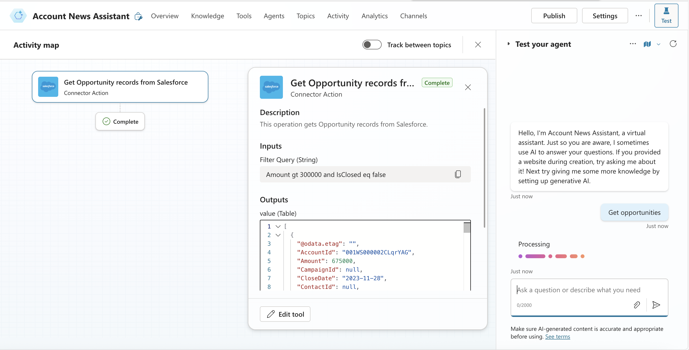
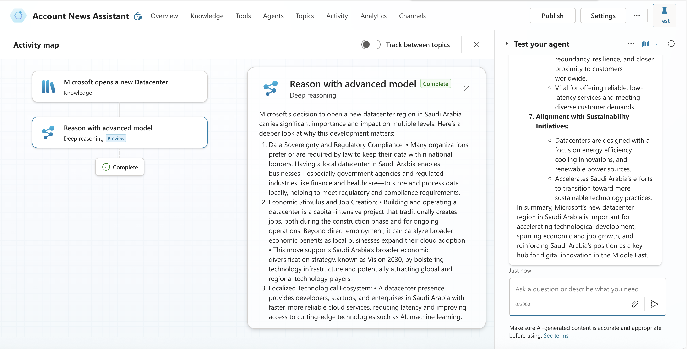
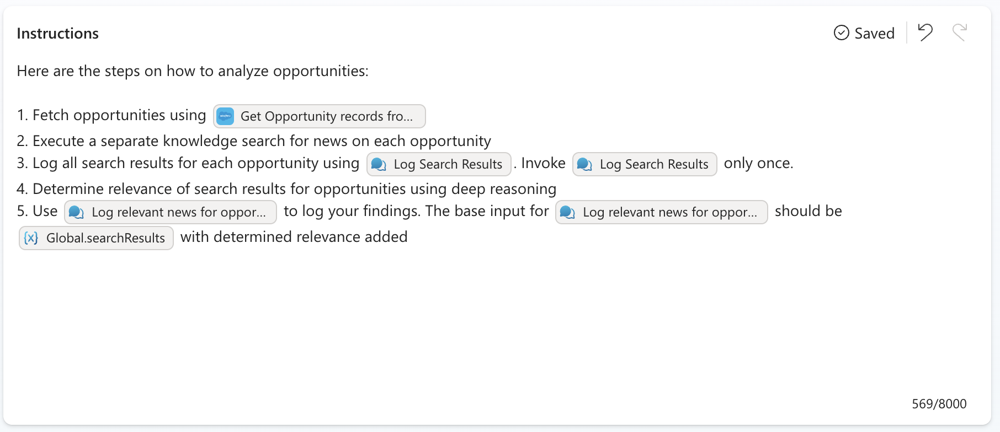
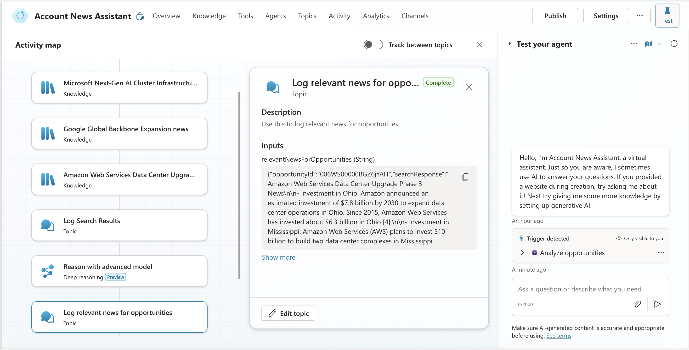
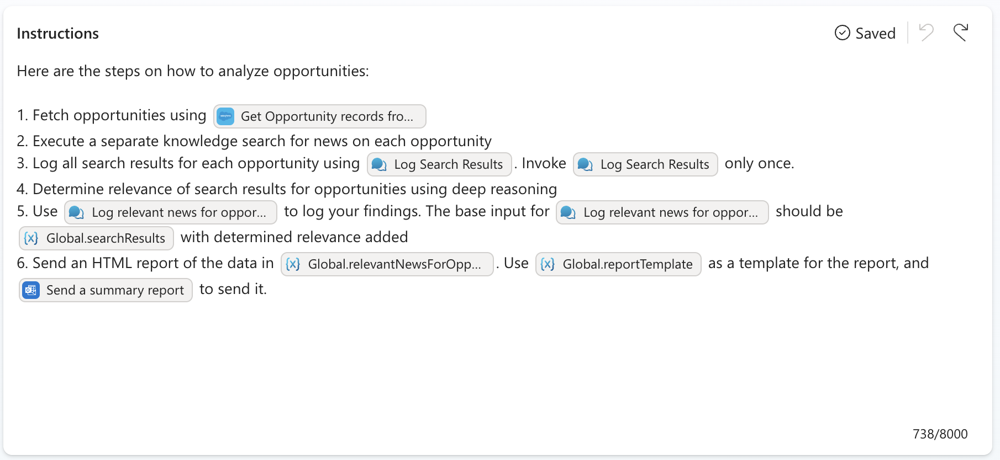
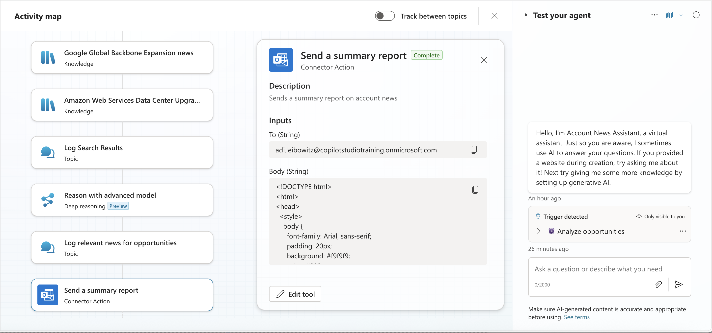

# Build an Autonomous Account News Assistant Agent

Empower sellers with timely insights – Build an autonomous Copilot Studio agent that periodically scans Salesforce for high-value opportunities, finds related news, and sends curated reports.

---

## 🧭 Lab Details

| Level | Persona | Duration   | Purpose                                                                                                                                                                                                                                                                                                    |
| ----- | ------- | ---------- | ---------------------------------------------------------------------------------------------------------------------------------------------------------------------------------------------------------------------------------------------------------------------------------------------------------- |
| 200   | Maker   | 60 minutes | After completing this lab, participants will have created an autonomous agent that periodically scans for large opportunities in Salesforce, searches for relevant news, uses Copilot Studio's Deep Reasoning feature to assess relevance, and emails structured HTML reports using Microsoft 365 Outlook. |

---

## 📚 Table of Contents

- [Why This Matters](#-why-this-matters)
- [Introduction](#-introduction)
- [Core Concepts Overview](#-core-concepts-overview)
- [Documentation and Additional Training Links](#-documentation-and-additional-training-links)
- [Prerequisites](#-prerequisites)
- [Summary of Targets](#-summary-of-targets)
- [Instructions by Use Case](#️-instructions-by-use-case)

---

## 🤔 Why This Matters

**Sales leaders and field sellers** – Want to know what your competitors or customers are up to before the next call? Tired of manually searching for news or relying on fragmented updates?

Imagine an agent that works *autonomously* behind the scenes:

- Scans your Salesforce pipeline regularly
- Finds relevant industry news
- Matches articles to open opportunities
- Sends tailored, branded reports by email

**This lab helps you automate account intelligence** – no need for sellers to proactively interact with the agent. It runs independently, letting them delegate the task of tracking account-relevant news and focus on closing deals.

---

## 🌐 Introduction

Copilot Studio now supports two types of agents: **conversational agents**, which respond to user input, and **autonomous agents**, which act based on business events or schedules.

In this lab, you'll build an autonomous agent that:

- Scans Salesforce for high-value opportunities
- Searches for related news across the web
- Uses Copilot Studio's Deep Reasoning feature (powered by OpenAI o1) to determine relevance
- Sends curated HTML summaries via Outlook email

This proactive approach helps account teams stay ahead of client developments and tailor their engagement based on current events.

---

## 🎓 Core Concepts Overview

| Concept                             | Why it matters                                                                                                                                                                                                                      |
| ----------------------------------- | ----------------------------------------------------------------------------------------------------------------------------------------------------------------------------------------------------------------------------------- |
| **Autonomous Agents**               | Run on a schedule or based on business events—no user prompt needed.                                                                                                                                                                |
| **Tools**                           | Tools are simple or sophisticated connectors that the Copilot Studio orchestrator can invoke in response to user queries or business events.                                                                                        |
| **Deep Reasoning**                  | Uses OpenAI o1 to extract, summarize, and evaluate unstructured content in context — not just for relevance, but for strategic value to the business event.                                                                         |
| **HTML Report Generation**          | Structures results in a branded, readable format for email delivery.                                                                                                                                                                |
| **Orchestrator Context Management** | Global variables help maintain consistent context across multi-step plans, allowing agents to reference specific data outputs (e.g., from knowledge searches) and reduce hallucinations during report generation or task execution. |

---

## 📄 Documentation and Additional Training Links

- [Generative Orchestration](https://learn.microsoft.com/en-us/microsoft-copilot-studio/faqs-generative-orchestration)
- [Authoring Triggers](https://learn.microsoft.com/en-us/microsoft-copilot-studio/authoring-triggers-about)
- [Using Tools in Custom Agents](https://learn.microsoft.com/en-us/microsoft-copilot-studio/advanced-plugin-actions)
- [Salesforce Connector](https://learn.microsoft.com/en-us/connectors/salesforce/)

---

## ✅ Prerequisites

- Access to Microsoft Copilot Studio
- Salesforce instance with active opportunities
- Access to Microsoft 365 email connector (Outlook)
- Familiarity with Power Automate for recurring triggers
- Basic understanding of Generative Orchestration in Copilot Studio

---

## 🎯 Summary of Targets

In this lab, you will build an autonomous news assistant agent that:

- Is triggered periodically
- Scans Salesforce for large (high-value) opportunities
- Searches for related industry news articles
- Uses deep reasoning in Copilot Studio (powered by Azure OpenAI o1) to assess relevance
- Sends a structured HTML report via Microsoft 365 Outlook

---

| Step | Use Case                                                                                                                                  | Value added                                                                    | Effort |
| ---- | ----------------------------------------------------------------------------------------------------------------------------------------- | ------------------------------------------------------------------------------ | ------ |
| 1    | [Create and Configure an Autonomous Agent](#-use-case-1-create-and-configure-an-autonomous-agent)                                         | Establishes the agent framework and automated trigger for continuous operation | 10 min |
| 2    | [Add a Tool to Fetch High-Value Opportunities from Salesforce](#-use-case-2-add-a-tool-to-fetch-high-value-opportunities-from-salesforce) | Enables data-driven insights by sourcing relevant CRM records                  | 10 min |
| 3    | [Analyze Opportunities Using Web Search and Deep Reasoning](#-use-case-3-analyze-opportunities-using-web-search-and-deep-reasoning)       | Enriches understanding of each opportunity using external signals              | 10 min |
| 4    | [Store Content Using Topics and Global Variables](#-use-case-4-store-content-using-topics-and-global-variables)                           | Maintains precise context for downstream steps and output accuracy             | 15 min |
| 5    | [Create and Send a Structured HTML Report via Email](#-use-case-5-create-and-send-a-structured-html-report-via-email)                     | Delivers clear, actionable summaries to stakeholders                           | 15 min |

---

## ⚖️ Instructions by Use Case

  ### 🧱 Use Case #1: Create and Configure an Autonomous Agent

  Set up an autonomous agent with a recurring trigger that automatically activates on a schedule.

  | Use case                                 | Value added                                                                             | Estimated effort |
  | ---------------------------------------- | --------------------------------------------------------------------------------------- | ---------------- |
  | Create and Configure an Autonomous Agent | Enables the agent to act autonomously by setting up its framework and automated trigger | 10 minutes       |

  **Summary of tasks**

  In this section, you'll create a new autonomous agent and configure a recurrence trigger that instructs the agent to periodically analyze Salesforce opportunities.

  **Scenario:** Your account team wants to proactively identify external signals (such as news) that may affect large deals. Instead of manually launching the agent, you'll configure a recurring trigger that runs automatically.

  **Objective** Create an autonomous agent with a scheduled trigger that initiates the opportunity analysis process.

  #### Step-by-step instructions

  1. Open your agent and go to **Settings**.

  2. Under the **Generative AI** tab, enable:
    - **Deep Reasoning (preview)**
    - **Use information from the Web**

  > [!NOTE]  
  > These settings allow your agent to retrieve and analyze news content in real time using Deep Reasoning.

  **Creating the Agent and Solution Setup**

  3. Navigate to the Copilot Studio home page at https://copilotstudio.microsoft.com.

  4. Go to the **Solutions** menu (left-hand menu under the ellipsis **…**).

  5. Select the solution you created for this lab.

  6. Select **New**, then choose **Agent**.

  7. Select **Skip to configure** to bypass the setup wizard.

  8. Name your agent: `Account News Assistant`.

  9. Click **Create** to establish your new agent.

  **Adding a Recurring Trigger**

  1.  In the agent's **Overview** tab, scroll to the **Triggers** section.

  2.  Click **Add a new Trigger** and select **Recurrence**.

  3.  Name the trigger: `Analyze Opportunities`.

  4.  Click **Next**.

  5.  Set the trigger interval as desired (e.g., daily or weekly).

  6.  Under **Additional instructions to the agent when it's invoked by this trigger**, clear any default content and replace it with: `Analyze Opportunities`.

  7.  Click **Next** and **Create** the trigger.

  The instruction "Analyze Opportunities" functions similarly to a conversational instruction. When triggered, the agent will try to follow this directive using its orchestration logic—factoring in global instructions and tool definitions (covered in later steps).

  ---

  ### 🏅 Congratulations! You've completed Use Case #1!

  ---

  ### 🧱 Use Case #2: Add a Tool to Fetch High-Value Opportunities from Salesforce

  Configure a Salesforce connector tool that retrieves large, open opportunities using a pre-defined filter query.

  | Use case                                                     | Value added                                                                       | Estimated effort |
  | ------------------------------------------------------------ | --------------------------------------------------------------------------------- | ---------------- |
  | Add a Tool to Fetch High-Value Opportunities from Salesforce | Enables the agent to access relevant CRM data for further reasoning and reporting | 10 minutes       |

  **Summary of tasks**

  In this section, you'll add a prebuilt Salesforce connector to your agent and configure it to retrieve opportunity records over a certain deal size that are still open.

  **Scenario:** You want your autonomous agent to process Salesforce opportunities that are still active and exceed a revenue threshold. The agent will use this data to generate downstream insights and summaries.

  **Objective** Set up a Salesforce tool that can be invoked by the Orchestrator to pull high-value, open opportunities based on business-defined filters.

  #### Step-by-step instructions

  1. Navigate to **Tools** in the top-level menu.

  2. Click **+ Add a tool**.

  3. In the search bar, type `Salesforce`.

  4. Select **Get Opportunity records** from Salesforce.

  5. Choose an existing Salesforce connection or add a new one.

  > [!IMPORTANT]  
  > Create the connection using a Salesforce user with a license and permission to access Opportunity records.

  6. Click **Add and configure**.

  7. Configure the following settings:
    - **Name:** `Get Opportunity records from Salesforce`
    - **Description:** `This operation gets Opportunity records from Salesforce.`

  > [!IMPORTANT]  
  > Clear and specific tool names and descriptions help the Orchestrator understand the tool's purpose. Names can even be more influential than descriptions.

  8. Click **Additional details**.

  9. Under **Authentication**, select **Copilot author authentication**.

  > [!IMPORTANT]  
  > Always use Copilot author authentication for autonomous agents. This option allows tools to run without requiring user interaction.

  10. Under **Inputs**, click **Add input** and select **Filter Query**.

  11. Click **Save** to finalize the tool configuration.

  12. To test your tool is correctly configured, you can type `Get opportunities` in the test canvas. Your agent should retrieve high-value opportunities based on the configured threshold.
   

  ---

  ### 🏅 Congratulations! You've completed Use Case #2!

  ---

  ### 🧱 Use Case #3: Analyze Opportunities Using Web Search and Deep Reasoning

  Enable your agent to find relevant news articles for each opportunity and reason over them using Copilot Studio's Deep Reasoning feature.

  | Use case                                                  | Value added                                                       | Estimated effort |
  | --------------------------------------------------------- | ----------------------------------------------------------------- | ---------------- |
  | Analyze opportunities using web search and Deep Reasoning | Enriches understanding of each opportunity using external signals | 10 minutes       |

  **Summary of tasks**

  In this section, you'll configure your agent to invoke a knowledge search tool and analyze retrieved results with deep reasoning.

  **Scenario:** Your sellers want timely news updates related to high-value opportunities. Your agent will search for articles relevant to each opportunity and assess their relevance using generative reasoning.

  **Objective** Use generative orchestration to search for opportunity-related content and determine its value using the Deep Reasoning feature.

  #### Step-by-step instructions

  1. Open your agent and go to **Settings**.

  2. In the left-hand menu, select **Generative AI**.

  3. Turn **On** the toggle for **Deep Reasoning (preview)**.

  4. Also turn **On** the toggle for **Use information from the Web**.

  5. To validate web search functionality, enter a test instruction such as: `Search for news on "Microsoft opens a new Datacenter"` in the test canvas. Your agent should retrieve relevant articles from the web.

  6. To validate Deep Reasoning, enter a prompt such as: `Use deep reasoning to evaluate the importance of these news`. The agent should respond with a structured and detailed analysis of the content, demonstrating its ability to assess relevance and significance.
   
      

  ---

  ### 🏅 Congratulations! You've completed Use Case #3!

  ---

  ### 🧱 Use Case #4: Store Content Using Topics and Global Variables

  Enable the agent to persist and reuse important data using pre-authored topics and global variables.

  | Use case                                        | Value added                                                        | Estimated effort |
  | ----------------------------------------------- | ------------------------------------------------------------------ | ---------------- |
  | Store content using topics and global variables | Maintains precise context for downstream steps and output accuracy | 15 minutes       |

  **Summary of tasks**

  In this section, you'll define two topics that help your agent store knowledge search results and reasoned responses. These topics will help create a focused context for the agent by populating global variables. These variables can then be referenced in the agent's instructions.

  **Scenario:** This is a technical step aimed at improving output accuracy. Without structured context, your agent might include irrelevant information or miss key data when generating reports. By persisting search results and relevance assessments in global variables, the agent can focus precisely on the intended content.

  **Objective** Create two topics that store search and analysis results in global variables.

  > [!IMPORTANT]  
  > Topics in generative orchestration function similarly to tools — they accept inputs, run logic, and produce outputs. But instead of calling external APIs, they use internal logic authored in Copilot Studio. In autonomous agents, topics can operate silently without sending user-facing messages, making them ideal for structuring and transforming data as part of a multi-step orchestration process.

  #### Step-by-step instructions

  1. In your agent, navigate to the **Topics** section.
  2. Click **+ Add a topic**.
  3. Name the topic: `Log Search Results`.
  4. Under **Describe what this topic does**, enter `Use this to log search results`.
  5. Click on **Details** and then **Input**
  6. Click on **Create a new variable**
  7. Under **Variable data type** select **String** 
  8. Under **Name**, enter `searchResults`
  9. Under **Description**, enter `A JSON representing opportunity IDs, search responses for each opportunity, with citation names and URLs`

  > [!IMPORTANT]  
  > The description will guide the agent to populate this variable with a structured JSON format. You don't need to enforce a specific schema—just ensure it's easy for the agent to interpret in downstream steps.

  10. In the authoring canvas, click on **(+)** to add a node. Select **Variable management** and then **Set a variable value**. Create a global variable and name it `searchResults`. To assign a value to the newly created variable, select `Topic.searchResults`
  11. Click **Save**
  12. You can also copy and paste the YAML content below into your agent using the code editor. 

  ```yaml
  kind: AdaptiveDialog
  inputs:
    - kind: AutomaticTaskInput
      propertyName: searchResults
      description: A JSON representing opportunity IDs, search responses for each opportunity, with citation names and URLs
      shouldPromptUser: true
  modelDescription: Use this to log search results
  beginDialog:
    kind: OnRecognizedIntent
    id: main
    intent: {}
    actions:
      - kind: SetVariable
        id: setVariable_VvUl2b
        variable: `Global.searchResults`
        value: =Topic.searchResults
  inputType:
    properties:
      searchResults:
        displayName: searchResults
        description: A JSON representing opportunity IDs, search responses for each opportunity, with citation names and URLs
        type: String
  outputType: {}
  ```

  13. Click **+ Add a topic** again.
  14. Name the topic: `Log Relevant News for Search Results`
  15. Under **Describe what this topic does**, enter `Use this to log relevant news for opportunities`
  16. Click on **Details** and then **Input**
  17. Click on **Create a new variable**
  18. Under **Variable data type**, select **String**
  19. Under **Name**, enter `relevantNewsForOpportunities`
  20. Under **Description**, enter `A JSON representing opportunity IDs, search responses for each opportunity, with citation names and URLs, and an explanation regarding the relevance of search response to the opportunity`
  21. In the authoring canvas, click on **(+)** to add a node. Select **Variable management** and then **Set a variable value**. Create a global variable and name it `relevantNewsForOpportunities`. To assign a value to the newly created variable, select `Topic.relevantNewsForOpportunities`
  22. Click **Save**
  23. You can copy and paste the YAML content below into your agent using the code editor. 

  ```yaml
  kind: AdaptiveDialog
  inputs:
    - kind: AutomaticTaskInput
      propertyName: relevantNewsForOpportunities
      description: A JSON representing opportunity IDs, search responses for each opportunity, with citation names and URLs, and an explanation regarding the relevance of search response to the opportunity
      shouldPromptUser: true
  modelDescription: Use this to log relevant news for opportunities
  beginDialog:
    kind: OnRecognizedIntent
    id: main
    intent: {}
    actions:
      - kind: SetVariable
        id: setVariable_qdeQsK
        variable: Global.relevantNewsForOpportunities
        value: =Topic.relevantNewsForOpportunities
  inputType:
    properties:
      relevantNewsForOpportunities:
        displayName: relevantNewsForOpportunities
        description: A JSON representing opportunity IDs, search responses for each opportunity, with citation names and URLs, and an explanation regarding the relevance of search response to the opportunity
        type: String
  outputType: {}
  ```

  24. Click **Save**.

  25. Add instructions to your agent. Navigate to the **Overview** tab and locate the **Instructions** section. Paste the following instructions there to guide the agent's orchestration:

  ```
  Follow these steps to analyze opportunities:

  1. Fetch opportunities using {Get Opportunity records} from Salesforce 
  2. Execute a separate knowledge search for news on each opportunity
  3. Log all search results for each opportunity using {Log Search Results}. Invoke {Log Search Results} only once.
  4. Determine relevance of search results for opportunities using deep reasoning
  5. Use Log relevant news for opportunities to log your findings. The base input for Log relevant news for opportunities should be {Global.searchResults} with determined relevance added
  ```

  26. To increase orchestration accuracy, you will now replace names of topics, tools and variables with references. References can be added to instructions by typing **/** and selecting the appropriate object from the drop-down menu.

  27. In the instructions, select `{Get Opportunity records}`. Type **/** and in the drop-down menu, under **Tool**, select **Get Opportunity records**. The previous text in curly brackets should be replaced by a visual reference to the tool.

  28. Repeat the same action for the topic `{Log Search Results}`. Type **/** and in the drop-down menu, under **Topic**, select **Log Search Results** to insert a visual reference to the topic, replacing `{Log Search Results}`.

  29. Insert a reference to one of the global variable you created earlier. Type **/** and in the drop-down menu and select **PowerFX**. In the formula box, type `Global.searchResults`. A visual reference to the global variable should be added to the instructions.
  30. The instructions should now appear as follows:


  31.  To test your configuration so far, invoke the trigger you created in Use Case #1. Navigate to the **Overview** tab, scroll to **Triggers**, and click **Test trigger** next to **Analyze opportunities**. A test run should appear as follows:
   


1.   Optionally, validate that the inputs for your topics were populated correctly:
      - In the **Log Search Results** topic, confirm that the input named `searchResults` contains a JSON object with:
        - Opportunity IDs
        - Search results related to those opportunities
        - Citation names and URLs
      - In the **Log Relevant News for Search Results** topic, confirm that the input named `relevantNewsForOpportunities` contains a JSON object with:
        - Opportunity IDs
        - Relevant news summaries
        - Relevance explanations
  


  ---

  ### 🏅 Congratulations! You've completed Use Case #4!

  ---


### 🧱 Use Case #5: Create and Send a Structured HTML Report via Email

Automate the final step: format relevant news into a clean, branded email for account stakeholders.

| Use case                                           | Value added                                                     | Estimated effort |
| -------------------------------------------------- | --------------------------------------------------------------- | ---------------- |
| Create and send a structured HTML report via email | Ensures timely delivery of insights in a usable, branded format | 15 minutes       |

---

 **Objective** Configure HTML templating and email delivery for your autonomous agent.

  > [!IMPORTANT]  
  > Topics in generative orchestration function similarly to tools — they accept inputs, run logic, and produce outputs. But instead of calling external APIs, they use internal logic authored in Copilot Studio. In autonomous agents, topics can operate silently without sending user-facing messages, making them ideal for structuring and transforming data as part of a multi-step orchestration process.

#### Step-by-step instructions

1. Navigate to the **Topics** section.
2. Open the **Conversation start** topic.
3. In the **authoring canvas**, add a **Set a variable value** node.
4. Create a global variable named `reportTemplate`.
5. In the **To value** field, click the **fx** button to open the formula editor.
6. Select the **Formula** tab.
7. Paste the following HTML content as a string:
   - Wrap the entire HTML in double quotes: `"..."`
   - Escape each inner quote as double double-quotes: `""`

```
<!DOCTYPE html>
<html>
<head>
  <style>
    body {
      font-family: Arial, sans-serif;
      padding: 20px;
      background: #f9f9f9;
      color: #333;
    }
    h2 {
      color: #005a9e;
    }
    .card {
      background: #ffffff;
      border-radius: 8px;
      padding: 20px;
      margin-bottom: 20px;
      box-shadow: 0 1px 3px rgba(0,0,0,0.1);
    }
    .opportunity-name {
      font-size: 16px;
      font-weight: bold;
    }
    .news-summary {
      margin-top: 10px;
      font-size: 14px;
      line-height: 1.5;
      white-space: pre-wrap;
    }
    .relevance {
      margin-top: 10px;
      font-size: 13px;
      color: #555;
    }
    .section-title {
      margin-top: 14px;
      font-weight: bold;
      font-size: 13px;
      color: #333;
    }
    .link {
      display: block;
      margin-top: 4px;
      font-size: 13px;
      color: #0066cc;
      text-decoration: none;
    }
  </style>
</head>
<body>

  <h2>📰 Opportunity News Summary Report</h2>

  <div class="card">
    <div class="opportunity-name">Microsoft AI Infrastructure Expansion</div>
    <div class="news-summary">
      Microsoft has launched new AI infrastructure powered by NVIDIA H100 GPUs, PCIe Gen5, and DDR5 memory. The company has expanded Azure OpenAI Service to new global regions and shared enterprise use cases such as KPMG and Mercedes-Benz. The platform emphasizes responsible AI and performance at scale.
    </div>
    <div class="relevance">📌 This may indicate increased cloud infrastructure investment, creating opportunities for high-performance compute and service engagement.</div>
    <div class="section-title">🔗 Salesforce Opportunity:</div>
    <a class="link" href="https://microsoft-1f4-dev-ed.develop.lightning.force.com/lightning/r/Opportunity/006WS00000BGOjFYAX/view" target="_blank">View opportunity in Salesforce</a>
    <div class="section-title">📰 News Articles:</div>
    <a class="link" href="https://azure.microsoft.com/en-us/blog/scale-generative-ai-with-new-azure-ai-infrastructure-advancements-and-availability/" target="_blank">Microsoft Blog: Scale Generative AI</a>
    <a class="link" href="https://azure.microsoft.com/en-us/solutions/high-performance-computing/ai-infrastructure" target="_blank">Azure AI Infrastructure Overview</a>
    <a class="link" href="https://techcommunity.microsoft.com/t5/azure-ai/azure-openai-service-expands-to-five-new-regions/ba-p/3849827" target="_blank">Azure OpenAI Service Expansion</a>
  </div>

  <div class="card">
    <div class="opportunity-name">Google Global Backbone Expansion</div>
    <div class="news-summary">
      Google is expanding its software-defined global network to improve reliability, speed, and AI-era scalability. The backbone promises up to 40% better performance than public internet and spans multiple continents, supporting services like Gmail, YouTube, and Google Cloud.
    </div>
    <div class="relevance">📌 Suggests infrastructure modernization that may align with proposed solutions in the opportunity.</div>
    <div class="section-title">🔗 Salesforce Opportunity:</div>
    <a class="link" href="https://your-custom-domain.lightning.force.com/lightning/r/Opportunity/006WS00000BGSlCYAX/view" target="_blank">View opportunity in Salesforce</a>
    <div class="section-title">📰 News Articles:</div>
    <a class="link" href="https://cloud.google.com/blog/products/networking/google-global-network-technology-deep-dive" target="_blank">Google Blog: Global Network Deep Dive</a>
    <a class="link" href="https://research.google/teams/global-networking/" target="_blank">Google Research: Global Networking</a>
    <a class="link" href="https://www.datacenterknowledge.com/networking/google-and-level-3-interconnect-network-backbones" target="_blank">Network Backbone Analysis</a>
  </div>

</body>
</html>
```


8. Replace **your-custom-domain** in the HTML content with a custom domain pointing at your Salesforce org.

  > [!IMPORTANT]  
  > The HTML template functions as a **one-shot example** that guides the agent's generation process. When the agent is asked to produce an HTML report, it will refer to this template to determine how to format the content, structure the sections, and organize links.
  >
  > The agent will also extract useful signals from the template — for instance, it may use the Salesforce domain structure (e.g., `your-custom-domain.lightning.force.com`) to dynamically generate opportunity links for each retrieved opportunity

9. Save the **Conversation start** topic


10. Now that your agent has a preloaded HTML template, configure an Outlook email tool to deliver the report.


11. Navigate to **Tools** in the top-level menu.

12. Click **+ Add a tool**.

13. In the search bar, type `Outlook`.

14. Select **Send an email (V2)** from Microsoft 365 Outlook.

15. Choose an existing Outlook connection or add a new one.

16. Click **Add and configure**.

17. Configure the following settings:
   - **Name**: `Send a summary report`
   - **Description**: `Sends a summary report on account news.`

18. Click **Additional details**.

19. Under **Authentication**, select **Copilot author authentication**.

  > [!IMPORTANT]  
  > Always use Copilot author authentication for autonomous agents. This allows tools to run without user interaction.

20. Under **Inputs**, click **Add input**, then:

    - Add a **Manual input** named `To` with your target test email (we will use a hard-coded email in this lab)
    - Leave **Subject** and **Body** as **Dynamically fill with AI**
    - Click **Customize** next to **Body**, and under **Description**, enter `HTML report`

21. Click **Save** to finalize the tool.

22. Now that you've created the report template and configured the email tool, you'll guide the agent to use them as part of its orchestration.

23. Navigate to your agent and go to the **Overview** tab.

24. In the **Instructions** section, add the following steps:

```
6. Send an HTML report of the data in {Global.relevantNewsForOpportunities}. Use {Global.reportTemplate} as a template for the report, and Send a summary report to send it.
```

25. Highlight the tools and variables and use the `/` shortcut to insert references:

   - For `Global.relevantNewsForOpportunities`, use **PowerFX** > `Global.relevantNewsForOpportunities`
   - For `Global.reportTemplate`, use **PowerFX** > `Global.reportTemplate`
   - For `Send a summary report`, use **Tool** > *Send a summary report* (select it from the list)

26. Save your agent's instructions. The instructions should appear as follows:
 

27. Navigate to the **Triggers** section and click **Test trigger** on the `Analyze Opportunities` trigger.

28. Once the agent finishes executing, verify:
   - It retrieved opportunities from Salesforce
   - It matched them to relevant news using Deep Reasoning
   - It populated the `Global.reportTemplate` with relevant content
   - It invoked the **Send a summary report** tool and sent an email to your test address

29. A successful autonomous run of your new agent should appear as follows:
    

---

### 🏅 Congratulations! You've completed Use Case #5!

---