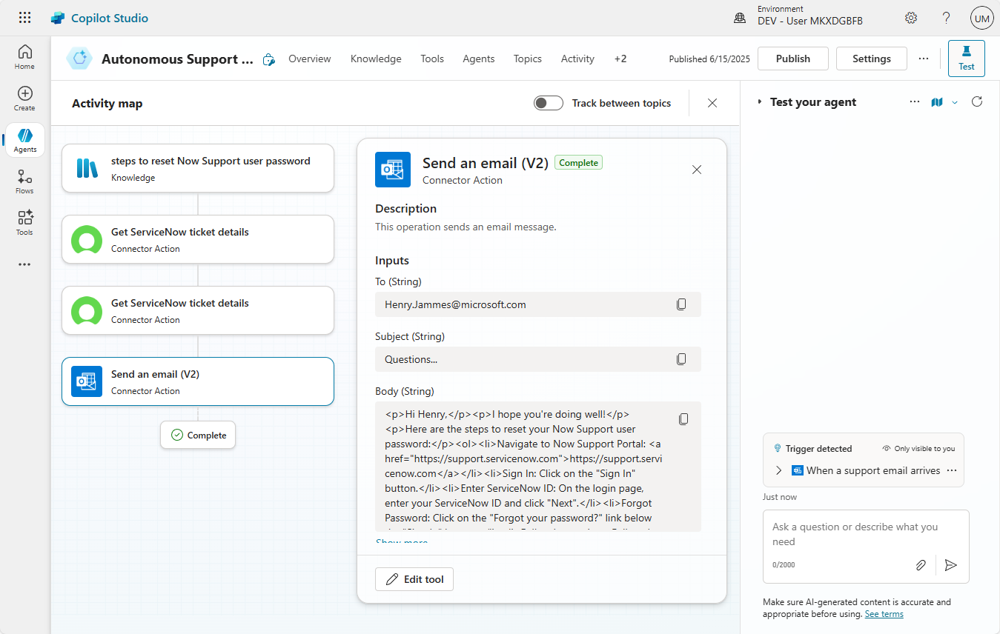

# Autonomous Support Agent - Unlock new levels of productivity with AI automation

Let AI do the work and automate processes more easily than ever with autonomous agents that handle user support inquiries automatically.

---

## 🧭 Lab Details

| Level | Persona | Duration | Purpose |
| ----- | ------- | -------- | ------- |
| 200 | Maker/Developer | 20 minutes | After completing this lab, participants will be able to create autonomous agents that automatically respond to user emails, provide guidance from knowledge bases, and integrate with ServiceNow for ticket management. You'll learn how to configure triggers, add knowledge sources, and integrate external tools for comprehensive automated support. |

---

## 📚 Table of Contents

- [Why This Matters](#-why-this-matters)
- [Introduction](#-introduction)
- [Core Concepts Overview](#-core-concepts-overview)
- [Documentation and Additional Training Links](#-documentation-and-additional-training-links)
- [Prerequisites](#-prerequisites)
- [Summary of Targets](#-summary-of-targets)
- [Use Cases Covered](#-use-cases-covered)
- [Instructions by Use Case](#️-instructions-by-use-case)
  - [Use Case #1: Create and Configure an Autonomous Agent](#-use-case-1-create-and-configure-an-autonomous-agent)
  - [Use Case #2: Add Knowledge and Tools Integration](#-use-case-2-add-knowledge-and-tools)

---

## 🤔 Why This Matters

**IT Support Teams and Makers** - Tired of manually responding to repetitive support emails and constantly checking ticket statuses?

Think of a traditional help desk:
- **Without autonomous agents**: Support staff manually reads every email, searches knowledge bases, checks ticket systems, and crafts individual responses - consuming hours of valuable time
- **With autonomous agents**: AI automatically processes incoming emails, searches your knowledge base, retrieves ticket information, and sends comprehensive responses in seconds

**Common challenges solved by this lab:**
- "Our support team spends too much time on routine email inquiries"
- "Users have to wait hours for simple password reset instructions"
- "We can't scale our support to handle increasing ticket volumes"
- "Checking ticket statuses across systems is time-consuming and error-prone"

**In just 20 minutes, you'll transform how your organization handles support requests, freeing your team to focus on complex issues that truly need human expertise.**

---

## 🌐 Introduction

Customer support automation has become essential for organizations looking to scale their operations while maintaining high service quality. Manual email responses and ticket lookups create bottlenecks that frustrate both support staff and end users.

**Real-world example:** A mid-sized company receives 200+ support emails daily asking about password resets, ticket statuses, and common troubleshooting steps. Without automation, their 3-person support team spends 60% of their time on these routine inquiries, leaving complex issues unaddressed and creating long response times.

After implementing autonomous agents, the same company now handles 80% of routine inquiries automatically, with instant responses that include personalized ticket updates and relevant knowledge base articles. The support team can focus on strategic initiatives and complex problem-solving, while user satisfaction increases due to immediate, accurate responses.

---

## 🎓 Core Concepts Overview

| Concept | Why it matters |
|---------|----------------|
| **Autonomous Agents** | Enable 24/7 automated responses to user inquiries, reducing manual workload and improving response times while maintaining consistency in support quality |
| **Triggers** | Events, as simple as "Email received", that trigger autonomous agents to then automatically detect and process the content and context initially provided |
| **Knowledge** | Connect agents to your existing documentation and knowledge sources, ensuring responses are accurate, up-to-date, and aligned with your organization's information |
| **ServiceNow Integration** | Provide real-time ticket status updates and incident details directly within email responses, eliminating the need for manual system lookups |
| **Multi-language Support** | Automatically detect and respond in the user's preferred language, improving global support accessibility and user experience |

---

## 📄 Documentation and Additional Training Links

* [Microsoft Copilot Studio Documentation](https://learn.microsoft.com/en-us/microsoft-copilot-studio/)
* [Building Autonomous Agents with Copilot Studio](https://learn.microsoft.com/en-us/microsoft-copilot-studio/advanced-autonomous-agents)
* [ServiceNow Connector Documentation](https://learn.microsoft.com/en-us/connectors/service-now/)
* [Office 365 Outlook Connector](https://learn.microsoft.com/en-us/connectors/office365/)
* [Copilot Studio Triggers and Actions](https://learn.microsoft.com/en-us/microsoft-copilot-studio/advanced-trigger-actions)

---

## ✅ Prerequisites

* Access to Microsoft Copilot Studio with appropriate licensing
* ServiceNow instance with API access and valid credentials
* Office 365 environment with Outlook integration enabled
* Administrative permissions to create and configure autonomous agents
* A test email account to simulate user interactions

---

## 🎯 Summary of Targets

In this lab, you'll build a complete autonomous support agent that transforms how your organization handles routine support inquiries. By the end of the lab, you will:

* Create and configure an autonomous agent with email triggers for automatic activation
* Integrate knowledge sources to provide accurate, contextual responses to user questions
* Connect ServiceNow for real-time ticket status updates and incident details
* Configure email response tools that reply professionally with proper formatting and citations
* Test the complete workflow with realistic support scenarios and multi-question emails

---

## 🧩 Use Cases Covered

| Step | Use Case | Value added | Effort |
|------|----------|-------------|--------|
| 1 | [Create and Configure an Autonomous Agent](#-use-case-1-create-and-configure-an-autonomous-agent) | Establishes the foundation for automated email processing with intelligent trigger configuration | 10 min |
| 2 | [Add Knowledge and Tools](#-use-case-2-add-knowledge-and-tools) | Connects external knowledge sources and ServiceNow integration for comprehensive automated responses | 10 min |

---

## 🛠️ Instructions by Use Case

---

## 🧱 Use Case #1: Create and Configure an Autonomous Agent

Set up the foundational autonomous agent with email triggers that automatically activates when support emails arrive.

| Use case | Value added | Estimated effort |
|----------|-------------|------------------|
| Create and Configure an Autonomous Agent | Establishes the foundation for automated email processing with intelligent trigger configuration | 10 minutes |

**Summary of tasks**

In this section, you'll learn how to create an autonomous agent, configure email triggers, and set up the basic framework for automated support responses.

**Scenario:** Your support team receives dozens of emails daily with questions about password resets, ticket statuses, and general inquiries. You need an intelligent system that can automatically detect these emails and begin processing them without human intervention.

### Objective

Create an autonomous agent that automatically triggers when new support emails arrive and prepare it for knowledge integration and response capabilities.

---

### Step-by-step instructions

#### Creating the Agent and Solution Setup

1. Navigate to the Copilot Studio home page at https://copilotstudio.microsoft.com/

2. Go to the **Solutions** menu (located in the left-hand menu under the ellipsis `...`)

3. Select the solution you had created previously for your labs

4. Select **New** and choose **Agent**

5. Select **Skip to configure** to bypass the initial setup wizard

6. Name your agent `Autonomous Support Agent`

7. Select **Create**.

> [!TIP]
> Choose a descriptive name that clearly identifies the agent's purpose for easier management in larger environments.

#### Configuring Email Triggers

8. In the **Overview** tab, scroll down to the triggers section and click **Add a new Trigger**

9. Search and select `When a new email arrives (V3)` (**Office 365 Outlook**)

10. Select **Next**, then **Continue**

10. Rename the trigger to `When a support email arrives`

11. Select **Next**, 

12. In the **Subject Filter (Optional)** field, enter `Support` to filter emails that contain the word "Support" in the subject line.

13. Finally **Create trigger**

> [!TIP]
> This trigger configuration determines which emails activate your agent. You can refine filters later to target specific email addresses or subject patterns.

14. The trigger is now configured. After you **publish** your agent, it will automatically activate your agent when new emails arrive

---

###  🏅 Congratulations! You've completed Use Case #1!

---

### Test your understanding

**Key takeaways:**

* **Autonomous Agent Foundation** – You've created the core agent structure that will handle all automated support interactions
* **Email Trigger Configuration** – The trigger ensures your agent automatically responds to incoming emails without manual intervention
* **Solution Integration** – Your agent is properly integrated within your Copilot Studio solution for organized management

**Lessons learned & troubleshooting tips:**

* Ensure your trigger settings align with your organization's email flow to avoid processing unintended messages
* Test trigger activation with a simple email before adding complex logic
* Keep agent names descriptive and consistent with your naming conventions

**Challenge: Apply this to your own use case**

* Consider what other triggers might be useful for your support scenarios (Teams messages, forms submissions, etc.)
* Think about how you might filter emails to ensure only support-related messages activate the agent
* Plan the types of email patterns your organization receives that could benefit from automation

---

---

## 🔄 Use Case #2: Add Knowledge and Tools

Transform your basic agent into a comprehensive support system by adding knowledge sources and ServiceNow integration for complete automated responses.

| Use case | Value added | Estimated effort |
|----------|-------------|------------------|
| Add Knowledge and Tools Integration | Connects external knowledge sources and ServiceNow integration for comprehensive automated responses | 10 minutes |

**Summary of tasks**

In this section, you'll learn how to integrate knowledge sources, configure ServiceNow tools for ticket lookups, and set up email response capabilities for complete automated support workflows.

**Scenario:** Your agent can now detect incoming emails, but it needs access to your knowledge base and ticketing system to provide meaningful responses. Users frequently ask about password resets and ticket statuses, requiring integration with both documentation and ServiceNow.

### Step-by-step instructions

#### Adding Knowledge Sources

1. Navigate to the **Knowledge** tab in your agent and select **+ Add knowledge**

2. Choose **Public website** as your knowledge source type

3. **Add** this URL: `https://support.servicenow.com/` and confirm ownership for better results

> [!TIP]
> You can add multiple knowledge sources including SharePoint sites, documents, and other websites relevant to your support topics.

#### Configuring ServiceNow Integration

4. Go to **Tools** and click **Add tool**

5. Search for `ServiceNow List records` and select **List records**

6. Select **Add and configure**

> [!TIP]
> You may need to set the connection again for the buttons to be available.

7. Rename the tool to `Get ServiceNow ticket details`

8. Update the description to: `Gets the details of an incident using its incident number`

> [!TIP]
> The description helps the AI know when to use this tool and what it does.

10. Under **Additional details**, change **Authentication** to **Maker-provided credentials**

11. For **Record Type**, set a **Custom value** and choose `Incident`

12. Select **+ Add input** and choose **Query**

13. Select **Customize** and use this for **Description**:

    ```
    The output of this variable is the concatenation of numberCONTAINS and the incident number. E.g., 'numberCONTAINSINC0007001'. Only the incident number should be prompted and obtained from the user (e.g., INC0007001)
    ```

> [!TIP]
> These instructions will be used by AI to understand how determine how to pass that information to the ServiceNow connector. In this case, how to use the very specific OData formatting of ServiceNow queries.

14. Select **+ Add input** and choose **Limit**

15. Select **Custom Value** and set **1**

16. Select **Save**

#### Setting Up Email Response Capabilities

17. Return to the **Tools** tab, and select **+ Add a tool**

18. Search for `Send an email (V2)` from **Office 365 Outlook** and select it

19. Select **Add and configure**

20. Update its name to `Reply to email`

21. Update the description to: `Use this operation to reply to the email received`

22. Under **Additional details**, set authentication to **Maker-provided credentials**

23. For the inputs, keep **Dynamically fill with AI**, for the **To** input, click on **Customize** to set its **Description** to:

    ```
    Use the "from" email of the triggering received email.
    ```

23. For the inputs, keep **Dynamically fill with AI**, for the **Subject** input, click on **Customize** to set its **Description** to:

    ```
    Use the original subject of the triggering received email.
    ```

23. For the inputs, keep **Dynamically fill with AI**, for the **Body** input, click on **Customize** to set its **Description** to:

    ```
    Write the email body using minimal HTML that renders well in Outlook. Use <p> for paragraphs, <br> for line breaks, <ul>/<ol> for bullet points, and <table> for simple tables if needed. All URLs must be formatted as HTML links using <a href="...">, not left as plain text. Do not use Markdown syntax like [1] or reference-style links. Do not include full HTML documents or tags like <html> or <head>. The HTML must be valid as a JSON string: escape double quotes (") and avoid unescaped special characters.
    ```

24. Click **Save** to finalize the tool configuration

#### Setting Up Teams Capabilities

25. Return to the **Tools** tab, and select **+ Add a tool**

26. Search for `Create a chat` from **Microsoft Teams** and select it

27. Select **Add and configure**

28. Update its name to `Create a Teams chat`

29. Update the description to: `Create a Teams chat with the user who has sent the email.`

30. Under **Additional details**, set authentication to **Maker-provided credentials**

31. For the inputs, keep **Dynamically fill with AI**, for the **Members to add** input, click on **Customize** to set its **Description** to:

    ```
    Only use the "from" email address of the received email. There should be only one user to add. E.g., henry.jammes@copilotstudiotraining.onmicrosoft.com
    ```
32. Click **Save** to finalize the tool configuration

33. Return to the **Tools** tab, and select **+ Add a tool**

34. Search for `Post message in a chat or channel` from **Microsoft Teams** and select it

35. Select **Add and configure**

36. Update its name to `Send a Teams message`

37. Update the description to: `Send a Teams message in the chat conversation that was created with the user.`

38. Under **Additional details**, set authentication to **Maker-provided credentials**

31. For the **Inputs**:
    - For **Post as**, select **Custom value** and set it to `User`
    - For **Post in**, select **Custom value** and set it to `Group chat`
    - For **Group chat**, leave **Dynamically fill with AI**, but set this description in **Customize**:
        ```
        Conversation ID of the Teams chat that was created.
        The format should be similar to this: 19:3d4da799-6a66-4f70-9057-ada103025953_5f22554b-fd15-4676-8c82-dc6122af2a80@unq.gbl.spaces
        ```    
    - For **Message**, leave **Dynamically fill with AI**, but set this description in **Customize**:
        ```
        Polite message greeting the user and telling them you have replied to their email. Provide a one phrase summary of the response you provided to their query. Finish by offering to schedule a call if they to talk through it if they'd like.
        ```     

32. Click **Save** to finalize the tool configuration

#### Configuring Agent Instructions and AI Settings

28. Navigate to **Overview** and then **Instructions**

29. **Paste** the following comprehensive instructions:
```
1. Understand and isolate each question from the received email body.
For each individual question, do a separate **knowledge search** using the configured knowledge sources.
2. If a ticket ID is mentioned, for example INC0000059, check if an update is available using the <Get ServiceNow ticket details> tool.
3. Once you have gathered knowledge and ticket information, use the <Reply to email> tool to reply to the original email received. Your reply should use the same language as the initial user email (e.g., if the questions are in French, reply in French, etc.)`
4. Use the <Create a Teams chat> tool to create a Teams conversation with the user
5. Use the <Send a Teams message> tool to send a message to the user
```

> [!IMPORTANT]
> For each of the placeholder <...> in the description, use `/` to insert the tools you  just configured in your instructions.

> [!TIP]
> Note: the UX may differ and you don't have that option, leave the description as-is.


30. **Publish** your agent to activate it

#### Testing Your Complete Agent

31. **Send** a test email to your ficitious user email by using the **Send Support Email** form. 

> [!IMPORTANT]
> To access this form, use the provided values in the **Lab Resources** (specific per training).
>
> The email should contain something like this:
>   ```
>   Hi!
>   
>   I hope you're doing well!
>   
>   I had a couple of questions - what are the steps again to reset your Now Support user password?
>   Also, was wondering if you had an update on my cases INC0000059 and INC0000055
>   
>   Much appreciated.
>   Thanks!
>   ```

32. Make sure you **receive** the email in your **inbox**, in [outlook.office.com](https://outlook.office.com/mail/)

> [!TIP]
> You don't need to repeat the original trigger event to make more tests. In the **Test** pane, you can select `...`, choose **Test trigger** and then select the desired trigger and from there, decide to execute a past trigger again.
> 
> 

33. Check the execution of your  autonomus agent by going to the **Activity** tab. Select the **Refresh** icon until you see the execution.

34. Check the emails in your **Sent** folder in Outlook to see the actual reply the user autonomously sent.

> [!TIP]
> - Agents can be both conversational and autonomous. Meaning that they can be triggered by an email (such as an email received) or by an end-user simply using a chat or voice interface. 
> - If the agent is purely autonomous, you can safely **delete** the default custom topics that are useless to it:
>   - Goodbye
>   - Greeting
>   - Start Over
>   - Thank you
> - You can also **disable** the system topics that it won't need:
>   - Conversation start
>   - Conversational boosting
>   - End of conversation
>   - Escalate
>   - Fallback
>   - Multiple topics matched



---

###  🏅 Congratulations! You've completed Use Case #2!

---

### Test your understanding

**Key takeaways:**

* **Knowledge Integration** – Your agent can now access external documentation to provide accurate, up-to-date information
* **ServiceNow Connectivity** – Ticket status lookups are automated, providing users with real-time incident updates
* **Intelligent Email Responses** – The agent composes professional responses with proper formatting, citations, and multi-language support

**Challenge: Apply this to your own use case**

* Consider what additional knowledge sources would benefit your specific organization
* Think about other ServiceNow operations (create tickets, update status) that could enhance the automation
* Plan how you might extend this pattern to other communication channels like Teams or chat interfaces

---

## 🏆 Summary of learnings

True learning comes from doing, questioning, and reflecting—so let's put your skills to the test.

To maximize the impact of autonomous support agents:

* **Start Simple, Scale Smart** – Begin with common, repetitive inquiries before tackling complex support scenarios to build confidence and refine your approach
* **Knowledge Quality Drives Response Quality** – Invest time in curating and maintaining your knowledge sources, as they directly impact the accuracy and helpfulness of automated responses
* * **Integration Amplifies Value** – Connecting multiple systems (email, knowledge bases, ticketing) creates a seamless experience that rivals human support capabilities
* **Multi-language Awareness** – Configure your agent to detect and respond appropriately in users' preferred languages to maximize global accessibility
* **Monitor and Iterate** – Regularly review agent interactions to identify improvement opportunities and expand capabilities based on real user needs

---

### Conclusions and recommendations

**Autonomous Support Agent golden rules:**

* Always test your agent with realistic scenarios before full deployment to identify potential issues early
* Keep your knowledge sources current and well-organized to ensure accurate and relevant responses
* Configure appropriate authentication and security measures for all integrated systems and tools
* Design clear fallback procedures for scenarios where automated responses aren't sufficient
* Monitor agent performance metrics and user feedback to continuously improve response quality
* Start with a limited scope and gradually expand capabilities as you gain confidence and experience

By following these principles, you'll create reliable autonomous agents that enhance user satisfaction, reduce support team workload, and scale your organization's support capabilities efficiently and effectively.

---