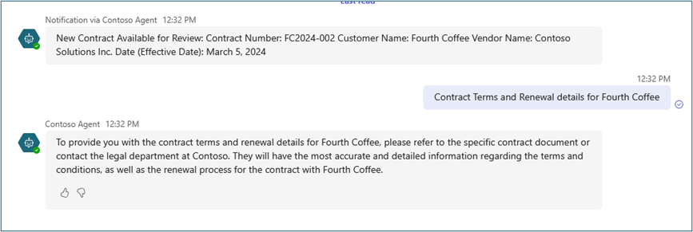
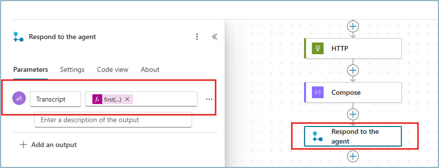

# Proactive Contract Alerts in Teams with Azure AI Search and Speech-to-Text - Build Intelligent Event-Driven Agents

Configure Copilot Studio agents to proactively notify users, search contract documents, and transcribe audio files using Azure AI services.

---

## 🧭 Lab Details

| Level | Persona | Duration      | Purpose                                                                                                                                                                                                                                                                                                                                                                                                                                                                          |
| ----- | ------- | ------------- | -------------------------------------------------------------------------------------------------------------------------------------------------------------------------------------------------------------------------------------------------------------------------------------------------------------------------------------------------------------------------------------------------------------------------------------------------------------------------------- |
| 200   | Maker   | 60–75 minutes | After completing this lab, participants will be able to configure Copilot Studio agents to proactively notify users when new files are added to Azure Blob Storage, connect Azure AI Search as a knowledge source to enable contextual question-answering over documents, integrate Azure Speech-to-Text services to automatically transcribe audio files, and understand how to combine low-code and Azure AI-based services to extend Copilot Studio functionality end-to-end. |

---

## 📚 Table of Contents

- [Why This Matters](#-why-this-matters)
- [Introduction](#-introduction)
- [Core Concepts Overview](#-core-concepts-overview)
- [Documentation and Additional Training Links](#-documentation-and-additional-training-links)
- [Prerequisites](#-prerequisites)
- [Summary of Targets](#-summary-of-targets)
- [Use Cases Covered](#-use-cases-covered)
- [Instructions by Use Case](#️-instructions-by-use-case)
  - [Use Case #1: Event-Driven Contract Notifications](#-use-case-1-event-driven-contract-notifications)
  - [Use Case #2: Intelligent Document Search and Audio Transcription](#-use-case-2-intelligent-document-search-and-audio-transcription)

---

## 🤔 Why This Matters

**Makers and Business Users** - This lab demonstrates how Copilot Studio can move beyond simple chat-based interactions into real-world automation and intelligence.

Think of your current contract management workflow:
- **Without intelligent agents**: Sales operations teams manually check shared folders for new contracts, email or message updates in Teams, and listen to entire recordings just to confirm details—slow, repetitive, and prone to oversight
- **With intelligent agents**: Your Copilot automatically detects new contracts uploaded to Azure Blob Storage, extracts key details like contract number, vendor, and effective date, posts short updates in Teams, answers questions like "What's the renewal term for Contoso?" using Azure AI Search, and transcribes customer meeting recordings into text for instant summaries

**Common challenges solved by this lab:**
- "I need to manually track when new contracts are uploaded and notify my team"
- "Finding specific contract information requires searching through dozens of documents"
- "Listening to entire customer call recordings to extract key information is time-consuming"
- "Our copilot needs to access and reason over indexed data sources securely"

**By connecting to Azure services like Blob Storage, AI Search, and Speech, makers learn to bridge data and conversation, add enterprise-grade knowledge, and infuse AI capabilities without custom coding.**

---

## 🌐 Introduction

As organizations adopt AI copilots across departments, the real value comes not from basic Q&A, but from connecting those copilots to real business data and workflows. Modern enterprises generate information continuously—from uploaded contracts and customer calls to indexed knowledge in Azure. However, unless your copilot can access, interpret, and act on that data, its usefulness remains limited.

**Real-world example:** Imagine a sales operations team that handles dozens of new contracts and client calls every week. Before this lab's approach, they had to manually check shared folders for new contracts, email or message updates in Teams, and listen to entire recordings just to confirm details. After implementing the capabilities built in this lab, their Copilot automatically detects new contracts uploaded to Azure Blob Storage, extracts key details and posts updates in Teams, answers contextual questions using Azure AI Search, and transcribes customer meeting recordings into searchable text.

This lab focuses on closing the gap between basic copilot functionality and enterprise-grade intelligence—teaching you how to turn Copilot Studio into a truly data-aware, event-driven assistant powered by Azure AI and Power Platform.

---

## 🎓 Core Concepts Overview

| Concept                                         | Why it matters                                                                                                                                                                                                                                                                                           |
| ----------------------------------------------- | -------------------------------------------------------------------------------------------------------------------------------------------------------------------------------------------------------------------------------------------------------------------------------------------------------- |
| **Event-driven Copilot Flows**                  | Enables copilots to react automatically to real-world triggers (like new files in Azure Blob Storage). This bridges the gap between conversational AI and operational workflows, delivering faster user notifications and reducing manual tracking while maintaining enterprise security and compliance. |
| **Connecting Azure Services to Copilot Studio** | Shows how to extend copilots beyond chat by connecting them securely to Azure resources (Blob Storage, AI Search, Speech). This integration gives copilots access to enterprise data and intelligence while maintaining governance, enabling true digital transformation of business processes.          |
| **Azure AI Search as Knowledge Source**         | Demonstrates how to add contextual understanding by letting copilots query and summarize enterprise documents. This makes business data instantly searchable and conversational, improving productivity and decision-making by transforming static documents into interactive knowledge.                 |
| **Speech-to-Text Integration**                  | Introduces real-time AI transcription capabilities so copilots can understand and summarize customer calls or meetings. This adds "hearing" to your Copilot—turning unstructured audio into structured insights for teams, enabling faster follow-ups and better customer service.                       |

---

## 📄 Documentation and Additional Training Links

* [Advanced proactive messaging - Microsoft Copilot Studio | Microsoft Learn](https://learn.microsoft.com/en-us/microsoft-copilot-studio/advanced-proactive-message)
* [Connect to Azure AI Search - Microsoft Copilot Studio | Microsoft Learn](https://learn.microsoft.com/en-us/microsoft-copilot-studio/knowledge-azure-ai-search)
* [Azure Speech Service documentation | Microsoft Learn](https://learn.microsoft.com/en-us/azure/ai-services/speech-service/)
* [Azure Blob Storage triggers in Power Automate | Microsoft Learn](https://learn.microsoft.com/en-us/power-automate/triggers-introduction)

---

## ✅ Prerequisites

* Access to Microsoft Copilot Studio, with permissions to create, edit, and publish agents and agent flows.
* Contoso Agent created in Lab 1 (or equivalent Copilot Studio agent).
* Microsoft Teams account to test Copilot notifications and interactions.
* Provided connection details (endpoint URLs, access keys, and container names) for pre-created Azure resources—including Blob Storage, AI Search, and Speech Services.
* Power Platform environment enabled for Copilot Studio.
* Basic familiarity with Copilot Studio concepts such as agent setup, knowledge sources, and flows.

---

## 🎯 Summary of Targets

In this lab, you'll transform your Copilot Studio agent into an intelligent, event-driven assistant that connects to Azure AI services. By the end of the lab, you will:

* Configure proactive notifications triggered by new files in Azure Blob Storage with AI-powered content extraction.
* Connect Azure AI Search as a knowledge source to enable semantic search over contract documents.
* Integrate Azure Speech-to-Text services for automatic audio transcription and insights.
* Understand the architecture of combining low-code Power Platform tools with Azure AI services.
* Apply event-driven automation patterns that extend beyond simple chat interactions.

---

## 🧩 Use Cases Covered

| Step | Use Case                                                                                                                | Value added                                                                                             | Effort |
| ---- | ----------------------------------------------------------------------------------------------------------------------- | ------------------------------------------------------------------------------------------------------- | ------ |
| 1    | [Event-Driven Contract Notifications](#-use-case-1-event-driven-contract-notifications)                                 | Automate contract processing with proactive Teams notifications and AI-powered content extraction       | 35 min |
| 2    | [Intelligent Document Search and Audio Transcription](#-use-case-2-intelligent-document-search-and-audio-transcription) | Enable semantic document search and speech-to-text capabilities for comprehensive business intelligence | 30 min |

---

## 🛠️ Instructions by Use Case

---

## 🧱 Use Case #1: Event-Driven Contract Notifications

Build an intelligent agent flow that automatically detects new contract uploads and sends proactive Teams notifications with AI-extracted key details.

| Use case                            | Value added                                                                                       | Estimated effort |
| ----------------------------------- | ------------------------------------------------------------------------------------------------- | ---------------- |
| Event-Driven Contract Notifications | Automate contract processing with proactive Teams notifications and AI-powered content extraction | 35 minutes       |

**Summary of tasks**

In this section, you'll learn how to create event-driven agent flows that monitor Azure Blob Storage, extract contract information using AI Builder, and send proactive notifications to Teams.

**Scenario:** A sales operations team needs automatic notifications when new contracts are uploaded, with key details extracted and shared in Teams without manual intervention.

### Objective

Create and configure an event-driven flow that monitors Azure Blob Storage for new contracts, extracts key information using AI, and sends proactive Teams notifications.

---

### Step-by-step instructions

#### Lab 2A: Notify Users When New Contract Documents Are Added to Azure Blob Storage

#### Prepare and Publish Your Agent

1. Open the **Contoso Agent** that was built in Lab 1 and **Publish** it.

> [!IMPORTANT]
> We are required to publish the Agent to Teams and Microsoft 365 Copilot channel so that the agent can message/ping proactively in Teams.


2. Select the **Channels** tab and click on **Teams and Microsoft 365 Copilot**, then select **Add channel**.


#### Create Event-Driven Agent Flow

3. Select **Flows** and click on **+ New agent flow** to add a new Agent Flow to notify users when new documents are uploaded to blob storage.


4. In the designer, select **Add a trigger node** and search for **blob**. Select **When a blob is added or modified (properties only) (V2)** trigger.


5. Select **change connection reference** to add a new connection. Provide the following details to connect to Azure Blob Storage account:
   - **Connection name:** `ContractsBlobStorage`
   - **Authentication type:** `Access Key`
   - **Azure Storage Account Name:** `ppccontractblob`
   - **Azure Storage Account Access Key:** `[Provided in LAB Environment]`


6. Once the connection is setup, use the dropdown to select the **Storage account name** in the container.


#### Configure Blob Content Processing

7. Add a new action – **Get Blob Content (V2)** in the Azure Blob Storage actions to the flow.


8. Since the connection is already established to blob storage account, you can select the **Storage account name** from the dropdown menu. For the **Blob** field, type `/` and then container name. Then `/` and add the Dynamic content from the trigger node – `body/Name` (Ex: `/{Container Name}/{Dynamic Content}`).


9. Add a new action in the flow and select action - **Extract information from Contract** (AI Builder pre-built prompt).


10. In the **Extract information from Contract** action parameters, select **Dynamic content** as **File Content** (from Get Blob content node) into **Contract file** field.


#### Create Custom AI Prompt for Notifications

11. Add a new action in the flow and select action – **Run a prompt**.


12. Click the dropdown in the **Prompt** and then **+New custom prompt** under Prompt parameter to create a new prompt.


13. In the new pop-up prompt window, update the prompt name to – **Extract Contract Info**.


14. Copy and paste the following in the instructions:
    ```
    Extract Contract Number, Customer name, Vendor name and Date from {ContractInput} and Provide extracted information like following: 
    New Contract Available for Review:
    Contract Number: AW2024-003
    Customer Name: Adventure Works
    Vendor Name: Contoso Solutions Inc.
    Date (Effective Date): March 10, 2024
    ```


15. Replace `{ContractInput}` with a new input parameter by clicking **+ Add Content**, select **Text** and name it `ContractInput`. Click **Save**.


16. Select the newly created prompt in the dropdown for **Prompt** and pass the dynamic content **Body** (from Extract information from contract node) into **ContractInput**.


> [!TIP]
> If you do not see the Body from the Extract information from contract node action, you can click "See more" to view all the dynamic content, or use Insert Expression with: `body('Extract_information_from_Contract')`

#### Send Teams Notification

17. Add a new action into the flow – **Post a message in a chat or channel** to send a message to a user on Teams regarding the new contract document. Configure the parameters as:
    - **Post as:** `Power Virtual Agents (preview)`
    - **Post in:** `Chat with bot`
    - **Bot:** `Contoso Agent`
    - **Recipient:** Your lab user account
    - **Message:** Text (Dynamic Content from Run a prompt action)


18. Switch to the overview tab and click **edit** to change the name of the flow to – **New Contracts Notification** and select **Save**.

19. Click on **Publish** to Publish the Agent flow.

#### Testing Lab 2A

Open Teams in the browser using your lab credentials and open your Contoso Agent. The proctors will be adding documents to the Azure Blob storage every 5–10 minutes to trigger the agent flow. You should see a proactive notification from your Contoso Agent with key details.




> [!TIP]
> Try asking for a follow-up question on this contract and the agent does not provide a good answer yet! This is what we will achieve next in Lab 2B.

---

###  🏅 Congratulations! You've completed Event-Driven Contract Notifications!

---

### Test your understanding

**Key takeaways:**

* **Event-Driven Automation** – Blob storage triggers enable real-time responses to business events, eliminating manual monitoring and notification processes.
* **AI-Powered Content Extraction** – AI Builder prompts can automatically extract structured information from unstructured documents, making data immediately actionable.
* **Proactive Communication** – Copilot Studio agents can initiate conversations in Teams, bringing intelligence directly into collaborative workspaces.

**Lessons learned & troubleshooting tips:**

* Agents must be published to Teams channel before they can send proactive messages
* Use dynamic content carefully and check "See more" if expected options don't appear
* AI Builder prompts require clear instructions and proper input parameter mapping

**Challenge: Apply this to your own use case**

* What other document types in your organization could benefit from automated processing and notification?
* How would you modify the AI prompt to extract different types of business-critical information?
* Consider what other Azure services could trigger similar automated workflows.

---

## 🔄 Use Case #2: Intelligent Document Search and Audio Transcription

Connect Azure AI Search for semantic document search and integrate Speech-to-Text services for comprehensive business intelligence capabilities.

| Use case                                            | Value added                                                                                             | Estimated effort |
| --------------------------------------------------- | ------------------------------------------------------------------------------------------------------- | ---------------- |
| Intelligent Document Search and Audio Transcription | Enable semantic document search and speech-to-text capabilities for comprehensive business intelligence | 30 minutes       |

**Summary of tasks**

In this section, you'll learn how to connect Azure AI Search as a knowledge source for semantic document search and integrate Azure Speech Services for automatic audio transcription.

**Scenario:** Users need to ask natural language questions about contracts and get instant answers, plus the ability to transcribe customer call recordings for quick insights and searchable content.

### Step-by-step instructions

#### Lab 2B: Configure Azure AI Search on Blob Storage

1. Open **Contoso Agent** and click on **+Add Knowledge** on the overview tab.


2. Select **Azure AI Search**.


3. Click on **Your connections** and select **Create new connection**.


4. Use the provided Endpoint URL and Access Key to connect to Azure AI Search service:
   - **Endpoint URL:** `https://ppcaisearch001.search.windows.net`
   - **Azure AI Search Admin Key:** `[Provided in LAB Environment]`


5. Select the available index and select **Add to agent**.


6. Once the Azure AI Search service is connected as knowledge source, select it to edit the **Name** and **Description**.


7. Update the following and then click **Save**:
   - **Name:** `Contoso Contracts`
   - **Description:**
     ```
     This knowledge source provides access to customer contract agreements. Each 
     contract file follows the format: Customer Contract Agreement - [Customer Name].docx 
     
     Each contract contains essential details, including: 
     • Scope of Services: Defines the services provided  
     • Payment Terms: Specifies the total contract value, milestone-based payments, and due dates. 
     • Service Level Agreement (SLA): Outlines uptime guarantees, response times, and escalation procedures. 
     • Data Privacy & Compliance: Ensures compliance with regulations like GDPR, CCPA, and defines data ownership. 
     • Contract Term & Renewal: States the contract duration, renewal policies, and termination conditions. 
     • Governing Law: Specifies applicable legal jurisdiction
     ```


8. Go to **Agent Overview** tab and click **Edit** to add additional instruction to the agent instructions, then click **Save**:
   ```
   For Contract related queries, use the Contoso Contracts knowledge source
   ```


#### Testing Lab 2B

In your test window, send a message like: `Contract terms and renewal details for Fourth Coffee`


#### Lab 2C: Speech-to-Text Integration with Copilot Studio

1. In Copilot Studio, open **Agent Flows**, Select **+New agent flow**.


2. Add a Trigger – **When an agent calls the flow**.


3. Add a new action **Create transcription (V3.1)** from Azure Batch Speech-to-text actions.


4. Create connection with provided details then click **Create new**:
   - **Connection name:** `SpeechtoTextConnection`
   - **Auth. Type:** `API Key`
   - **Account Key:** `[Provided in LAB Environment]`
   - **Region:** `westus`


5. Add the following Action parameters for **Create transcription (V3.1)**:
   - **Transcription/locale:** `en-US`
   - **Transcription/displayName:** `Call transcription`
   - **transcription/contentUrls:** (Advanced Parameters) `[Provided in LAB Environment - Audio File URL]`


6. Add an **Initialize variable** action with Parameters:
   - **Name:** `TranscriptionID`
   - **Type:** `String`
   - **Value:** `trim(last(split(outputs('Create_transcription_(V3.1)')?['body/self'], '/')))` (Insert expression)


7. Add a **Delay** action with Count = 30 and Unit = Second.


8. Add a **Get transcriptions list files (V3.1)** from Azure Batch Speech-to-text actions and pass the **TranscriptionID** variable as Dynamic Content.


9. Add a **Get transcription file (V3.1)** action with Parameters:
   - **Id:** `variables('TranscriptionID')`
   - **File Id:** `last(split(first(body('Get_transcriptions_list_files_(V3.1)')?['values'])?['self'], '/files/'))` (Insert expression)


10. Add an **HTTP** action with:
    - **URI:** `body('Get_transcription_file_(V3.1)')?['links']?['contentUrl']`
    - **Method:** `GET`
    - **Headers Key:** `Accept`
    - **Headers Value:** `application/json`


11. Add a **Compose** action. In the **Inputs** field paste: `body('HTTP')?['combinedRecognizedPhrases']`



12. Add an Action - **Respond to the Agent** with a Text output parameter:
    - **Name:** `Transcript`
    - **Value:** `first(outputs('Compose'))?['display']`


13. Click on **Save draft** to save the agent flow. Go to **Overview** tab and update the flow name to – **Transcribe Customer Call** and **Publish** the flow.


14. Open the **Contoso Agent**, go to **Tools** tab and select **+Add a tool**.


15. In the **Add tool** window, Select **Flow** filter and select the newly created **Transcribe Customer Call** flow and add to the agent by selecting **Add to agent** button.


16. In the **Contoso Agent Overview** tab, update instructions to direct the agent to this Agent flow for customer call insights. Type `/` and then scroll down and select the **Transcribe Agent Flow**.


#### Testing Lab 2C

In your Agent Test pane, send a message: `Customer call insights`. (If prompted, create the required connection and retry)


---

###  🏅 Congratulations! You've completed Intelligent Document Search and Audio Transcription!

---

### Test your understanding

* How does Azure AI Search improve the agent's ability to answer contract-related questions compared to basic document storage?
* What are the key components required for Speech-to-Text integration, and how do they work together?
* How would you extend this approach to handle different audio formats or languages?

**Challenge: Apply this to your own use case**

* Consider what other document types in your organization could benefit from semantic search capabilities
* Think about different audio sources (meetings, voicemails, interviews) that could be transcribed and analyzed
* Explore how you could combine search results with transcription insights for comprehensive business intelligence

---

## 🏆 Summary of learnings

True learning comes from doing, questioning, and reflecting—so let's put your skills to the test.

To maximize the impact of intelligent, event-driven Copilot Studio agents:

* **Event-Driven Architecture** – Design agents that respond automatically to real business events, eliminating manual monitoring and creating proactive workflows
* **AI-Powered Content Processing** – Leverage AI Builder and Azure AI services to extract structured insights from unstructured data sources
* **Multi-Modal Intelligence** – Combine document search, speech transcription, and conversational AI to create comprehensive business intelligence solutions
* **Secure Azure Integration** – Connect Copilot Studio to enterprise Azure services while maintaining security, compliance, and governance standards
* **User-Centric Design** – Build agents that deliver intelligence directly in collaborative workspaces like Teams where users already work

---

### Conclusions and recommendations

**Intelligent Agent Development golden rules:**

* Always publish agents to appropriate channels before implementing proactive messaging capabilities
* Design AI prompts with clear instructions and structured output formats for consistent results
* Implement proper error handling and delays when integrating with external Azure services
* Use semantic search and knowledge sources to ground agent responses in enterprise data
* Test integration points thoroughly with realistic data and scenarios
* Consider the full user workflow when designing proactive notifications and responses

By following these principles, you'll create powerful, intelligent agents that seamlessly integrate enterprise data, events, and AI capabilities into natural conversational workflows—transforming how organizations process information and respond to business events.

---