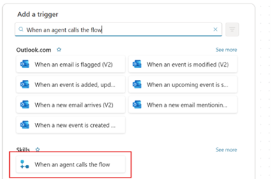
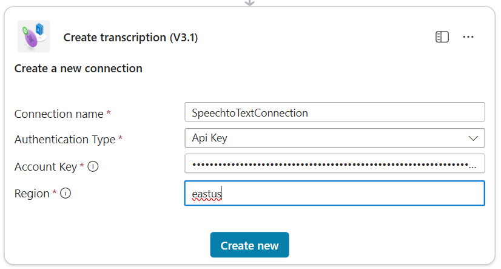
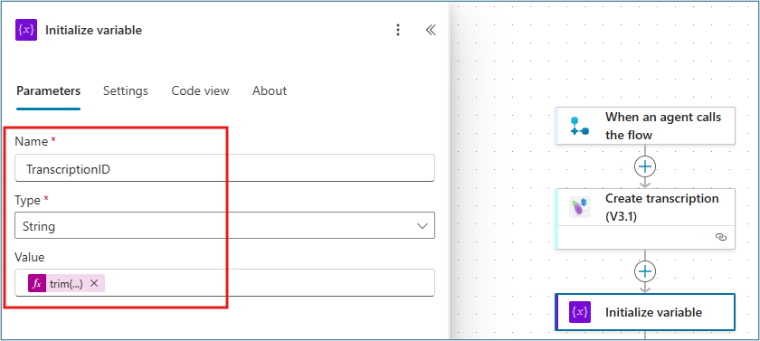
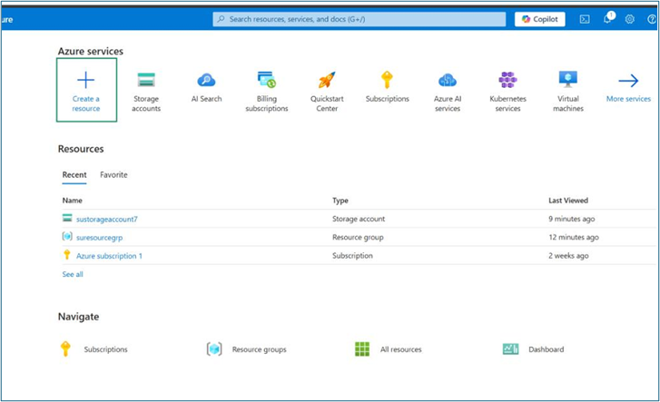
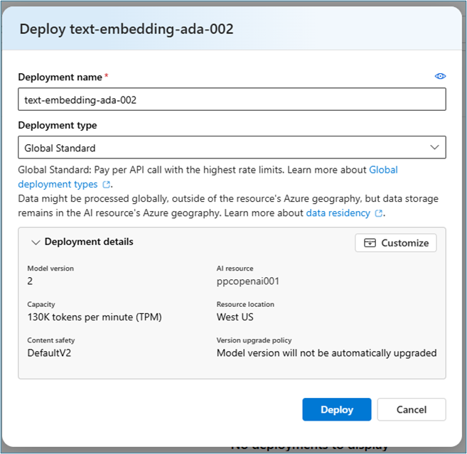
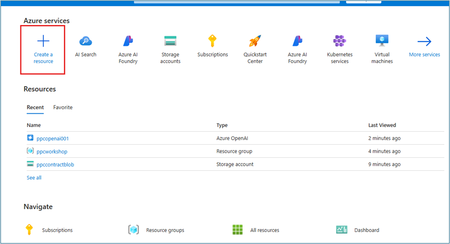
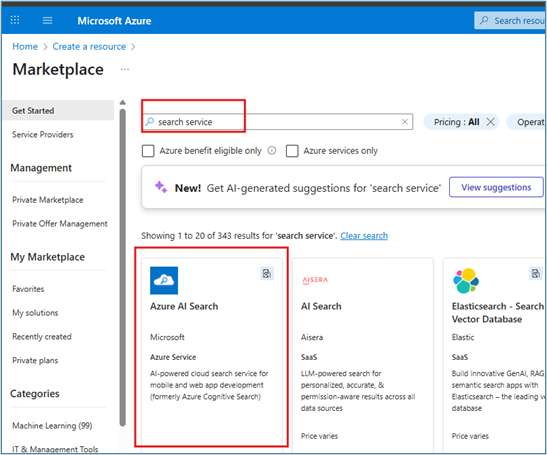
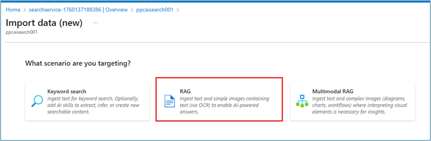

# Proactive Contract Alerts in Teams with Azure AI Search and Speech-to-Text - Build Intelligent Event-Driven Agents

Configure Copilot Studio agents to proactively notify users, search contract documents, and transcribe audio files using Azure AI services.

---

## 🧭 Lab Details

| Level | Persona | Duration      | Purpose                                                                                                                                                                                                                                                                                                                                                                                                                                                                          |
| ----- | ------- | ------------- | -------------------------------------------------------------------------------------------------------------------------------------------------------------------------------------------------------------------------------------------------------------------------------------------------------------------------------------------------------------------------------------------------------------------------------------------------------------------------------- |
| 200   | Maker   | 60–75 minutes | After completing this lab, participants will be able to configure Copilot Studio agents to proactively notify users when new files are added to Azure Blob Storage, connect Azure AI Search as a knowledge source to enable contextual question-answering over documents, integrate Azure Speech-to-Text services to automatically transcribe audio files, and understand how to combine low-code and Azure AI-based services to extend Copilot Studio functionality end-to-end. |

---

## 📚 Table of Contents

- [Purpose](#-purpose)
- [Why This Matters](#-why-this-matters)
- [Introduction](#-introduction)
- [Core Concepts Overview](#-core-concepts-overview)
- [Documentation and Additional Training Links](#-documentation-and-additional-training-links)
- [Prerequisites](#-prerequisites)
- [Summary of Targets](#-summary-of-targets)
- [Use Cases Covered](#-use-cases-covered)
- [Instructions by Use Case](#️-instructions-by-use-case)
  - [Use Case #1: Event-Driven Contract Notifications](#-use-case-1-event-driven-contract-notifications)
  - [Use Case #2: Intelligent Document Search and Audio Transcription](#-use-case-2-intelligent-document-search-and-audio-transcription)
- [Summary of Learnings](#-summary-of-learnings)
- [Azure Setup (For Reference Only)](#️-azure-setup-for-reference-only)

---

## 🎯 Purpose

After completing this lab, participants will be able to:

- Configure **Copilot Studio agents** to proactively **notify users** when new files are added to **Azure Blob Storage**.
- Connect **Azure AI Search** as a knowledge source to enable contextual question-answering over documents in Azure Blob Storage.
- Integrate **Azure Speech-to-Text** services to automatically **transcribe audio files** and return insights through Copilot Studio.
- Understand how to combine **Low-code** and **Azure AI-based** services to extend **Copilot Studio** functionality end-to-end.

## 🤔 Why This Matters

This lab demonstrates how Copilot Studio can move beyond simple chat-based interactions into **real-world automation and intelligence**.

By connecting to **Azure** services like **Blob Storage**, **AI Search**, and **Speech**, makers learn to:

- **Bridge data and conversation** — allowing copilots to proactively respond to real business events such as new contracts or uploaded files.

- **Add enterprise-grade knowledge** — enabling copilots to access and reason over indexed data sources securely.

- **Infuse AI capabilities** — such as document understanding and transcription, without custom coding.

Together, these skills showcase how **Copilot Studio + Azure AI** can transform business workflows into intelligent, event-driven experiences that blend **automation, knowledge, and natural language**.

---

## 🌐 Introduction

As organizations adopt AI copilots across departments, the real value comes not from basic Q&A, but from connecting those copilots to **real business data and workflows**.

Modern enterprises generate information continuously—from uploaded contracts and customer calls to indexed knowledge in Azure. However, unless your copilot can access, interpret, and act on that data, its usefulness remains limited.

This lab focuses on closing that gap — teaching you how to turn **Copilot Studio** into a truly **data-aware**, **event-driven assistant** powered by **Azure AI** and **Power Platform**.

This lab series (Lab 2) is designed to show how **Copilot Studio** can be extended through real-world **Azure AI** integrations. Each sub-lab builds on the previous one to help makers understand how to connect conversational agents to enterprise data, events, and intelligence.

The lab is divided into **three guided modules (2A, 2B, and 2C)** plus an **Azure setup reference** section:

- **Lab 2A – Notify users when new contract documents are added to Azure Blob Storage**  
  Participants build an event-driven agent flow that monitors an Azure Blob container and proactively sends Teams notifications when new files are uploaded. This introduces the concept of *trigger-based automation* within Copilot Studio.

- **Lab 2B – Configure Azure AI Search on Blob Storage**  
  Attendees connect Copilot Studio to a pre-created Azure AI Search index so their copilot can retrieve and summarize content from contract documents. This demonstrates *knowledge integration and semantic search* capabilities.

- **Lab 2C – Speech-to-Text Integration with Copilot Studio**  
  Participants integrate Azure Speech Service with Copilot Studio to transcribe uploaded audio files and return the transcript through the agent. This module adds *AI-driven audio understanding* to the copilot's skillset.

- **Azure Setup (Reference)**  
  The appendix provides background on how the Azure resources (Blob Storage, AI Search, OpenAI embedding model, and Speech Service) were provisioned.
  For this workshop, all **Azure components are pre-created**, and attendees are supplied with the necessary endpoints and keys so they can focus entirely on building and testing within Copilot Studio.

Together, these modules illustrate how to evolve a Copilot from a simple chat interface into a connected, intelligent assistant that can see, search, and listen across enterprise data sources.

## 💼 Real-world example

Imagine a **sales operations team** that handles dozens of new contracts and client calls every week.  

**Before:**  

- They manually check shared folders for new contracts
- Send an email or provide updates in Teams manually
- Listen to entire recordings just to confirm details

**After:** With the capabilities built in this lab, their Copilot automatically:

- Detects new contracts uploaded to **Azure Blob Storage**.
- Extracts key details like **contract number**, **vendor**, and **effective date** and posts a short update in **Teams**.
- Answers questions like “What’s the renewal term for Contoso?” using **Azure AI Search**.
- Transcribes **customer meeting recordings** into text, allowing instant summaries or quick keyword searches.

---

## 🎓 Core Concepts Overview

| Concept                                         | Why it matters                                                                                                                                                                                                                                                                                           |
| ----------------------------------------------- | -------------------------------------------------------------------------------------------------------------------------------------------------------------------------------------------------------------------------------------------------------------------------------------------------------- |
| **Event-driven Copilot Flows**                  | Enables copilots to react automatically to real-world triggers (like new files in Azure Blob Storage). This bridges the gap between conversational AI and operational workflows, delivering faster user notifications and reducing manual tracking while maintaining enterprise security and compliance. |
| **Connecting Azure Services to Copilot Studio** | Shows how to extend copilots beyond chat by connecting them securely to Azure resources (Blob Storage, AI Search, Speech). This integration gives copilots access to enterprise data and intelligence while maintaining governance, enabling true digital transformation of business processes.          |
| **Azure AI Search as Knowledge Source**         | Demonstrates how to add contextual understanding by letting copilots query and summarize enterprise documents. This makes business data instantly searchable and conversational, improving productivity and decision-making by transforming static documents into interactive knowledge.                 |
| **Speech-to-Text Integration**                  | Introduces real-time AI transcription capabilities so copilots can understand and summarize customer calls or meetings. This adds "hearing" to your Copilot—turning unstructured audio into structured insights for teams, enabling faster follow-ups and better customer service.                       |

---

## 📄 Documentation and Additional Training Links

- [Advanced proactive messaging - Microsoft Copilot Studio | Microsoft Learn](https://learn.microsoft.com/en-us/microsoft-copilot-studio/advanced-proactive-message)
- [Connect to Azure AI Search - Microsoft Copilot Studio | Microsoft Learn](https://learn.microsoft.com/en-us/microsoft-copilot-studio/knowledge-azure-ai-search)
- [Azure Speech Service documentation | Microsoft Learn](https://learn.microsoft.com/en-us/azure/ai-services/speech-service/)
- [Azure Blob Storage triggers in Power Automate | Microsoft Learn](https://learn.microsoft.com/en-us/power-automate/triggers-introduction)

---

## ✅ Prerequisites

- **Access to Microsoft Copilot Studio**, with permissions to create, edit, and publish agents and agent flows.
- Contoso Agent created in **Lab 1** (or equivalent Copilot Studio agent).
- **Microsoft Teams account** to test Copilot notifications and interactions.
- **Provided connection details** (endpoint URLs, access keys, and container names) for pre-created Azure resources—including Blob Storage, AI Search, and Speech Services.
- **Power Platform environment** enabled for Copilot Studio.
- **Basic familiarity** with Copilot Studio concepts such as agent setup, knowledge sources, and flows.

> [!NOTE] All Azure related resources are pre-provided for this lab. However we do provide instructions in this section **Azure Setup (For Reference Only)** section in the Appendix, if you want to set up these resources in your own subscription. 

---

## 🎯 Summary of Targets

In this lab, you'll transform your Copilot Studio agent into an intelligent, event-driven assistant that connects to Azure AI services. By the end of the lab, you will:

- Configure proactive notifications triggered by new files in Azure Blob Storage with AI-powered content extraction.
- Connect Azure AI Search as a knowledge source to enable semantic search over contract documents.
- Integrate Azure Speech-to-Text services for automatic audio transcription and insights.
- Understand the architecture of combining low-code Power Platform tools with Azure AI services.
- Apply event-driven automation patterns that extend beyond simple chat interactions.

---

## 🧩 Use Cases Covered

| Step | Use Case                                                                                                                | Value added                                                                                             | Effort |
| ---- | ----------------------------------------------------------------------------------------------------------------------- | ------------------------------------------------------------------------------------------------------- | ------ |
| 1    | [Event-Driven Contract Notifications](#-use-case-1-event-driven-contract-notifications)                                 | Automate contract processing with proactive Teams notifications and AI-powered content extraction       | 35 min |
| 2    | [Intelligent Document Search and Audio Transcription](#-use-case-2-intelligent-document-search-and-audio-transcription) | Enable semantic document search and speech-to-text capabilities for comprehensive business intelligence | 30 min |

---

## 🛠️ Instructions by Use Case

---

## 🧱 Use Case #1: Event-Driven Contract Notifications

Build an intelligent agent flow that automatically detects new contract uploads and sends proactive Teams notifications with AI-extracted key details.

| Use case                            | Value added                                                                                       | Estimated effort |
| ----------------------------------- | ------------------------------------------------------------------------------------------------- | ---------------- |
| Event-Driven Contract Notifications | Automate contract processing with proactive Teams notifications and AI-powered content extraction | 35 minutes       |

**Summary of tasks**

In this section, you'll learn how to create event-driven agent flows that monitor Azure Blob Storage, extract contract information using AI Builder, and send proactive notifications to Teams.

**Scenario:** A sales operations team needs automatic notifications when new contracts are uploaded, with key details extracted and shared in Teams without manual intervention.

### Objective

Create and configure an event-driven flow that monitors Azure Blob Storage for new contracts, extracts key information using AI, and sends proactive Teams notifications.

---

### Step-by-step instructions

#### Lab 2A: Notify Users When New Contract Documents Are Added to Azure Blob Storage

In this lab, you’ll create an **event-driven Agent Flow** that automatically alerts users in **Microsoft Teams** whenever a new contract document is uploaded to Azure Blob Storage.
Using **Agent Flows** within **Copilot Studio**, you’ll connect your agent to **Blob Storage**, extract key contract details using **custom prompts**, and send a neatly formatted **Teams** message.
By the end of this module, your copilot will be able to **detect new files**, **understand what they contain**, and **proactively notify users** — bringing real-time awareness into your business workflows.

#### Prepare and Publish Your Agent

2A.1 Open the **Contoso Agent** that was built in Lab 1 and **Publish** it.

> [!IMPORTANT]
> We are required to publish the Agent to Teams and Microsoft 365 Copilot channel so that the agent can message/ping proactively in Teams.


2A.2 Select the **Channels** tab and click on **Teams and Microsoft 365 Copilot**, then select **Add channel**.


#### Create Event-Driven Agent Flow

2A.3 Select **Flows** and click on **+ New agent flow** to add a new Agent Flow to notify users when new documents are uploaded to blob storage.


2A.4 In the designer, select **Add a trigger node** and search for **blob**. Select **When a blob is added or modified (properties only) (V2)** trigger.


2A.5 Select **change connection reference** to add a new connection. Provide the following details to connect to Azure Blob Storage account:

- **Connection name:** `ContractsBlobStorage`
- **Authentication type:** `Access Key`
- **Azure Storage Account Name:** `ppccontractblob`
- **Azure Storage Account Access Key:** `[Provided in LAB Environment]`


2A.6 Once the connection is setup, use the dropdown to select the **Storage account name** in the container.


#### Configure Blob Content Processing

2A.7 Add a new action – **Get Blob Content (V2)** in the Azure Blob Storage actions to the flow.


2A.8 Since the connection is already established to blob storage account, you can select the **Storage account name** from the dropdown menu. For the **Blob** field, type `/` and then container name. Then `/` and add the Dynamic content from the trigger node – `body/Name` (Ex: `/{Container Name}/{Dynamic Content}`).


2A.9 We will be using pre-built AI builder prompt – **Extract information from Contract** to extract all the information from the documents. Add a **new action** in the flow and select action - **Extract information from Contract**.


2A.10 In the **Extract information from Contract** action parameters, select **Dynamic content** as **File Content** (from Get Blob content node) into **Contract file** field.


#### Create Custom AI Prompt for Notifications

2A.11 We will use another custom AI builder prompt to extract the key details (ContractID, Customer Name, Vendor Name and Effective Date) for the notification. Add a **new action** in the flow and select action – **Run a prompt**.


2A.12 Click the dropdown in the **Prompt** and then **+New custom prompt** under Prompt parameter to create a new prompt.


2A.13 In the new pop-up prompt window, update the prompt name to – **Extract Contract Info**.

Copy and paste the following in the instructions:

```
Extract Contract Number, Customer name, Vendor name and Date from {ContractInput} and Provide extracted information like following:  

New Contract Available for Review:
Contract Number: AW2024-003
Customer Name: Adventure Works
Vendor Name: Contoso Solutions Inc.
Date (Effective Date): March 10, 2024
```


2A.13a Replace `{ContractInput}` with a new input parameter. Delete the text in the instructions and keep your cursor in that spot. Click  **+ Add Content**, select **Text** and name it `ContractInput`. Click Close. Your instructions should now look the screenshot above. Click **Save**.


2A.14 Select the newly created prompt in the dropdown for **Prompt** and pass the dynamic content **Body** (from Extract information from contract node) into **ContractInput**.


> [!TIP]
> If you do not see the Body from the Extract information from contract node action, you can click **See more** to view all the dynamic content.


> [!TIP]
> If you still don't see the Body, click on **Insert Expression** and paste the following expression:  
> `body('Extract_information_from_Contract')`  
> and click **Add**.


#### Send Teams Notification

2A.15 Add a new action into the flow – **Post a message in a chat or channel** to send a message to a user on Teams regarding the new contract document. Configure the parameters as:

- **Post as:** `Power Virtual Agents (preview)`
- **Post in:** `Chat with bot`
- **Bot:** `Contoso Agent`
- **Recipient:** `<Your lab user account>`
- **Message:** `Text` (Insert Dynamic Content and Select from **Run a prompt** action)


2A.16 Switch to the overview tab and click **edit** to change the name of the flow to – **New Contracts Notification** and select **Save**.


2A.17 Click on **Publish** to Publish the Agent flow.


#### Testing Lab 2A

As new documents are added to Blob Storage, you should see a proactive notification from your Contoso Agent with key details as shown below. **Open Teams** in the browser using your lab credentials and **open your Contoso Agent**.  
The proctors will be adding documents to the Azure Blob storage every 5 – 10 minutes to trigger the agent flow.


Try asking for a follow-up question on this contract and the note that the agent does not provide a good answer yet!  
This is what we will achieve next in **Lab 2B**.


---

### 🏅 Congratulations! You've completed Event-Driven Contract Notifications

---

### Test your understanding

**Key takeaways:**

- **Event-Driven Automation** – Blob storage triggers enable real-time responses to business events, eliminating manual monitoring and notification processes.
- **AI-Powered Content Extraction** – AI Builder prompts can automatically extract structured information from unstructured documents, making data immediately actionable.
- **Proactive Communication** – Copilot Studio agents can initiate conversations in Teams, bringing intelligence directly into collaborative workspaces.

**Lessons learned & troubleshooting tips:**

- Agents must be published to Teams channel before they can send proactive messages
- Use dynamic content carefully and check "See more" if expected options don't appear
- AI Builder prompts require clear instructions and proper input parameter mapping

**Challenge: Apply this to your own use case**

- What other document types in your organization could benefit from automated processing and notification?
- How would you modify the AI prompt to extract different types of business-critical information?
- Consider what other Azure services could trigger similar automated workflows.

---

## 🔄 Use Case #2: Intelligent Document Search and Audio Transcription

Connect Azure AI Search for semantic document search and integrate Speech-to-Text services for comprehensive business intelligence capabilities.

| Use case                                            | Value added                                                                                             | Estimated effort |
| --------------------------------------------------- | ------------------------------------------------------------------------------------------------------- | ---------------- |
| Intelligent Document Search and Audio Transcription | Enable semantic document search and speech-to-text capabilities for comprehensive business intelligence | 30 minutes       |

**Summary of tasks**

In this section, you'll learn how to connect Azure AI Search as a knowledge source for semantic document search and integrate Azure Speech Services for automatic audio transcription.

**Scenario:** Users need to ask natural language questions about contracts and get instant answers, plus the ability to transcribe customer call recordings for quick insights and searchable content.

### Step-by-step instructions

#### Lab 2B: Configure Azure AI Search on Blob Storage

In this lab, you’ll connect your Copilot Studio agent to **Azure AI Search** so it can intelligently retrieve and summarize information from contract documents stored in Azure Blob Storage.  
You’ll use a pre-created search index and link it as a **knowledge source** for your agent, giving it the ability to answer natural language queries like `What are the renewal terms for Fourth Coffee’s contract?`  
By the end of this module, your copilot will be able to **search**, **understand**, and **respond** using real contract data—transforming static documents into conversational knowledge.

**Pre-requisite:** Azure AI Search configured in Azure portal with text embedding model on Azure Blob storage account where all contract documents are stored

2B.1 Open **Contoso Agent** and click on **+Add Knowledge** on the overview tab.


2B.2 Select **Azure AI Search**.


2B.3 Click on **Your connections** and select **Create new connection**.


2B.4 Use the provided Endpoint URL and Access Key to connect to Azure AI Search service:

- **Endpoint URL:** `https://ppcaisearch001.search.windows.net`
- **Azure AI Search Admin Key:** `[Provided in LAB Environment]`


2B.5 Select the available index and select **Add to agent**.


2B.6 Once the Azure AI Search service is connected as knowledge source, select it to edit the **Name** and **Description**.


2B.7 Update the following and then click **Save**:

- **Name:** `Contoso Contracts`
- **Description:**

     ```
     This knowledge source provides access to customer contract agreements. Each 
     contract file follows the format: Customer Contract Agreement - [Customer Name].docx 
     
     Each contract contains essential details, including: 
     • Scope of Services: Defines the services provided  
     • Payment Terms: Specifies the total contract value, milestone-based payments, and due dates. 
     • Service Level Agreement (SLA): Outlines uptime guarantees, response times, and escalation procedures. 
     • Data Privacy & Compliance: Ensures compliance with regulations like GDPR, CCPA, and defines data ownership. 
     • Contract Term & Renewal: States the contract duration, renewal policies, and termination conditions. 
     • Governing Law: Specifies applicable legal jurisdiction
     ```


2B.8 Go to **Agent Overview** tab and click **Edit** to add additional instruction to the agent instructions, then click **Save**:

   ```
   For Contract related queries, use the Contoso Contracts knowledge source
   ```


#### Testing Lab 2B

In your test window, send a message like: `Contract terms and renewal details for Fourth Coffee`


#### Lab 2C: Speech-to-Text Integration with Copilot Studio

In this lab, you’ll integrate your copilot with **Azure Speech Services** to transcribe customer or meeting recordings directly within Copilot Studio.  
You’ll build a flow that uploads an audio file, sends it to Azure Speech for transcription, retrieves the text, and returns it to the user through the agent.  
By the end of this module, your copilot will be able to **listen and understand audio content**, turning long recordings into instantly searchable text and actionable insights.

**Pre-requisites:**

- Azure Speech Service created
- Azure Blob container to hold audio files

2C.1a In Copilot Studio, open **Agent Flows**, Select **+New agent flow**.


2C.2 Add a Trigger – **When an agent calls the flow**.



2C.3 Add a new action **Create transcription (V3.1)** from **Azure Batch Speech-to-text** actions.


2C.4 Create connection with provided details then click **Create new**:

- **Connection name:** `SpeechtoTextConnection`
- **Auth. Type:** `API Key`
- **Account Key:** `[Provided in LAB Environment]`
- **Region:** `eastus`



2C.5 Add the following Action parameters for **Create transcription (V3.1)**:

- **Transcription/locale:** `en-US`
- **Transcription/displayName:** `Call transcription`
- **transcription/contentUrls:** (Advanced Parameters) `[Provided in LAB Environment - Audio File URL]`


2C.6 Add an **Initialize variable** action with Parameters:

- **Name:** `TranscriptionID`
- **Type:** `String`
- **Value:** `trim(last(split(outputs('Create_transcription_(V3.1)')?['body/self'], '/')))` (Insert expression)



2C.7 Add a **Delay** action with Count = 30 and Unit = Second.


2C.8 Add a **Get transcriptions list files (V3.1)** from **Azure Batch Speech-to-text** actions and pass the ***TranscriptionID*** variable as Dynamic Content from the earlier step.


2C.9 Add a **Get transcription file (V3.1)** action with Parameters:

- **Id:** `variables('TranscriptionID')`
- **File Id:** `last(split(first(body('Get_transcriptions_list_files_(V3.1)')?['values'])?['self'], '/files/'))` - ***Add this using the Insert expression***


2C.10 Add an **HTTP** action with:

- **URI:** `body('Get_transcription_file_(V3.1)')?['links']?['contentUrl']`

> [!NOTE]
> You will not see the icon from the **Get transcription file** until it resolves.  It will first show as an expression.

- **Method:** `GET`
- **Headers Key:** `Accept`
- **Headers Value:** `application/json`


2C.11 Add a **Compose** action. In the **Inputs** field paste: `body('HTTP')?['combinedRecognizedPhrases']`

> [!NOTE]
> You will not see the icon from the **HTTP** action until it resolves.  It will first show as an expression.


2C.12 Add an Action - **Respond to the Agent** with a Text output parameter:
    - **Name:** `Transcript`
    - **Value:** `first(outputs('Compose'))?['display']`


2C.13 Click on **Save draft** to save the agent flow. Go to **Overview** tab and update the flow name to – **Transcribe Customer Call** and **Publish** the flow.


2C.14 Open the **Contoso Agent**, go to **Tools** tab and select **+Add a tool**.


2C.15 In the **Add tool** window, Select **Flow** filter and select the newly created **Transcribe Customer Call** flow and add to the agent by selecting **Add to agent** button.


2C.16 You should see the flow added as shown below  


2C.17 In the Contoso Agent **Overview** tab, update instructions to direct the agent to this Agent flow for customer call insights as shown below. .


To get the actual tool listed in the instructions. Type `/` and then scroll down and select the **Transcribe Agent Flow**.


#### Testing Lab 2C

In your Agent **Test pane**, send a message:  

`Customer call insights`.  

(If prompted, create the required connection and retry)


---

### 🏅 Congratulations! You've completed Intelligent Document Search and Audio Transcription

---

### Test your understanding

- How does Azure AI Search improve the agent's ability to answer contract-related questions compared to basic document storage?
- What are the key components required for Speech-to-Text integration, and how do they work together?
- How would you extend this approach to handle different audio formats or languages?

**Challenge: Apply this to your own use case**

- Consider what other document types in your organization could benefit from semantic search capabilities
- Think about different audio sources (meetings, voicemails, interviews) that could be transcribed and analyzed
- Explore how you could combine search results with transcription insights for comprehensive business intelligence

---

## 🏆 Summary of learnings

True learning comes from doing, questioning, and reflecting—so let's put your skills to the test.

To maximize the impact of intelligent, event-driven Copilot Studio agents:

- **Event-Driven Architecture** – Design agents that respond automatically to real business events, eliminating manual monitoring and creating proactive workflows
- **AI-Powered Content Processing** – Leverage AI Builder and Azure AI services to extract structured insights from unstructured data sources
- **Multi-Modal Intelligence** – Combine document search, speech transcription, and conversational AI to create comprehensive business intelligence solutions
- **Secure Azure Integration** – Connect Copilot Studio to enterprise Azure services while maintaining security, compliance, and governance standards
- **User-Centric Design** – Build agents that deliver intelligence directly in collaborative workspaces like Teams where users already work

---

### Conclusions and recommendations

**Intelligent Agent Development golden rules:**

- Always publish agents to appropriate channels before implementing proactive messaging capabilities
- Design AI prompts with clear instructions and structured output formats for consistent results
- Implement proper error handling and delays when integrating with external Azure services
- Use semantic search and knowledge sources to ground agent responses in enterprise data
- Test integration points thoroughly with realistic data and scenarios
- Consider the full user workflow when designing proactive notifications and responses

By following these principles, you'll create powerful, intelligent agents that seamlessly integrate enterprise data, events, and AI capabilities into natural conversational workflows—transforming how organizations process information and respond to business events.

---

## ⚙️ Azure Setup (For Reference Only)

This section provides background on the **Azure resources** that power your agent capabilities—**Blob Storage**, **Azure AI Search**, **Azure OpenAI embeddings**, and **Speech Services**. You don't need to perform these steps for the lab as these resources are **already pre-created for this lab**. This reference helps you understand how each component fits into the overall solution architecture. You'll see how contract documents are stored, indexed, and transcribed behind the scenes—so you can replicate or extend this setup in your own environment later.

### A. Create Azure Blob Storage Account with Container

**Prerequisites:**

- Azure Subscription

**Step-by-step instructions:**

1. Login to **Azure Portal**, in the home screen, click on **Create a resource** and search for **storage account**

   

2. Create a **storage account** by selecting the right values

   

3. Once the storage account is created and ready, click on **Go to resources**

   

4. Under **data storage**, select **Containers** and select **+ Add container**

   

5. Add a name for the container and click **Create**

   

6. In the **storage account resource**, select **Access keys** under **security + networking** tab

   

7. Copy the **storage account name** and one of the **key** values for connecting to it from the **Agent Flow**

   

### B. Azure AI Search on Contracts Stored in Azure Blob Storage

**Pre-requisite:** Ensure all the contract documents are added to the container inside the storage account


In the following steps, we will be creating:

- Create **Azure OpenAI resource** and **deploy an embedding model**
- Create **Azure AI Search** resource
- **Import & vectorize Blob data** with Azure AI Search
- Obtain **endpoint and keys** for the Search service

**Step-by-step instructions:**

1. Go to the **Azure Portal home screen** and click on **Create a resource**

   

2. Search for **Azure OpenAI** and select it to create a new Azure OpenAI resource

   

3. Click **Create**

   

4. Select right values for creating an Azure OpenAI resource and click on **Next** until the last step

   

5. Review values and select **Create**

   

6. Once the Azure OpenAI resource is ready, click on **Go to resource**

   

7. Select **Explore Azure AI Foundry portal** (This should open a new browser window)

   

8. In the **Azure AI Foundry** portal, ensure the right **Azure OpenAI resource** is selected. Click on **Deployments**

   

9. Select **text-embedding-ada-002** model for deployment and confirm

   

10. Ensure the deployment details reflect the right values and click on **Deploy**

    

11. Go to the **Azure portal home page** and select **Create a resource**

    

12. Search for **search service** and select **Azure AI Search**

    

13. Click on **Create**

    

14. Configure search service with right values and select **Review + Create**

    

15. Review the values and select **create**

    

16. Once the search service is deployed, select **Go to resource**

    

17. Select **Import data (new)** option

    

18. Select **Azure blob storage** as data source as we're configuring the search on documents in the blob

    

19. Select **RAG** scenario

    

20. Configure values to connect to the data source (Blob storage) and select **Next**

    

21. Select values to vectorize your text and select **Next** until the last step

    

22. Update the **index name**, review all details and click **Create**

    

23. Once the data is connected to search service, select the **Overview** tab in your search service and copy the URL (We will use this in Copilot Studio for connecting to search service)

    

24. Expand **settings** tab and click on **Keys**, copy one of the key values (We will use this in Copilot Studio for connecting to search service)

    

### C. Create Azure Speech Service and Azure Blob Container for Audio Files

1. In Azure portal, search and select **Azure AI services** resource

   

2. Select **Create**

   

3. Configure Azure AI service as shown below and create it

   

4. Once the resource is created, click on **Go to resource**

   

5. Select **keys and Endpoint** under **Resource management** to copy the **Key** and **Location/Region** values

   

6. Select the existing Blob Storage account and **add a new container** to host audio files

   

7. Provide a container name and click create

   

8. Upload an audio file (ex: Customer call recording) into the container

   

9. Select the uploaded audio file and Click on **Generate SAS** to get the **Blob SAS URL**

   

---
