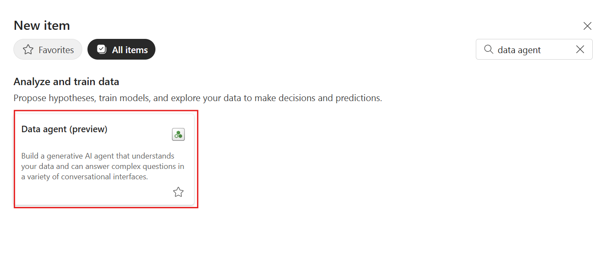
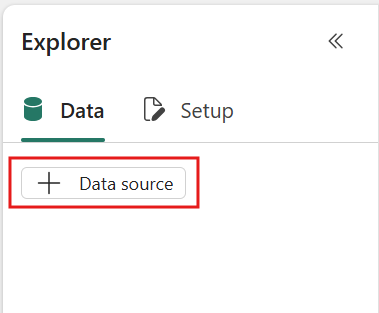
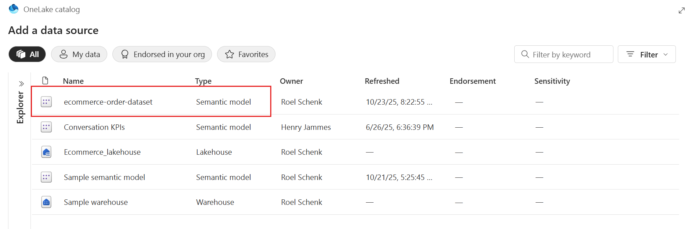
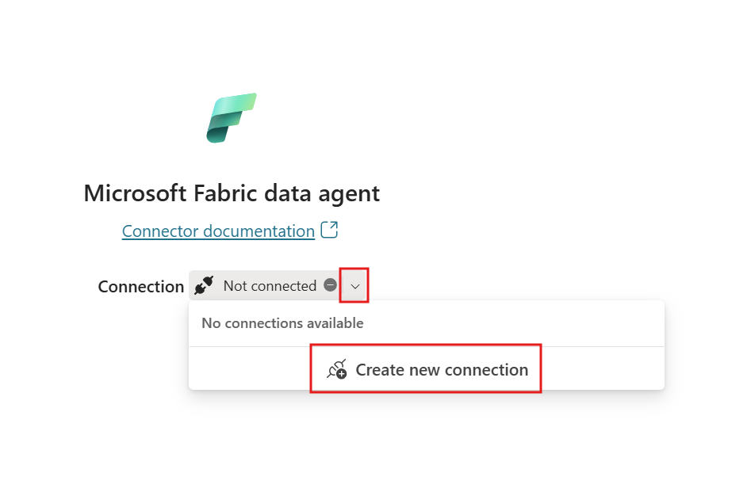

# Connecting Fabric Data Agents with Microsoft Copilot Studio

Build intelligent agent-to-agent communication between Microsoft Fabric Data Agents and Copilot Studio to unlock powerful e-commerce analytics capabilities.

---

## 🧭 Lab Details

| Level | Persona         | Duration   | Purpose                                                                                                                                                                                                                                                                                                                                                                                                               |
| ----- | --------------- | ---------- | --------------------------------------------------------------------------------------------------------------------------------------------------------------------------------------------------------------------------------------------------------------------------------------------------------------------------------------------------------------------------------------------------------------------- |
| 300   | Maker/Developer | 20 minutes | After completing this lab, participants will be able to create and configure Fabric Data Agents with meta-prompts, establish a connection with Fabric Data agents from  Microsoft Copilot Studio, and enable intelligent data querying through connected agents. Participants will gain hands-on experience with agent orchestration and understand how to leverage AI-powered data agents for business intelligence. |

---

## 📚 Table of Contents

- [Why This Matters](#-why-this-matters)
- [Introduction](#-introduction)
- [Core Concepts Overview](#-core-concepts-overview)
- [Documentation and Additional Training Links](#-documentation-and-additional-training-links)
- [Prerequisites](#-prerequisites)
- [Summary of Targets](#-summary-of-targets)
- [Use Cases Covered](#-use-cases-covered)
- [Instructions by Use Case](#️-instructions-by-use-case)
  - [Use Case #1: Creating and Configuring the Fabric Data Agent](#-use-case-1-creating-and-configuring-the-fabric-data-agent)
  - [Use Case #2: Connecting Fabric Agent to Copilot Studio](#-use-case-2-connecting-fabric-agent-to-copilot-studio)

---

## 🤔 Why This Matters

**Makers and Developers** - Stop struggling with disconnected data systems and manual query writing that limits your AI agents' potential.

Think of multi-agent communication like having a team of specialized experts:

- **Without connected agents**: Each system works in isolation, requiring manual data extraction and integration, leading to slower insights and limited capabilities
- **With connected agents**: Your Copilot Studio agent can seamlessly delegate data queries to specialized Fabric agents, providing instant, accurate analytics without manual intervention

**Common challenges solved by this lab:**

- "My Copilot can't access our Fabric data models directly"
- "We need complex SQL knowledge to query our semantic models"
- "Our agents can't collaborate to answer multi-faceted business questions"
- "Setting up data connections for each agent is time-consuming and error-prone"

**In just 20 minutes, you'll transform isolated systems into a collaborative AI ecosystem that amplifies your organization's data intelligence capabilities.**

---

## 🌍 Introduction

Modern organizations need AI agents that can work together, sharing specialized knowledge to answer complex business questions. Microsoft Fabric Data Agents and Copilot Studio's MCP Server communication capabilities make this possible, but setting up this orchestration requires understanding both platforms and their integration points.

**Real-world example:** Imagine your sales team asking: "Which products are underperforming this quarter, what's causing the trend, and what actions should we take?" Without connected agents, answering this requires multiple tools, manual data extraction, and hours of analysis. With properly configured Fabric Data Agent MCP connection, your Copilot Studio agent instantly consults the Fabric Data Agent for analytics, combines it with business context, and provides actionable recommendations—all in seconds.

By mastering the techniques in this lab, you'll enable your organization to build sophisticated AI solutions where specialized agents collaborate seamlessly, turning complex data questions into instant, actionable insights.

---

## 🎓 Core Concepts Overview

| Concept                | Why it matters                                                                                                                                                                                                |
| ---------------------- | ------------------------------------------------------------------------------------------------------------------------------------------------------------------------------------------------------------- |
| **Fabric Data Agents** | Specialized AI agents that understand your semantic models and can translate natural language into accurate data queries, eliminating the need for SQL expertise while ensuring data accuracy and governance. |
| **Meta-Prompts**       | Advanced prompting techniques that help agents generate their own optimal instructions, ensuring consistent, high-quality responses tailored to your specific data domain and use cases.                      |
| **Semantic Models**    | Pre-defined data relationships and business logic in Fabric that ensure all agents work with consistent, governed data definitions, preventing conflicting interpretations and ensuring accuracy.             |

---

## 📄 Documentation and Additional Training Links

- [Microsoft Fabric Data Agents Documentation](https://learn.microsoft.com/fabric/data-agents/overview)
- [Copilot Studio Add Other Agents (preview)](https://learn.microsoft.com/en-us/microsoft-copilot-studio/authoring-add-other-agents)
- [Fabric Semantic Models Best Practices](https://learn.microsoft.com/fabric/semantic-models/best-practices)
- [Consume a Fabric Data Agent in Microsoft Copilot Studio (preview)](https://learn.microsoft.com/en-us/fabric/data-science/data-agent-microsoft-copilot-studio)

---

## ✅ Prerequisites

- Access to Microsoft Copilot Studio with available message packs
- A Fabric capacity (any tier) with access to the "Workshop Demo Workspace"
- Basic familiarity with Microsoft Fabric workspaces and Copilot Studio
- Access to the e-commerce dataset in the shared workspace
- Permissions to create agents in your assigned Copilot Studio environment

---

## 🎯 Summary of Targets

In this lab, you'll build an intelligent agent ecosystem by creating a Fabric Data Agent and connecting it to Copilot Studio. By the end of the lab, you will:

- Create and configure a Fabric Data Agent with access to e-commerce semantic models
- Generate optimized agent instructions using meta-prompting techniques
- Establish agent-to-agent communication between Fabric and Copilot Studio
- Test the integrated solution with progressively complex e-commerce queries
- Understand how to scale this pattern for your own data domains

---

## 🧩 Use Cases Covered

| Step | Use Case                                                                                                      | Value added                                                                                                                        | Effort |
| ---- | ------------------------------------------------------------------------------------------------------------- | ---------------------------------------------------------------------------------------------------------------------------------- | ------ |
| 1    | [Creating and Configuring the Fabric Data Agent](#-use-case-1-creating-and-configuring-the-fabric-data-agent) | Build a specialized data agent that understands your e-commerce semantic model and responds accurately to natural language queries | 12 min |
| 2    | [Connecting Fabric Agent to Copilot Studio](#-use-case-2-connecting-fabric-agent-to-copilot-studio)           | Enable your Copilot Studio agent to leverage Fabric data intelligence                                                              | 8 min  |

---

## 🛠️ Instructions by Use Case

---

## 🧱 Use Case #1: Creating and Configuring the Fabric Data Agent

Transform your e-commerce semantic model into an intelligent, conversational data agent using meta-prompts for optimal configuration.

| Use case                                       | Value added                                                                                                                        | Estimated effort |
| ---------------------------------------------- | ---------------------------------------------------------------------------------------------------------------------------------- | ---------------- |
| Creating and Configuring the Fabric Data Agent | Build a specialized data agent that understands your e-commerce semantic model and responds accurately to natural language queries | 12 minutes       |

**Summary of tasks**

In this section, you'll learn how to create a Fabric Data Agent, connect it to your semantic model, and optimize it using meta-prompting techniques.

**Scenario:** Your organization has rich e-commerce data in Fabric but business users struggle to extract insights without SQL knowledge. You need to create an intelligent agent that can understand natural language questions and provide accurate analytics from your semantic model.

### Objective

Create and configure a Fabric Data Agent that can intelligently query the e-commerce dataset using natural language, with optimized instructions generated through meta-prompting.

---

### Step-by-step instructions

#### Initial Setup and Navigation

1. Navigate to [fabric.microsoft.com](https://fabric.microsoft.com) and sign in with your credentials.

2. On the left-hand navigation panel, select **Workspaces** and then select **Workshop Demo Workspace**.

3. Within the workspace, locate the **e-commerce** folder. This folder contains:
   - E-commerce Data Agent (reference example)
   - E-commerce Dataset Report
   - E-commerce Order Dataset (semantic model)
   - E-commerce Lakehouse
   - SQL Endpoint

4. Open the **E-commerce Dataset Report** to familiarize yourself with the data structure and available metrics. Keep this tab open for reference.

5. Duplicate the browser tab and navigate back to **Workshop Demo Workspace**.

6. Create your personal workspace folder:
   - Click **New** > **Folder**
   - Name it with your username or another unique identifier
   - This will be your working directory for the lab

#### Creating the Fabric Data Agent

1. In your personal folder, click **New Item**.

2. Use the filter in the top-right corner and search for "data agent" to locate **Data Agent (Preview)**.

   

3. Select **Data Agent (Preview)** and provide a name following this pattern:

   ```
   [YourIdentifier]_DataAgent
   ```

   Example: `JSmith_DataAgent`

4. Click **Create** to initialize your agent.

#### Connecting the Data Source

1. In the agent setup window, locate the **Explorer** panel on the left side.

2. Click the **+ Data source** button.

   

3. Select **ecommerce-order-dataset** (Type: Semantic Model) from the results.

   

4. Click **Add** to connect the semantic model.

5. After validation completes, select all available tables:

    - Customers
    - Order_Items
    - Orders
    - Payments
    - Products

   > [!TIP]
   > Selecting all tables ensures your agent has complete context for complex queries that might span multiple data dimensions.

#### Testing Initial Functionality

1. Navigate to the **Test** pane and try these baseline queries:

    ```
    What is our total revenue?
    Show me the top 5 products by sales
    How many customers do we have?
    ```

2. Verify that the agent returns data-backed responses, by drilling down in the response you should be able to see the DAX used.

#### Optimizing with Meta-Prompts

1. In the **Setup** section, locate the **Agent instructions** field. (Alternatively, you can also locate the **Agent instructions** in the navigation bar on the top.)

2. Generate agent-level instructions using this meta-prompt in the **test pane** (on the right where it says **Test the agent's responses**):

    ```
    Meta-Prompt: Generate Agent-Level Instructions:
    Analyze your available data sources and create agent-level instructions for yourself (max 15000 chars).

    Objective: {AGENT_OBJECTIVE}
    Users: {USER_PERSONA}

    Examine your data sources: list all sources, types, and primary use. Analyze domain, time coverage, and main themes.

    Generate instructions with:
    ## Objective
    ## Data Sources (list with priority)
    ## Key Terminology (infer from columns/measures)
    ## Response Guidelines
    Style: {RESPONSE_STYLE}
    ## Handling Common Topics (3-5 based on available data)

    Custom terms: {CUSTOM_TERMINOLOGY}
    ```

   When using this meta-prompt, replace the variables manually in the prompt as per the values below **OR** paste these in the Test:

   - `{AGENT_OBJECTIVE}`: "E-commerce analytics agent for business intelligence"
   - `{USER_PERSONA}`: "Business analysts and sales teams"
   - `{RESPONSE_STYLE}`: "Clear summaries with data citations and trend analysis"
   - `{CUSTOM_TERMINOLOGY}`: Leave empty or add your domain-specific terms

3. Copy the generated response, review and adjust as needed, then paste it into the **Agent Instructions** field.

   > [!IMPORTANT]
   > Always review generated instructions for accuracy and completeness. The meta-prompt provides a strong foundation but may need minor adjustments for your specific use case.

#### Optional meta prompt if your model is not a semantic model and has multiple tables, generate data source instructions using

    ```
    Meta-Prompt: Generate Data Source Instructions
    Analyze data source {DATA_SOURCE_NAME} and create instructions (max 15000 chars).

    Examine: tables, columns, measures, relationships, hierarchies, date ranges, fact vs dimension tables, grain, data quality.

    Infer business context, KPIs, common filters.

    Generate:
    ## General Knowledge (domain, coverage, refresh)
    ## Table Descriptions (name, purpose, key columns, grain)
    ## Measures Catalog (name, calculation, usage)
    ## Relationships
    ## When Asked About [Topic] (tables, measures, filters, logic per topic)
    ## Query Best Practices (time filtering, joins, performance)

    Terms: {CUSTOM_TERMINOLOGY}
    ```

   Replace `{DATA_SOURCE_NAME}` with "e-commerce-order-dataset"

4. Test the enhanced agent with more complex queries:

    ```
    What's the average order value by customer segment?
    Which payment methods are most popular for high-value orders?
    Show me monthly revenue trends with year-over-year comparison
    ```

#### Publishing the Agent

1. Generate the agent description using this meta-prompt inside the test pane of your Fabric Agent

    ```
    Meta-Prompt: Generate Agent Description
    Create a 1-2 sentence description of yourself as a Fabric Data Agent (max 200 chars).

    Analyze your data sources and describe: what data domain you cover and what questions you answer.

    Example: "Fabric Data Agent for retail sales. Answers questions about revenue, products, customers, and trends."

    Output plain text only.
    ```

2. Click **Publish** and paste the generated description in the purpose and capabilities field.

   > [!IMPORTANT]
   > Save this description separately as you'll need it when connecting to Copilot Studio in Use Case #2.

---

### 🎯 Congratulations! You've completed Use Case #1!

---

### Test your understanding

**Key takeaways:**

- **Meta-prompts accelerate configuration** — Instead of manually writing instructions, you leverage the agent's understanding of its own data to generate optimal configurations
- **Semantic models provide governance** — By connecting to semantic models rather than raw data, you ensure consistent business logic and calculations
- **Iterative testing improves quality** — Starting with simple queries and progressively testing complex ones helps identify gaps in instructions

**Lessons learned & troubleshooting tips:**

- If the agent returns unexpected results, check that all required tables are selected in the data source configuration
- Meta-prompt outputs should always be reviewed and refined—treat them as drafts, not final versions
- Keep descriptions concise but informative for better agent-to-agent discovery

**Challenge: Apply this to your own use case**

- What other data domains in your organization could benefit from a Fabric Data Agent?
- How would you modify the meta-prompts for a financial or HR dataset?
- Consider creating specialized agents for different user personas accessing the same data

---

---

## 🔄 Use Case #2: Connecting Fabric Agent to Copilot Studio

Enable intelligent agent collaboration by connecting your Fabric Data Agent to Microsoft Copilot Studio.

| Use case                                  | Value added                                                                                               | Estimated effort |
| ----------------------------------------- | --------------------------------------------------------------------------------------------------------- | ---------------- |
| Connecting Fabric Agent to Copilot Studio | Enable your Copilot Studio agent to leverage Fabric data intelligence to enable multi-agent communication | 8 minutes        |

**Summary of tasks**

In this section, you'll learn how to create a Copilot Studio agent, establish connection to your Fabric Data Agent, and enable multi-agent communication.

**Scenario:** Your Fabric Data Agent is ready, but users prefer interacting through Copilot Studio where they can combine data insights with other business processes. You need to add the Fabric Data Agent as an MCP Server so Copilot Studio can delegate data queries to your specialized Fabric agent.

### Step-by-step instructions

#### Creating the Copilot Studio Agent

1. Open a new browser tab and navigate to [copilotstudio.microsoft.com](https://copilotstudio.microsoft.com).

2. **Optional** If the environment in the top right corner in anything else than "ddev-[your username]" make sure to select the right "ddev-[your username]".

3. In the left navigation, locate **Agents** and click the blue **New agent** button.

4. Skip the describe functionality and select **Configure**.

5. Configure your agent with these settings:

   - **Name**: `E-commerce RAG Agent`
   - **Description**: `An agent connected to a Microsoft Fabric data agent specializing in e-commerce business knowledge and support`
   - **Instructions**: Copy the instructions from the code block below
   - **Web search**: Deselect/disable this option

   **Agent Instructions:**

   ```
   You are a research assistant that provides accurate, well-sourced 
   information. Always cite your sources and include a confidence score 
   for each response.

   Citation Requirements:
   Include a "Sources" section at the end of every response

   For each source, document:
    - the tool used (web search, database query, document retrieval),
    - the specific action performed,
    - and relevant metadata (URLs, document names, timestamps)

   Cite specific information inline using the format: 
   [information] (Source: [source name])

   Confidence Scoring:
   End each response with: "Confidence Score: [X]%"

   Scoring guidelines:
   90-100%: Verified from multiple authoritative sources or 
            official documentation
   70-89%: Retrieved from reliable sources with minor uncertainties
   50-69%: Based on available data but with some limitations or gaps
   Below 50%: Limited data available; user should verify independently

   Response Structure:
   Main answer/information
   Inline citations where appropriate
   Sources section (formatted as a list)
   Confidence score
   ```

   > [!NOTE]
   > These instructions force the agent to provide verifiable, traceable information by documenting which knowledge sources and tools are used for sourcing, while performing internal evaluation through confidence scoring that helps users distinguish between high-confidence facts and potential AI hallucinations.

6. Click **Create** in the top-right corner.

7. Click **Settings** in the top-right corner to change the default orchestration model to Claude Sonnet 4.5.

8. Under **Model**, select Claude Sonnet 4.5

   > [!NOTE]
   > You might need to wait for the "This feature isn't available until your agent has finished setting up." to turn into "Your agent has been provisioned." and select Claude Sonnet 4.5 again.

9. Click **Save**, in the bottom right corner

10. Click **X**, in the top right corner after it's saved to close the settings page.

#### Adding the Fabric Agent as a connected agent for Copilot Studio

1. After agent creation, navigate to the **Agents** tab in the top menu (next to Overview).

2. Click the blue **Add** button.

3. Scroll down and select **Microsoft Fabric**.

4. If it say's *Connection : Not connected* then click the drop down next to *Not connected* and select **Create new connection**. Click **Create** and sign in using the same account used for this lab. Verify it's showing as the email for your account, then click **Next**.

   

5. Select your Fabric Data Agent:

    - Look for the agent name you created in Use Case #1
    - Verify the owner matches your username
    - Click to select it

6. Click **Next** to proceed.

7. Configure your connected agent:

    - **Name**: `{Username}_DataAgent`  
    > [!TIP]
7. Configure your connected agent:

    - **Name**: `{Username}_DataAgent`  *Tip search for your username in the 'Filter by keyword' pane in the top right corner
    - **Description**: Paste the description you saved from the meta-prompt in Use Case #1

8. Verify the connection shows a green checkmark.

9. Click **Add agent** to complete the connection.

   > [!NOTE]
   > In some occurrences you might see a "An unexpected server error occurred.There was a problem saving your changes"  
   > This is an intermittent issue, try to click on **Add agent** again to check if it works. If it doesn't work, please select **Back**, reselect the right agent and click **Add agent**.

   > [!TIP]
   > The description you provide here is crucial—it helps the Copilot Studio agent understand when to delegate queries to the Fabric agent.

#### Testing the connected Fabric Data Agent

1. Once the agent is added, click on **> Additional details**. Under **Credentials to use** select **Maker-provided credentials**. This will allow the agent to use your credentials to access the Fabric Data Agent, if you keep it as **End user credentials**, then users will have to consent to connect to this agent using their credentials, when they first access your agent. Also you will have to ensure that all the users who this agent will be shared with have access to the source Data Agent within Fabric.

2. Return to the **Test** pane in Copilot Studio.

    - If you kept the **Credentials to use** as default (End user credentials), then don't forget to select **Allow** when this is asked the first time you'll be using the agent 'I'll use your credentials to connect and to get the information you're looking for.'
    - Sometimes the first prompt responds with "Sorry, something went wrong...." - Don't worry just retry the intial prompt.

3. Test the Fabric Data Agent connection with progressive queries:

    **Simple query to verify connection:**
    ```
    What products do we sell?
    ```

    **Medium complexity query:**
    ```
    Show me our top customers by total purchase value
    ```

    **Complex analytical query:**
    ```
    Analyze our quarterly sales performance and identify which product categories are trending up or down
    ```

    **Multi-step business query:**
    ```
    Based on our sales data, what products should we promote next month and why?
    ```

4. Observe in the test pane that queries trigger the Fabric Data Agent as an MCP Server, indicated by messages showing delegation to the Fabric Data Agent.

   > [!IMPORTANT]
   > Successful communication is confirmed when you see explicit handoff messages in the execution trace showing your Copilot Studio agent calling the Fabric Data Agent.

#### Optional Enhancements

1. **Code Interpreter** (Optional): Enable Code Interpreter in settings to allow the agent to generate visualizations from Fabric data.

2. **Knowledge Sources** (Optional): Add relevant e-commerce best practices or business rules as knowledge sources to enhance response quality.

---

### 🎯 Congratulations! You've completed Use Case #2!

---

### Test your understanding

- Can you identify when the Data Agent MCP Server is being triggered in the test pane?
- How does the agent description influence when the Fabric agent is consulted?
- What types of queries benefit most from Data Agnet MCP Server query versus native Copilot Studio capabilities?

**Challenge: Apply this to your own use case**

- How would you connect multiple Fabric agents for different data domains?
- What other agent types could you add to create a more comprehensive AI ecosystem?
- Consider scenarios where Copilot Studio might need to coordinate between multiple specialized agents

---

## 🏆 Summary of learnings

True learning comes from doing, questioning, and reflecting—so let's put your skills to the test.

To maximize the impact of agent-to-agent communication:

- **Use meta-prompts strategically** — They accelerate configuration but always review and refine the output for your specific context
- **Design with specialization in mind** — Each agent should have a clear, focused purpose rather than trying to do everything
- **Test incrementally** — Start with simple queries and progressively increase complexity to identify configuration gaps
- **Document agent capabilities clearly** — Good descriptions enable effective MCP discovery and delegation
- **Monitor MCP execution** — Understanding when and why agents communicate helps optimize the overall system

---

### Conclusions and recommendations

**Agent-to-Agent Communication golden rules:**

- Always provide clear, specific descriptions for connected agents to ensure proper delegation
- Test Fabric Data Agent MCP communication with queries that explicitly require data the Fabric agent provides
- Keep agent instructions focused on their specialized domain rather than general knowledge
- Use semantic models as the foundation for consistent, governed data access
- Consider the user journey—optimize for the most common query patterns first
- Document your meta-prompt variables for consistency across multiple agents

By following these principles, you'll build robust AI ecosystems where specialized agents collaborate seamlessly, transforming complex business questions into instant, actionable insights that drive real business value.

---

### Optional Challenge Activities

🚀 **Ready to go further?** Try these advanced challenges:

1. **Multi-Agent Orchestration**: Create a second Fabric Data Agent for a different dataset and connect both to the same Copilot Studio agent
2. **Custom Visualizations**: Enable Code Interpreter and test queries that generate charts from your e-commerce data
3. **Advanced Meta-Prompting**: Develop specialized meta-prompts for different user personas (executives vs. analysts)
4. **Performance Optimization**: Experiment with different model selections to find the optimal balance of speed and accuracy
5. **Knowledge Integration**: Add industry-specific knowledge documents to enhance the agent's business recommendations

---

### Example Data Agent MCP Conversation Flow

**User**: "What's our customer retention strategy effectiveness?"

**Expected Data Agent MCP Flow**:

1. Copilot Studio agent recognizes need for data analysis
2. Delegates to Fabric Data Agent for customer metrics
3. Fabric agent queries: repeat purchase rates, customer lifetime value, churn indicators
4. Returns structured data to Copilot Studio
5. Copilot Studio synthesizes insights with business context
6. Provides comprehensive answer with data-backed recommendations

This demonstrates successful agent collaboration where each component contributes its specialized expertise.

---
