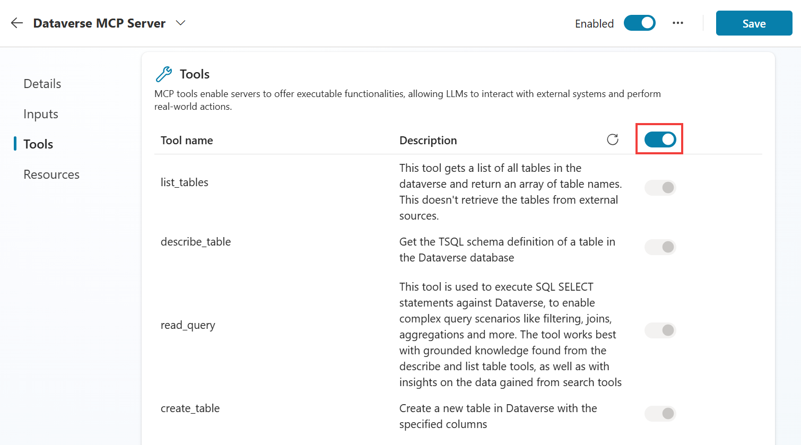
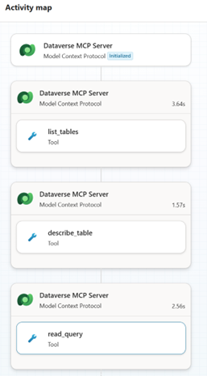

# Contoso Agent and Dataverse MCP Connector - Build an AI Agent with Live Data Integration

Create and configure a Copilot Agent in Copilot Studio with Dataverse MCP Server integration to streamline business workflows.

---

## 🧭 Lab Details

| Level | Persona | Duration | Purpose |
| ----- | ------- | -------- | ------- |
| 100 | Maker | 30 minutes | After completing this lab, participants will be able to create and configure a Copilot Agent in Copilot Studio, integrate the Dataverse MCP Server to read and update account information from the Account and Contact table, structure agent responses for clarity and business value, and apply these skills to solve common business challenges. |

---

## 📚 Table of Contents

- [Why This Matters](#-why-this-matters)
- [Introduction](#-introduction)
- [Core Concepts Overview](#-core-concepts-overview)
- [Documentation and Additional Training Links](#-documentation-and-additional-training-links)
- [Prerequisites](#-prerequisites)
- [Summary of Targets](#-summary-of-targets)
- [Use Cases Covered](#-use-cases-covered)
- [Instructions by Use Case](#️-instructions-by-use-case)
  - [Use Case #1: Create and Configure Copilot Agent](#-use-case-1-create-and-configure-copilot-agent)
  - [Use Case #2: Structure Agent Responses with Custom Prompts](#-use-case-2-structure-agent-responses-with-custom-prompts)

---

## 🤔 Why This Matters

**Makers and Business Users** - Many professionals face challenges integrating data sources, automating workflows, and ensuring that business applications are both flexible and secure.

Think of your current sales workflow:
- **Without Copilot Agent**: Sales reps have to log into multiple applications to access or update account and contact data, navigating complex menus and switching between Teams and Dataverse, which slows down workflows
- **With Copilot Agent**: Sales reps read, create, and update Dataverse records directly from Teams using natural language, without leaving their main workspace

**Common challenges solved by this lab:**
- "I need to switch between too many applications to get my work done"
- "Accessing and updating customer data takes too long and interrupts my flow"
- "I want to use natural language to interact with business data"
- "My team needs a unified workspace that connects to our enterprise data"

**By completing this 30-minute lab, you'll gain practical skills that translate directly to real-world scenarios and address complexity, time investment, and technical barriers.**

---

## 🌐 Introduction

In today's fast-evolving digital landscape, organizations need solutions that empower makers to streamline business processes and enhance productivity. This lab provides a hands-on, 30-minute experience focused on building and configuring a Copilot Agent using Copilot Studio and the Dataverse MCP Server.

**Real-world example:** Sales teams often struggle with fragmented workflows when managing customer data, having to switch between multiple applications to access, update, or create records. By embedding a Copilot Agent in Teams, they can interact with data in the application that resides in Dataverse directly from their main workspace, streamlining operations and improving responsiveness.

By giving you hands-on experience on how the Dataverse MCP Server integrates with agents built in Copilot Studio, you can utilize this for many applications that will host their data in Dataverse.

---

## 🎓 Core Concepts Overview

| Concept | Why it matters |
|---------|----------------|
| **Copilot Agent Creation and Configuration** | Building and configuring a Copilot Agent empowers teams to automate repetitive tasks and interact with business data using natural language, boosting productivity and reducing manual effort. Technically, it provides a foundation for integrating enterprise data sources and customizing agent workflows to fit specific organizational needs. |
| **Dataverse MCP Server Integration** | Connecting the Copilot Agent to the Dataverse MCP Server allows users to access and manage critical business data directly from their main workspace, streamlining operations and minimizing workflow interruptions. On the technical side, this integration enables secure, real-time read, create, and update actions on Dataverse tables, enhancing data accessibility and reliability. |
| **Structured Agent Responses for Clarity and Value** | Designing prompts and formatting agent outputs ensures users receive clear, actionable information that supports better decision-making and customer engagement. Technically, this approach standardizes responses, making them consistent and relevant to business processes while reducing confusion and errors. |

---

## 📄 Documentation and Additional Training Links

* [Overview - Microsoft Copilot Studio | Microsoft Learn](https://learn.microsoft.com/en-us/microsoft-copilot-studio/)
* [Connect to Dataverse with model context protocol (MCP) - Power Apps | Microsoft Learn](https://learn.microsoft.com/en-us/power-apps/developer/data-platform/mcp)
* [Use prompts to make your agent perform specific tasks - Microsoft Copilot Studio | Microsoft Learn](https://learn.microsoft.com/en-us/microsoft-copilot-studio/prompts)
* [Configure suggested prompts for Teams and Microsoft 365 - Microsoft Copilot Studio | Microsoft Learn](https://learn.microsoft.com/en-us/microsoft-copilot-studio/configuration-suggested-prompts)

---

## ✅ Prerequisites

* Access to Microsoft Copilot Studio, with permissions to create, edit, and publish agents and agent flows.
* Power Platform environment enabled for Copilot Studio.
* Basic familiarity with Copilot Studio concepts such as agent setup, knowledge sources, and flows.

---

## 🎯 Summary of Targets

In this lab, you'll build and configure a Copilot Agent that integrates with Dataverse to provide natural language access to business data. By the end of the lab, you will:

* Create and configure a Copilot Agent in Copilot Studio with proper instructions and suggested prompts.
* Integrate the Dataverse MCP Server to enable natural language queries against Account and Contact tables.
* Test agent functionality with real data queries and understand tool execution flow.
* Create custom prompts to structure agent responses for consistent, business-relevant outputs.
* Apply activity tracking to troubleshoot and optimize agent performance.

---

## 🧩 Use Cases Covered

| Step | Use Case | Value added | Effort |
|------|----------|-------------|--------|
| 1 | [Create and Configure Copilot Agent](#-use-case-1-create-and-configure-copilot-agent) | Enable natural language interaction with Dataverse data directly from Teams workspace | 20 min |
| 2 | [Structure Agent Responses with Custom Prompts](#-use-case-2-structure-agent-responses-with-custom-prompts) | Ensure consistent, business-relevant outputs that support decision-making processes | 10 min |

---

## 🛠️ Instructions by Use Case

---

## 🧱 Use Case #1: Create and Configure Copilot Agent

Build a Copilot Agent that connects to Dataverse through the MCP Server for seamless data access.

| Use case | Value added | Estimated effort |
|----------|-------------|------------------|
| Create and Configure Copilot Agent | Enable natural language interaction with Dataverse data directly from Teams workspace | 20 minutes |

**Summary of tasks**

In this section, you'll learn how to create a new Copilot Agent in Copilot Studio, configure it with proper instructions and suggested prompts, and integrate the Dataverse MCP Server for live data connectivity.

**Scenario:** A sales team at Contoso needs to quickly access and update account and contact information without leaving their Teams environment. The agent will provide natural language access to critical business data stored in Dataverse.

### Objective

Create and configure a functional Copilot Agent with Dataverse MCP Server integration that can read and query account and contact information.

---

### Step-by-step instructions

#### Navigate to Copilot Studio and Create Agent

1. Browse to [Copilot Studio Homepage](https://copilotstudio.microsoft.com/). Ensure you are logged in using the credentials for the lab and are in the correct Environment for building your agent.


2. Click on **+ New Agent**.


#### Configure Your Agent

3. Click on **Configure** and fill in the Name, Description and Instructions for the agent as below:

   **Name:** `Contoso Agent`
   
   **Description:** `This agent will help Contoso sales reps update their accounts and contacts using the Dataverse MCP Server.`
   
   **Instructions:** 
   ```
   This agent will:
   Read accounts and contact information from the Account and Contact Tables in Dataverse using the Dataverse MCP Server. 
   Update accounts and contact information from the Account and Contact Tables in Dataverse using the Dataverse MCP Server. 
   Create new accounts and contact information in the Account and Opportunity Tables in Dataverse using the Dataverse MCP Server. 
   Do not use outside knowledge. Only use the Dataverse MCP Tool to create, read, update and delete.
   ```

   

4. Create some prompts that will help guide users on how they can use the agent. Click on the **+ Add suggested prompts** for the Suggested prompts area.

   

   Add the following prompts and then click **Save**:
   - **Title:** Account Search | **Prompt:** List all accounts in [Insert Location]
   - **Title:** Contact Search | **Prompt:** List all contacts from [Insert Account Name]

   

> [!TIP]
> You can configure up to six suggested prompts customers can choose from to start a conversation. In Teams and in Copilot Chat, suggested prompts appear on the agent's welcome page, before you start a new chat. You can't see or use them when you test your agent in Copilot Studio.

5. Click **Create**.


#### Add the Dataverse MCP Server as a Tool

7. Scroll down to the **Tools** section and click **+ Add tool**.

   

8. Click **Model Context Protocol** and then click **+ New tool** or **Dataverse MCP Server (Preview)** if it shows up in the recommendations.

   

9. If there is no Dataverse Connection yet, click on the dropdown to create a new connection using "Authentication Type" as **OAuth** and using your lab credentials. Then click **Add** and **configure**.

   

> [!IMPORTANT]
> The Dataverse MCP Server will allow you natural language access to your tables in Dataverse. We have sample data in the Accounts and Contacts tables that we will use. The tools available are: list tables, describe table, read data, create record, update record, list prompts, execute prompt, list knowledge sources, and retrieve knowledge.

10. Review the tools available for the Dataverse MCP Server. You can select and deselect which tools are available to the agent. When the tool is executed, the list is dynamically updated from the MCP Server. You cannot call an MCP Server from a Topic for this reason.

    

#### Test Your Agent

11. We are now ready to test our agent and see if it will give us information about our accounts. In the testing panel, ask the following question: `List the accounts in the state of WA.`

12. For the first run, you would get a Consent dialog as by default the tool is configured to use "End user credentials". Please click **Allow** to continue.

    

    > [!NOTE]
    > One can change this setting to "Maker-provided credentials" from Details section >> Additional details section >> Credentials to use, particularly if you are using Service Principals or Client Certification Auth to connect to Dataverse.

    

    > [!TIP]
    > Click on the Activity Map at the top of the agent testing panel to track what topics or tools the agent is using. You can see that the Dataverse MCP server is initiated and then which tools are being used – list_tables, describe_tables, read_query.

    

13. If you click on the tool that was used, you will see the Inputs and Outputs of the tool.

    

14. Continue testing by asking: `Who are the contacts for City Power & Light (sample)?`

    ---

###  🏅 Congratulations! You've completed Create and Configure Copilot Agent!

---

### Test your understanding

**Key takeaways:**

* **Agent Configuration** – Proper instructions and descriptions help the agent understand its role and limitations, ensuring it uses only the specified tools and data sources.
* **MCP Server Integration** – The Dataverse MCP Server provides dynamic, real-time access to business data through natural language queries.
* **Activity Tracking** – The Activity Map helps troubleshoot agent behavior by showing which tools are executed and their inputs/outputs.

**Lessons learned & troubleshooting tips:**

* You must create your agent before adding MCP Servers as Tools
* Use Activity Map to debug and understand tool execution flow
* Suggested prompts help guide users but don't appear in Copilot Studio testing

**Challenge: Apply this to your own use case**

* What other Dataverse tables could benefit from natural language access in your organization?
* How would you modify the agent instructions for different business scenarios?
* Consider what additional suggested prompts would be valuable for your users.

---

## 🔄 Use Case #2: Structure Agent Responses with Custom Prompts

Create custom prompts to ensure consistent, structured responses from your agent that provide business-relevant information.

| Use case | Value added | Estimated effort |
|----------|-------------|------------------|
| Structure Agent Responses with Custom Prompts | Ensure consistent, business-relevant outputs that support decision-making processes | 10 minutes |

**Summary of tasks**

In this section, you'll learn how to create custom prompts that structure agent responses to show specific Dataverse fields and provide consistent output formats.

**Scenario:** Different users might get varying levels of detail when querying account information. By creating structured prompts, you ensure all users receive consistent, relevant account details that support their business decisions.

### Step-by-step instructions

15. If you tried some different testing in the Copilot, you may have noticed you will get different attributes for accounts and contacts. If you want a more structured response, you can create a prompt in the Tools. In the **Tools** tab, click **+ Add a tool** then **+ New tool**.

    

16. Select **Prompt**.

    

17. Rename the prompt at the top to `Show Account Details`. Then in the instructions type: `Find account which contains` and then click **+ Add content** to pass in the name of the account we are searching for. Select **Text** for the Input and call it `Account Name`. Click **close**.

    

18. We can now grab specific fields from Dataverse to show to our end users in the chat. Click back in the instructions and type `and find relevant details like:` click **+ Add content**. This time we will select **Dataverse** and some of the fields in the Account table which we feel our end users would like to see about the account.

19. Let's select the following by clicking on the dropdown: **Account Name**, **Account Number**, **Address 1**, **Annual Revenue**, **Email** and **Main Phone**. Click **Add** and then **Save**.

    

    

    > [!TIP]
    > Custom prompts allow you to standardize the information presented to users, ensuring they always receive the most relevant business data in a consistent format.

20. Now we can test out our prompt. Let's go back over to our Contoso Agent and test again. In our testing pane, type `List Prompts`. We will see information on our Show Account Details Prompt.

    

21. Let's execute this prompt to get information on an account. Type `Execute prompt Show Account Details for Fourth Coffee`.

    

    > [!TIP]
    > More information: [Use prompts to make your agent perform specific tasks - Microsoft Copilot Studio | Microsoft Learn](https://learn.microsoft.com/en-us/microsoft-copilot-studio/prompts)

    > [!IMPORTANT]  
    > Make sure you have turned on activity tracking and ensure that the prompt is passing in the GUID of the account if you see an error.

#### Troubleshooting: Dataverse MCP Issues

If you are seeing an issue while running the above prompt, please make sure to enable the Dataverse MCP option under Power Platform Admin Center:


Navigate to the **Power Platform admin center** → **Environments** → **Settings** → **Product** → **Features** and check: Dataverse MCP is turned **On**.


---

###  🏅 Congratulations! You've completed Structure Agent Responses with Custom Prompts!

---

### Test your understanding

* How do custom prompts improve the user experience compared to free-form queries?
* What business scenarios would benefit from structured, consistent data presentation?
* How would you extend this approach to other Dataverse tables like Opportunities or Cases?

**Challenge: Apply this to your own use case**

* Create additional structured prompts for Contact details or other relevant business entities
* Consider what fields would be most valuable for different user personas (sales, support, management)
* Think about how structured responses could support specific business processes in your organization

---

## 🏆 Summary of learnings

True learning comes from doing, questioning, and reflecting—so let's put your skills to the test.

To maximize the impact of Copilot Agent and Dataverse MCP integration:

* **Start with Clear Instructions** – Well-defined agent instructions and limitations ensure consistent behavior and appropriate tool usage
* **Leverage Activity Tracking** – Use the Activity Map to understand tool execution flow, troubleshoot issues, and optimize performance
* **Structure Your Responses** – Custom prompts provide consistent, business-relevant outputs that support decision-making
* **Design for Your Users** – Suggested prompts and structured responses should align with real business workflows and user needs
* **Test Thoroughly** – Regular testing with realistic queries helps identify edge cases and improvement opportunities

---

### Conclusions and recommendations

**Copilot Agent and Dataverse MCP golden rules:**

* Always define clear agent instructions that specify data sources and limitations
* Use structured prompts to ensure consistent, valuable responses for business users
* Implement activity tracking to monitor and optimize agent performance
* Design suggested prompts that align with real user workflows and common tasks
* Test with realistic business scenarios to validate agent functionality
* Consider different user personas when designing prompts and response structures

By following these principles, you'll create powerful, user-friendly agents that seamlessly integrate enterprise data into natural language workflows, improving productivity and decision-making across your organization.

---
