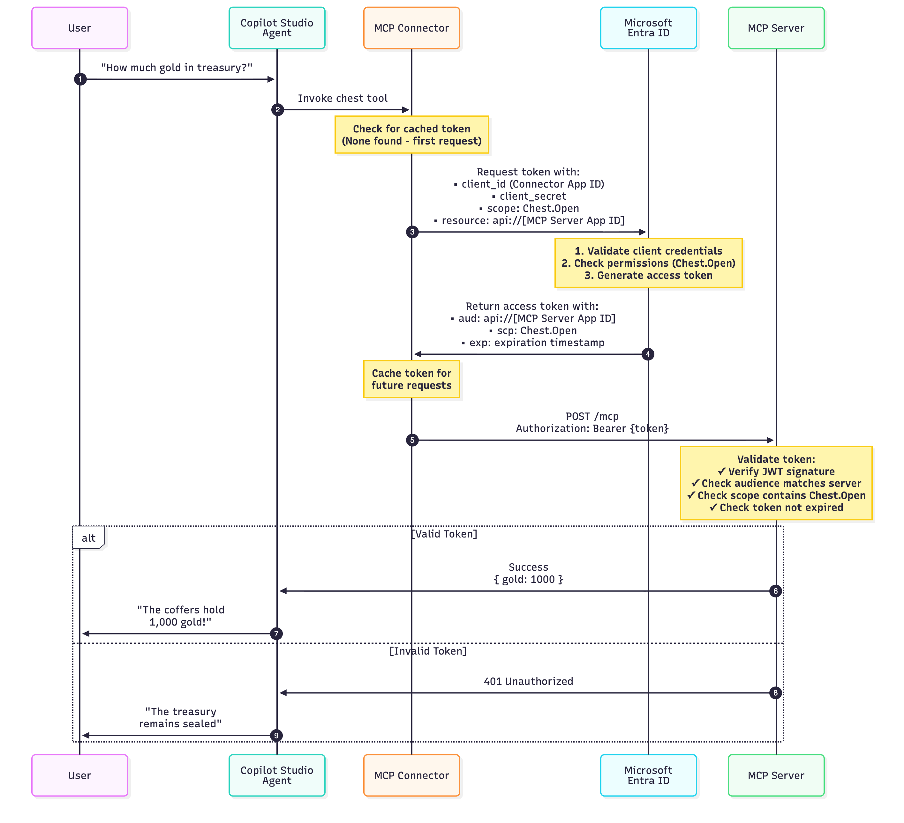

# ⚔️ Quest: Build and Connect Your Guild's Custom MCP Server

*Greetings, brave developer! The Adventurers' Guild seeks your expertise in establishing a mystical connection between the ancient Guild Hall and the modern realm of Copilot Studio. Your quest: forge a custom Model Context Protocol (MCP) server and bind it to an intelligent agent that can tap into the Guild's treasures.*

---

## 🧭 Quest Details

| Level | Persona        | Duration       | Purpose                                                                                                                                                                                                                                    |
| ----- | -------------- | -------------- | ------------------------------------------------------------------------------------------------------------------------------------------------------------------------------------------------------------------------------------------ |
| 200   | Pro Developer  | 60-70 minutes  | After completing this quest, you will have deployed a custom MCP server locally and connected it to a Copilot Studio agent that can query quests, hire parties, and manage the Guild treasury on your behalf. |

---

## 📜 Quest Log (Table of Contents)

- [Why This Quest Matters](#-why-this-quest-matters)
- [Core Concepts You'll Master](#-core-concepts-youll-master)
- [Ancient Scrolls (Documentation Links)](#-ancient-scrolls-documentation-links)
- [Prerequisites (Your Adventuring Gear)](#-prerequisites-your-adventuring-gear)
- [Use Cases](#-use-cases)
- [The Adventure Begins](#️-the-adventure-begins)

---

## 🤔 Why This Quest Matters

**Fellow Developers** – Tired of manually tracking quests, parties, and gold reserves? Wish you had an intelligent assistant that understood the Guild's unique operations?

Imagine an agent that can:

- Browse available quests filtered by rank
- Find the perfect adventuring party for any job
- Check treasury balance with proper authentication
- Hire parties for quests while validating funds and compatibility

**This quest teaches you advanced techniques for MCP servers in Copilot Studio:**

- **Connecting Copilot Studio to custom MCP servers** – Using the MCP onboarding wizard to integrate domain-specific tools
- **Passing context via custom headers** – Dynamically controlling server behavior through headers like `user-level`
- **Implementing OAuth 2.0 authentication** – Securing MCP servers with Microsoft Entra ID, including app registration configuration

---

## 🎓 Core Concepts You'll Master

| Concept                                | What You'll Learn                                                                                                                                                 |
| -------------------------------------- | ----------------------------------------------------------------------------------------------------------------------------------------------------------------- |
| **Connecting Custom MCP Servers**      | Deploying a local MCP server and exposing it via Dev Tunnel for integration with Copilot Studio                                                                  |
| **MCP Onboarding Wizard**              | Using Copilot Studio's MCP connector wizard to register custom servers and expose their tools to agents                                                          |
| **Custom Header Context**              | **Advanced technique:** Passing context via custom headers (`user-level`) to dynamically control server behavior and content filtering                          |
| **OAuth Authentication with MCP**      | **Advanced technique:** Securing MCP servers with OAuth 2.0, including Microsoft Entra ID app registration and bearer token validation                          |

---

## 📚 Ancient Scrolls (Documentation Links)

- [Model Context Protocol Documentation](https://modelcontextprotocol.io)
- [MCP SDK for TypeScript](https://github.com/modelcontextprotocol/typescript-sdk)
- [Copilot Studio MCP Integration Guide](https://learn.microsoft.com/en-us/microsoft-copilot-studio/agent-extend-action-mcp)
- [Dev Tunnels Documentation](https://learn.microsoft.com/en-us/azure/developer/dev-tunnels/)

---

## ✅ Prerequisites (Your Adventuring Gear)

Before embarking on this quest, ensure you have:

- **Node.js** installed (v18 or higher)
- **npm** package manager
- **Dev Tunnels CLI** ([Installation Guide](https://learn.microsoft.com/en-us/azure/developer/dev-tunnels/get-started))
- **Access to Copilot Studio**
- **A code editor** (VS Code recommended)
- **Basic TypeScript knowledge** (optional but helpful)

---

## 🎯 Use Cases

In this quest, you will complete four use cases:

| Use Case | Description                                                           | Estimated Time |
| -------- | --------------------------------------------------------------------- | -------------- |
| 1        | [Deploy Local MCP Server](#-use-case-1-deploy-local-mcp-server)      | 10 minutes     |
| 2        | [Connect Agent to MCP Server](#-use-case-2-create-an-agent-and-connect-to-the-mcp-server) | 20 minutes     |
| 3        | [Add Custom Headers](#️-use-case-3-add-custom-headers-advanced)       | 15 minutes     |
| 4        | [Configure OAuth Authentication](#-use-case-4-configure-oauth-authentication-advanced) | 20 minutes     |

---

## ⚔️ The Adventure Begins

### 🔨 Use Case 1: Deploy Local MCP Server

**Objective:** Deploy the Adventurers' Guild MCP server locally, expose it via Dev Tunnel, and validate connectivity.

**Time Required:** 10 minutes

---

#### 📍 Step 1: Navigate to Project Directory

1. Open your terminal.

2. Clone the MCS Labs repository (if you haven't already):

   ```bash
   git clone https://github.com/microsoft/mcs-labs.git
   cd mcs-labs
   ```

3. Navigate to the Guild's codebase:

   ```bash
   cd samples/adventurers-guild-mcp
   ```

---

#### 📦 Step 2: Install Dependencies

3. Install required packages:

   ```bash
   npm install
   ```

---

#### 🚀 Step 3: Start the Server

4. Start the MCP server:

   ```bash
   npm run dev
   ```

5. You'll see the Guild Hall welcome message. Your server is ready when you see:

   ```
   ━━━━━━━━━━━━━━━━━━━━━━━━━━━━━━━━━━━━━━━━━━━━━━━━━━━━━━━━━━━━━━━━━━
   ⚔️  THE ADVENTURERS' GUILD – MCP SERVER ⚔️
   ━━━━━━━━━━━━━━━━━━━━━━━━━━━━━━━━━━━━━━━━━━━━━━━━━━━━━━━━━━━━━━━━━━

   🏰 Guild Hall Status: OPEN FOR BUSINESS
   🌐 Portal Address: http://localhost:3000/mcp
   📜 Protocol: Model Context Protocol (Streamable HTTP)

   Available Services:
     📜 Quest Board (list_quests)
     👥 Party Roster (parties)
     💰 Treasury Vault (chest) – Auth Required
     🤝 Party Hiring (hire_party)

   Guild Ranks: Novice → Adept → Veteran → Mythic

   "Fortune favors the bold, but wisdom favors the prepared."
   — Guild Master Aldric Ironquill

   ━━━━━━━━━━━━━━━━━━━━━━━━━━━━━━━━━━━━━━━━━━━━━━━━━━━━━━━━━━━━━━━━━━

   🎲 The tavern is bustling with adventurers...
   🔥 The hearth is warm and inviting...
   📜 Fresh quests have been posted on the board...

   ⚡ Server ready to accept connections!
   ```

---

#### 🌉 Step 4: Create Dev Tunnel

6. Open a **new terminal window** (keep the server running in the first terminal).

7. Navigate to the project directory:

   ```bash
   cd samples/adventurers-guild-mcp
   ```

8. Login to Dev Tunnels (first time only):

   ```bash
   devtunnel user login
   ```

9. Start an anonymous tunnel:

   ```bash
   devtunnel host -p 3000 --allow-anonymous
   ```

10. Note the output:

    ```
    Hosting port 3000 at https://abc123xyz-3000.usw2.devtunnels.ms/
    Ready to accept connections for tunnel: abc123xyz
    ```

11. **Copy your tunnel URL** – you'll need it in Use Case 2.

    > [!IMPORTANT]
    > **⚠️ Use the URL with the port embedded in the path!**
    > 
    > ✅ **CORRECT:** `https://kmvg53tj-3000.eun1.devtunnels.ms`  
    > ❌ **WRONG:** `https://kmvg53tj.eun1.devtunnels.ms:3000`
    > 
    > The port must be part of the hostname (after a hyphen), NOT appended after a colon. Copilot Studio requires the embedded format for proper routing.

---

#### ✅ Step 5: Test Connectivity

12. Test the tunnel endpoint:

    ```bash
    curl https://your-tunnel-url.devtunnels.ms/mcp \
      -H "Content-Type: application/json" \
      -H "Accept: application/json, text/event-stream" \
      -d '{"jsonrpc":"2.0","id":"1","method":"tools/list"}'
    ```

13. Expected: JSON response listing available tools like `list_quests`, `parties`, `chest`, and `hire_party`.

---

#### 🔍 Step 6: Verify Tool Discovery

14. Copilot Studio will discover available tools:
    - **list_quests**
    - **parties**
    - **chest**
    - **hire_party**

---

### 🏆 Use Case 1 Complete!

Your MCP server is running locally and accessible via Dev Tunnel. ✅

---

### 🤖 Use Case 2: Create an Agent and Connect to the MCP server

**Objective:** Create a Copilot Studio agent, connect it to your MCP server, and test tool invocation.

**Time Required:** 20 minutes

---

#### ✨ Step 1: Create New Agent

1. Navigate to [Copilot Studio](https://copilotstudio.preview.microsoft.com).

2. Click the **+ Create** button (left sidebar).

3. Click **New agent**.

4. Click **Configure** (skip the Describe step).

5. Fill in the agent details:

   - **Name:** `Guildhall MCP Agent`
   
   - **Description:** `Onwards to adventure!`
   
   - **Instructions:** 
     ```
     You are a guildhall assistant, respond in character, use dnd related terminology and emojis. Use needlessly elaborate language.

     When presenting names, stats, etc, use formatting and emojis as bullet point to present information clearly.
     ```

   > [!TIP]
   > **🎭 Pro tip:** Using these instructions ensures your agent stays in character and provides the most whimsical workshop experience! 

6. Click **Create** (top right).

---

#### 🔧 Step 2: Add MCP Server and Configure Connection

7. Navigate to **Tools** → **+ Add a tool**.

8. Select **New tool** → **Model Context Protocol**.

9. In the MCP onboarding wizard, enter:

    - **Server name:** `Adventurers Guild MCP`
    - **Server description:** 
      ```
      A D&D-themed MCP server that manages guild operations including quests, 
      adventuring parties, and treasury. Supports rank-based access control 
      (Novice, Adept, Veteran, Mythic).
      ```
    - **Server URL:** `https://your-tunnel-url-3000.devtunnels.ms/mcp`
      
      *(Use your actual Dev Tunnel URL from Use Case 1 - make sure it includes the port in the hostname!)*

    > [!IMPORTANT]
    > **⚠️ Double-check your tunnel URL format!**
    > 
    > ✅ **CORRECT:** `https://kmvg53tj-3000.eun1.devtunnels.ms/mcp`  
    > ❌ **WRONG:** `https://kmvg53tj.eun1.devtunnels.ms:3000/mcp`
    > 
    > If you use the wrong format, the connection will fail. The port must be embedded in the hostname with a hyphen.

10. **Authentication type:** Select **None**

    > [!NOTE]
    > For now, we're skipping authentication. You'll configure OAuth in Use Case 4.

11. Click **Create**.

---

#### 🔗 Step 3: Create Connection

12. After clicking **Create**, you'll see the MCP server added but showing "Not connected".

13. Click the **Connection** dropdown and select **Create new connection**.

14. In the connection dialog, click **Create** (no credentials required for authentication type "None").

15. The connection will be automatically selected in the dropdown.

16. Click **Add and configure** (bottom right).

---

#### ⚙️ Step 5: Configure Credentials (Lab Setting)

17. You'll be redirected to the MCP tool configuration page under **Tools**.

18. Under **Additional details**, find the **Credentials to use** dropdown.

19. Change from **End user credentials** to **Maker-provided credentials**.

    > [!NOTE]
    > **For this lab:** Using "Maker-provided credentials" simplifies testing by using the connection you just created. This avoids requiring users to authenticate during conversations.
    > 
    > **For production:** Consider using "End user credentials" for personalized, user-specific authentication. Learn more: [Configure End-User Authentication](https://learn.microsoft.com/en-us/microsoft-copilot-studio/configure-enduser-authentication)

20. Click **Save** (top right).

---

#### 🛡️ Step 6: Configure Agent Settings (Lab Configuration)

21. Click **Settings** (top right).

22. In the left sidebar, select **Generative AI**.

23. Configure the following settings for optimal lab experience:

    **Model Selection:**
    - Under **Select your agent's model**, choose **GPT-4.1 (preview)** from the dropdown
    
    > [!NOTE]
    > GPT-4.1 provides enhanced reasoning capabilities for complex guild operations and more creative responses to your theatrical queries!

    **Content Moderation:**
    - Scroll down to **Moderation** section
    - Under **Content moderation level**, drag the slider to **Low**

    > [!NOTE]
    > **For this lab:** Setting content moderation to "Low" prevents the RPG-themed content (glorious battles, valorous quests) from being flagged. This ensures the Guild's colorful language flows freely!
    > 
    > **For production:** Set content moderation levels based on your agent's purpose and audience. Higher moderation reduces risk of harmful content but may limit creative responses. Learn more: [Content Moderation](https://learn.microsoft.com/en-us/microsoft-copilot-studio/responsible-ai-overview)

24. Click **Save** (bottom of page).

25. Close the Settings panel to return to your agent.

---

#### 🧪 Step 7: Test Tool Invocation

26. Open the **Test** pane (right side).

27. Test basic quest query (ask in character!):

    ```
    Pray tell, kind guildmaster, which quests feature on the board?
    ```

28. Expected: Agent responds in character and returns 2 quests:
    - 🐀 **Rat Problem** - The tavern keeper's cellar has become overrun...
    - 🛡️ **Escort the Merchant** - Grimble, a rotund merchant seeks safe passage...

29. Test party browsing with theatrical flair:

    ```
    Show me the brave adventuring parties who call this hall home, that I might choose worthy companions for my endeavors!
    ```

30. Expected: Agent lists available parties with colorful descriptions, each featuring their members, specialties, and expected rewards.

31. The quests seem somewhat... humble, and the parties appear to be fledgling adventurers. But no matter! Let us attempt to hire a party for the Rat Problem:

    ```
    I wish to hire The Iron Vanguard for the Rat Problem quest. Make it so!
    ```

32. Expected: Agent attempts the hire_party tool but encounters an error:
    
    ```
    💰 Alas! The guild treasury stands empty at 0 gold. 
    The Iron Vanguard demands 35 gold for their services. 
    The coffers must be filled ere we can secure their aid!
    ```

---

#### 🔮 What Just Happened?

**The Novice's Plight:**

When you first connected to the Guild, the mystical powers governing the MCP server assigned you the humble rank of **Novice** – the entry-level position for all new guild members. This rank-based system controls what you can see and do:

**Why only 2 quests?**
- The MCP server filters quests based on your rank
- Novice adventurers only see Easy and Medium difficulty quests
- Higher-ranked quests (Hard, Deadly, Legendary) remain hidden from inexperienced eyes
- This prevents sending novices on deadly dragon-slaying missions!

**Why only basic parties?**
- Available parties are also filtered by rank
- Novice members can only view parties with average levels 1-3
- Elite high-level parties won't accept contracts from unproven guild members
- As you climb the ranks, more powerful parties become available

**Why is the treasury locked?**
- The treasury requires **authentication** to access
- Without proper credentials, the chest remains sealed at 0 gold
- This protects the guild's finances from unauthorized access
- Even if you had gold, you'd need authentication to spend it!

**The Path Forward:**

In **Use Case 3**, you'll learn to pass a custom `user-level` header to the MCP connector, allowing you to query the mystical servers with higher ranks (Adept, Veteran, or even Mythic!). This will unlock legendary quests and elite adventuring parties.

In **Use Case 4**, you'll configure OAuth authentication to gain access to the treasury and finally hire those parties for glorious adventures!

---

### 🏆 Use Case 2 Complete!

Your Copilot Studio agent is connected and successfully invoking MCP server tools! ✅

**Current Status:**
- ✅ MCP server deployed and accessible
- ✅ Agent connected and calling tools
- ⚠️ Rank: Novice (limited quest/party access)
- 🔒 Treasury: Locked (authentication required)

**Next Up:** Learn to pass custom headers to unlock higher ranks and see legendary content!

---

### 🎖️ Use Case 3: Add Custom Headers (Advanced)

**Objective:** Pass context to your MCP server using custom headers to control rank-based filtering.

**Time Required:** 15 minutes

---

#### 🧭 Understanding Custom Headers in MCP

Before we dive in, let's understand why we need custom headers for our Guild:

**The Problem:**
- Your guild rank (Novice, Adept, Veteran, Mythic) determines what quests and parties you can see
- This is **server-level context** that applies to ALL tool calls
- It's NOT a tool input that the AI should decide—it's part of your identity as a guild member

**Custom Headers vs Tool Inputs:**

| Custom Headers | Tool Inputs |
|----------------|-------------|
| Set once at connection level | Different for each tool call |
| Verified server-side | AI orchestrator decides values |
| Apply to all tools in session | Specific to individual tools |
| Examples: user roles, permissions, API keys | Examples: search queries, IDs, filters |

In our case, `user-level` is a custom header because:
- Your rank shouldn't change mid-conversation
- The server needs to know your rank for ALL operations (quests, parties, hiring)
- The AI shouldn't be able to arbitrarily change your rank

---

#### ⚙️ Step 1: Edit Custom Connector OpenAPI Specification

1. Navigate to the Power Apps custom connectors page: `https://make.powerapps.com/environments/{your-environment-id}/customconnectors`

2. Locate your MCP connector named **Adventurers Guild MCP** in the list.

3. Click the **pencil icon (✏️)** to edit the connector.

4. Toggle the **Swagger editor** switch (top right) to enable YAML editing.

5. Locate the `/mcp` POST endpoint and find (or add) the `parameters` section.

6. Add the custom header configuration:

   ```yaml
   paths:
     /mcp:
       post:
         responses:
           '200':
             description: Immediate Response
         x-ms-agentic-protocol: mcp-streamable-1.0
         operationId: InvokeServer
         parameters:                      # ← Add this section
           - name: user-level            # ← Custom header name
             in: header                   # ← Specifies this is a header
             type: string                 # ← Data type
             required: false              # ← Optional parameter
             description: The user's guild rank (Novice, Adept, Veteran, or Mythic)
   ```

   > [!WARNING]
   > **Known Issue (October 2025):** Do NOT use the `X-` prefix pattern (e.g., `X-User-Level`). Custom headers with the `X-` prefix are currently not working with MCP connectors. Use header names without the prefix like `user-level` until this is resolved.

7. Click **Update connector** (top right) to save your changes.

---

#### 🔄 Step 2: Refresh Connector in Copilot Studio

8. Navigate back to [Copilot Studio](https://copilotstudio.preview.microsoft.com) and open your **Guildhall MCP Agent**.

9. Go to the **Tools** tab.

10. Locate **Adventurers Guild MCP** in your tools list.

11. Click the **three dots (…)** menu next to the connector.

12. Select **Delete** to remove the connector from your agent.

    > [!NOTE]
    > **Why delete and re-add?** Simply updating the custom connector definition in Power Apps isn't enough. You must remove and re-add the connector for Copilot Studio to recognize the new custom header configuration.

13. Click **+ Add a tool** to add it back.

14. Search for and select **Adventurers Guild MCP**.

15. Select your existing connection from the dropdown.

16. Click **Add and configure**.

---

#### 🎚️ Step 3: Configure Custom Header Value

17. You'll be redirected to the MCP tool configuration page under **Tools**.

18. Scroll down to the **Inputs** section.

19. Click **+ Add input**.

20. You'll see **user-level** in the available inputs list (from your OpenAPI definition).

21. Select **user-level** to add it as a connector input.

22. In the **Value** field, enter:

    ```
    Mythic
    ```

    > [!TIP]
    > **Advanced:** You can use PowerFX expressions or system variables to set this dynamically based on user authentication, session data, or other context. For this lab, we're hardcoding "Mythic" to unlock all content.

23. Click **Save** (top right).

---

#### 🧪 Step 4: Test Rank-Based Filtering

24. Open the **Test** pane (right side) and start a **New chat**.

25. Test quest availability with Mythic rank:

    ```
    Pray tell, what legendary quests await a champion of my caliber?
    ```

26. Expected: All 5 quests returned, including high-level quests:
    - 🐀 **Rat Problem** (Easy, 10 gold)
    - 🛡️ **Escort the Merchant** (Medium, 25 gold)
    - ⚔️ **Goblin Warband** (Hard, 50 gold)
    - 💀 **Crypt of Ashes** (Deadly, 120 gold)
    - 🐉 **Dragon's Parley** (Legendary, 300 gold)

27. Test party browsing with Mythic rank:

    ```
    Show me the finest adventuring parties in this hall!
    ```

28. Expected: All parties visible, including elite high-level parties:
    - 🛡️ **The Iron Vanguard** (Level 2-3, 35 gold)
    - 🎭 **Shadows & Strings** (Level 3-4, 60 gold)
    - 🌿 **Wilderness Wardens** (Level 2, 30 gold)
    - 🌟 **Radiant Crusaders** (Level 5-6, 150 gold) - Elite demon slayers!
    - 💥 **Chaos Incarnate** (Level 4-5, 75 gold) - Unpredictable but effective!

---

### 🗝️ Optional: Venture Deeper into the Dungeons of Server-Side Logic!

**Curious how the custom header magic works behind the scenes?** Here's the flow:

1. **User sends message** → "What quests are available?"
2. **AI orchestrator calls** `list_quests` tool
3. **Copilot Studio adds header** → `user-level: Mythic` (from connector input)
4. **MCP server receives request** with the `user-level` header
5. **Server extracts context:**
   ```typescript
   function deriveCtxFromHeaders(headers: Record<string, string>): Context {
     const rawLevel = headers["user-level"] || "Novice";
     const level = LEVELS.includes(rawLevel as Level) ? (rawLevel as Level) : "Novice";
     return { level };
   }
   ```
6. **Server filters quests** using `visibleQuests()`:
   ```typescript
   function visibleQuests(level: Level) {
     const allowed = new Set(QUEST_VIS_BY_LEVEL[level]);
     return QUESTS.filter(q => allowed.has(q.danger));
   }
   ```
7. **Only rank-appropriate content** is returned to the AI

The server code is in `samples/adventurers-guild-mcp/src/index.ts` if you want to explore further! 🏰

---

#### 🎭 Step 5: Test Rank Changes (Optional)

29. To see the difference ranks make, change the header value:

    - Go back to **Tools** → **Adventurers Guild MCP**
    - Edit the **user-level** input value to `Novice`
    - Click **Save**
    - Start a **New chat** in the Test pane

30. Ask the same quest query:

    ```
    What quests are available?
    ```

31. Expected: Only 2 quests returned (Rat Problem, Escort the Merchant).

32. **Change it back to Mythic** for the rest of the lab.

    > [!TIP]
    > **🎨 Advanced: Dynamic Rank Assignment**
    > 
    > Instead of hardcoding `Mythic`, you can set the `user-level` dynamically using system variables or PowerFX formulas:
    > 
    > **Example - Grant Mythic rank to the Grand Archmage:**
    > ```powerfx
    > If(System.User.DisplayName="Eldric Stormweaver, Grand Archmage of the Eternal Flame","Mythic")
    > ```
    > 
    > This allows different users to automatically receive appropriate guild ranks based on their identity!

---

### 🏆 Use Case 3 Complete!

You've mastered passing context via custom headers! ✅

**What you accomplished:**
- ✅ Edited OpenAPI specification to define custom header
- ✅ Refreshed connector in Copilot Studio to recognize new header
- ✅ Configured header value to unlock Mythic-level content
- ✅ Tested rank-based filtering with different header values

**Current Status:**
- ✅ MCP server deployed and accessible
- ✅ Agent connected and calling tools
- ✅ Rank: Mythic (all quests and parties visible!)
- 🔒 Treasury: Still locked (authentication required)

**Next Up:** Configure OAuth authentication to unlock the treasury and hire those legendary parties!

---

### 🔒 Use Case 4: Configure OAuth Authentication (Advanced)

**Objective:** Secure your MCP server with OAuth 2.0 authentication using Microsoft Entra ID.

**Time Required:** 20 minutes

---

#### 📝 Step 1: Create Your Connector App Registration

1. Navigate to the [Azure Portal - App Registrations](https://portal.azure.com/#view/Microsoft_AAD_RegisteredApps/ApplicationsListBlade).

2. Click **+ New registration** (top left).

3. Fill in the registration details:

   - **Name:** `[Your Name] the [Epic Title]'s Guildhall Connector`
     
     *(Examples: "Shmendrik the Wizard's Guildhall Connector", "Elara Moonwhisper the Arcane's Guildhall Connector")*
   
   - **Supported account types:** Select **Accounts in this organizational directory only**
   
   - **Redirect URI:** Leave blank for now

4. Click **Register**.

5. On the Overview page, note your **Application (client) ID** and **Directory (tenant) ID** - you'll need these later.

---

#### 🔐 Step 2: Request API Permissions

6. In your **connector** app registration, navigate to **API permissions** (left sidebar).

7. Click **+ Add a permission**.

8. Select the **APIs my organization uses** tab.

9. Search for `guildhall` in the search box.

10. Select **Guildhall MCP Server** from the results.

11. Select **Delegated permissions**.

12. Check the **Chest.Open** permission:

    ```
    ✅ Chest.Open - Open the guildhall chest
    ```

13. Click **Add permissions** (bottom).


    > [!NOTE]
    > **For this lab:** The **Guildhall MCP Server** app registration has been pre-provisioned in your workshop tenant. This app registration represents the MCP server as a protected resource in Microsoft Entra ID and exposes the `Chest.Open` scope.
    > 
    > **For production scenarios:** You would need to create your own app registration to represent your MCP server:
    > 1. Register a new app in Azure Portal
    > 2. Navigate to **Expose an API**
    > 3. Set the **Application ID URI** (e.g., `api://your-server-id`)
    > 4. Define custom scopes (e.g., `Chest.Open`, `Quest.Read`)
    > 5. Grant these scopes to your connector app registrations
    > 
    > Learn more: [Expose an API](https://learn.microsoft.com/en-us/entra/identity-platform/quickstart-configure-app-expose-web-apis)

---

#### 🔑 Step 3: Create Client Secret

16. Still in your **connector** app registration, navigate to **Certificates & secrets** (left sidebar).

17. Click **+ New client secret**.

18. Fill in the details:

    - **Description:** `Guildhall Connector Secret`
    - **Expires:** Select **180 days (6 months)**

19. Click **Add**.

20. **Immediately copy the secret Value** (not the Secret ID) - you won't be able to see it again!

---

#### ⚙️ Step 4: Update MCP Connector OAuth Settings

21. Navigate to the [Power Apps Custom Connectors](https://make.powerapps.com) page.

22. Locate **Adventurers Guild MCP** and click the **pencil icon (✏️)** to edit.

23. Click **Security** (top navigation).

24. Under **Authentication type**, change from **No authentication** to **OAuth 2.0**.

25. Under **Identity Provider**, select **Azure Active Directory**.

26. Fill in the OAuth configuration:

    **OAuth 2.0 settings:**
    
    - **Client ID:** *(Paste your connector app's Application (client) ID from Step 1)*
    
    - **Client secret:** *(Paste the secret value from Step 3)*
    
    - **Tenant ID:** *(Paste your Directory (tenant) ID from Step 1)*
    
    - **Resource URL:** `api://f0ec2345-de9b-494b-82dd-7b44e9091054`
      
      *(This is the Application ID URI of the Guildhall MCP Server app registration)*
    
    - **Scope:** `Chest.Open`
      
      *(This requests the specific permission to open the treasury)*

27. Click **Update connector** (top right).

28. After saving, scroll down to the **Redirect URL** field and **copy the generated URL**.

    > [!NOTE]
    > The redirect URL looks like: `https://global.consent.azure-apim.net/redirect/guildhall-20mcp-20server-5fd6bad79415dd6646-5fa2719be2128dcd02`

---

#### 🔗 Step 5: Add Redirect URI to Connector App Registration

29. Navigate back to the [Azure Portal - App Registrations](https://portal.azure.com/#view/Microsoft_AAD_RegisteredApps/ApplicationsListBlade).

30. Open your **connector** app registration (e.g., "Shmendrik the Wizard's Guildhall Connector").

31. Navigate to **Authentication** (left sidebar).

32. Under **Platform configurations**, click **+ Add a platform**.

33. Select **Web**.

34. In the **Redirect URIs** field, paste the redirect URL you copied from the connector (Step 28).

35. Click **Configure**.

36. Click **Save** (top of the page).

    > [!NOTE]
    > **What just happened?** You've registered the redirect URI that Azure AD will use to send authentication responses back to your custom connector after successful login. This completes the OAuth circle: Connector → Azure AD → Redirect → Connector.

---

#### 🔄 Step 6: Refresh Connector and Create Authenticated Connection

37. Navigate back to [Copilot Studio](https://copilotstudio.preview.microsoft.com) and open your **Guildhall MCP Agent**.

38. Go to the **Tools** tab.

39. Locate **Adventurers Guild MCP** in your tools list.

40. Click the **three dots (…)** menu next to the connector.

41. Select **Delete** to remove the connector from your agent.

    > [!NOTE]
    > **Why delete and re-add?** The connector needs to be refreshed to recognize the new OAuth authentication configuration and redirect URI.

42. Click **+ Add a tool** → **Existing tool**.

43. Search for and select **Adventurers Guild MCP**.

44. Under the **Connection** dropdown, click **+ Create new connection**.

45. You'll be redirected to the connection creation page in Power Apps.

46. Click **Create** (you'll be prompted to sign in and consent).

47. Sign in with your workshop credentials.

48. Review and accept the consent prompt:

    ```
    Guildhall MCP Server
    
    This application would like to:
    ✅ Open the guildhall chest (Chest.Open)
    
    Permissions requested by: [Your Connector Name]
    ```

49. Click **Accept**.

50. You'll be redirected back to Power Apps showing the new connection.

51. Return to Copilot Studio and select your newly created authenticated connection from the dropdown.

52. Click **Add and configure**.

53. Under **Additional details**, ensure **Credentials to use** is set to **Maker-provided credentials**.

54. Click **Save** (top right).

---

#### 🧪 Step 7: Test Treasury Access and Party Hiring

55. Open the **Test** pane and start a **New chat**.

56. Test treasury access:

    ```
    Pray tell, how much gold rests in the guild treasury?
    ```

57. Expected: Agent successfully calls the `chest` tool and returns:

    ```
    🏦 Hark! The guild coffers shimmer with prosperity!
    
    💰 **Treasury Balance:** 1,000 gold pieces
    
    The vault stands ready to fund your most ambitious ventures, 
    O champion! Shall we commission an adventuring party for a 
    legendary quest?
    ```

58. Try hiring a party now that you have funds:

    ```
    Excellent! Let us hire the most legendary party for the deadliest quest!
    ```

59. Expected: Successful hire with confirmation:

    ```
    ⚔️ By the Guild's decree, it is done!
    
    🌟 **The Radiant Crusaders** have been commissioned for 
    **Dragon's Parley** (150 gold)
    
    💰 **Treasury Balance:** 1,000 → 850 gold
    
    May fortune favor their blades against Pyraxion the Crimson! 🐉
    ```

---

### 🗝️ Understanding OAuth for MCP Servers (Optional Deep Dive)

**The Treasury's Protection:**

The guild treasury (`chest` tool) is protected by OAuth 2.0 authentication. To access it, you need:

1. **An app registration** representing your connection to the MCP server
2. **Permission to the `Chest.Open` scope** - the mystical key to viewing treasury contents
3. **A valid bearer token** with the correct audience and scope

**The Authentication Flow:**



**Why This Architecture?**

We employ a dual app registration pattern for maximum control:

- **MCP Server App Registration** - Represents the Guild's server as a protected resource in Microsoft Entra ID. This allows us to obtain tokens *for* the server (as the audience), not *from* it.

- **Connector App Registration** - Each connector gets its own identity. This enables Guild administrators to control exactly which connectors (and thus which agents) can invoke the mystical MCP server. Permissions are granted per-connector, allowing fine-grained access control.

This separation of concerns means:
- ✨ **Centralized security** - The MCP server doesn't manage credentials, Azure AD does
- 🔐 **Granular permissions** - Grant `Chest.Open` to some connectors, deny to others
- 📜 **Audit trail** - Track which connector (client) accessed which resources
- 🛡️ **Revocation** - Disable a connector without affecting the server or other clients

---

## 🎖️ Quest Complete!

### 🏆 Hark! The Bells of Victory Ring Throughout the Guild Hall! 🏆

**By the sacred flames of Anuril and the ancient scrolls of the Codex Arcanum!**

You, O Master Developer, have achieved what few dare attempt! Through cunning, skill, and perseverance, you have:

✅ **Forged a mystical MCP server** from the ethereal plane of localhost and bound it to the mortal realm via Dev Tunnel  
✅ **Summoned an intelligent agent** in Copilot Studio and woven threads of communication between realms  
✅ **Mastered the arcane arts of custom headers**, wielding rank-based filtering with the precision of a master enchanter  
✅ **Unlocked the forbidden vaults** through OAuth 2.0 authentication, proving yourself worthy of the Guild's deepest secrets  

### 🎭 Your Legend Grows!

The Guild Master himself, Aldric Ironquill, raises his goblet in your honor! The tavern erupts in cheers! Bards compose ballads of your technical prowess! Your name shall be inscribed in the **Book of Distinguished Developers**, forevermore!

---

## 🛡️ License

MIT License – Free to use, modify, and extend for your own projects.
