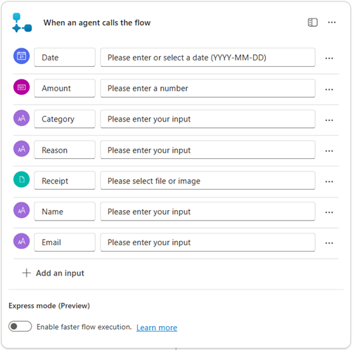
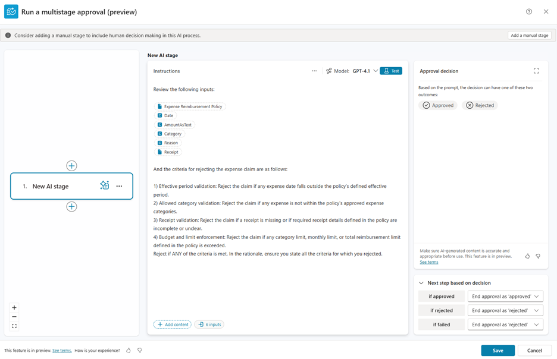
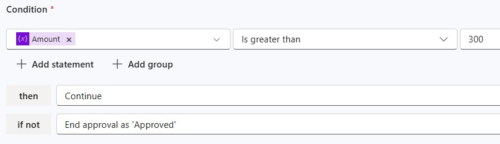
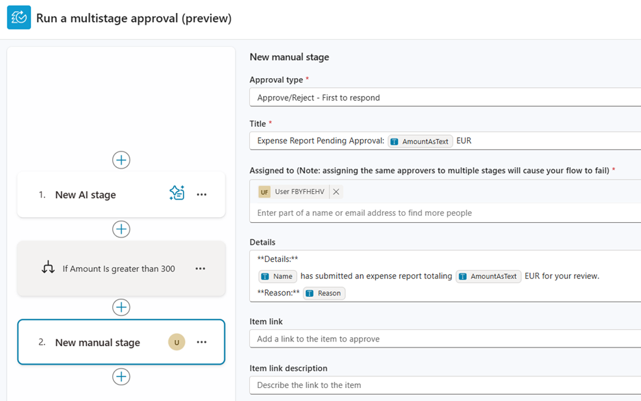
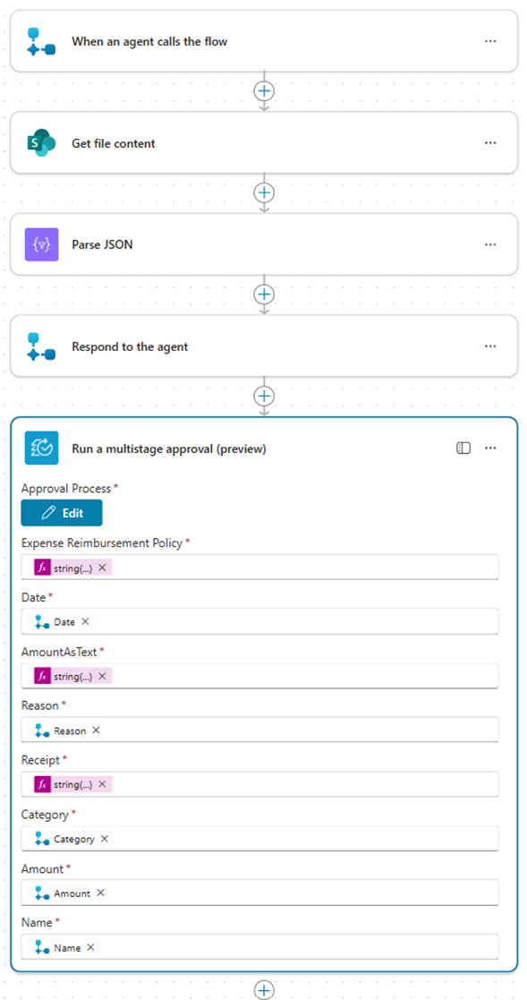
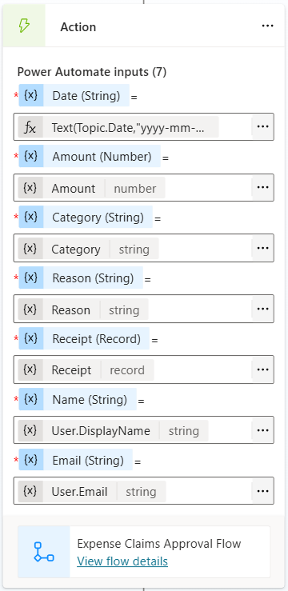
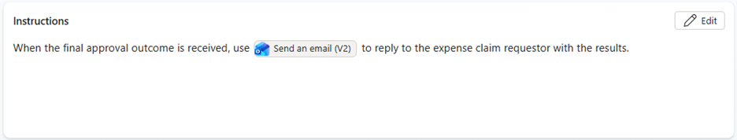
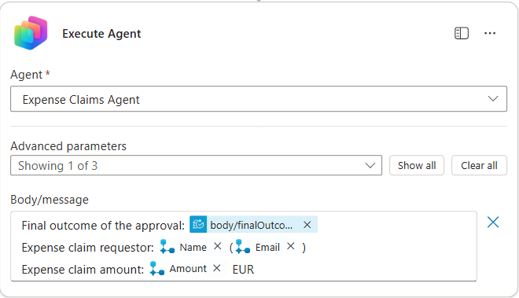
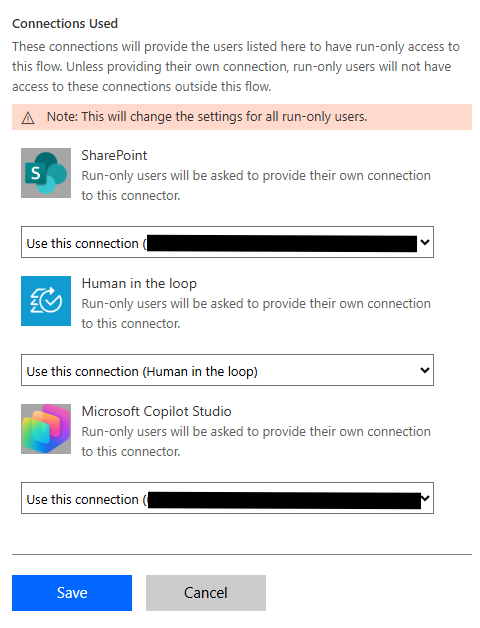

# Expense Claims Agent with Approvals (Human-in-the-Loop)

Build an end-to-end expense claims solution where an employee submits an expense report (and receipt) through an agent, the request is evaluated against policy using AI, escalated to a manager for final approval when needed, and the employee is notified of the final outcome via email.

---

## 🧭 Lab Details

| Level | Persona | Duration | Purpose |
| ----- | ------- | -------- | ------- |
| 200 | Maker | 45 minutes | After completing this lab, participants will be able to build an agent that invokes an agent flow with multi-stage, AI-driven approvals. The final approval outcome is routed back to the agent, which then notifies the employee. |

---

## 📚 Table of Contents

- [Why This Matters](#-why-this-matters)
- [Introduction](#-introduction)
- [Core Concepts Overview](#-core-concepts-overview)
- [Documentation and Additional Training Links](#-documentation-and-additional-training-links)
- [Prerequisites](#-prerequisites)
- [Summary of Targets](#-summary-of-targets)
- [Use Cases Covered](#-use-cases-covered)
- [Instructions by Use Case](#️-instructions-by-use-case)
  - [Use Case #1: Create an Agent Flow with a Multistage Approval](#-use-case-1-create-an-agent-flow-with-a-multistage-approval)
  - [Use Case #2: Create and Configure an Agent](#-use-case-2-create-and-configure-an-agent)
  - [Use Case #3: Configure Email Tool and Agent Invocation](#-use-case-3-configure-email-tool-and-agent-invocation)
  - [Test the End-to-End Solution](#-test-the-end-to-end-solution)

---

## 🤔 Why This Matters

Expense claims is a classic “high volume, high friction” process:
- Employees want fast decisions and clear outcomes.
- Finance wants consistent policy enforcement.
- Managers want to review only what requires human judgment.

This lab demonstrates a practical pattern for designing agents that orchestrate agent flows with AI-driven policy evaluation and human-in-the-loop approvals, ensuring both automation efficiency and enterprise-grade governance.

---

## 🌐 Introduction

In this lab, you’ll learn how to build an agent using Microsoft Copilot Studio that collects structured user input, invokes agent flows, orchestrates approvals, and notifies users of outcomes.

**Real-world example:** An expense report that once took days to approve is automatically evaluated against policy, escalated only when needed, and quickly returned to the employee with a clear outcome.

**This lab shows how** to implement this pattern using an agent and an agent flow with AI-driven and human-in-the-loop approvals, creating a reusable approach for real-world business processes.


---

## 🎓 Core Concepts Overview

| Concept | Why it matters |
|---------|----------------|
| **Agent** | A digital assistant powered by AI, capable of understanding and responding to user inputs with contextual intelligence rather than scripted responses. |
| **Agent Flow** | Structured, automated sequences of actions in that can be triggered by events or agents to automate tasks and integrate apps and services. |
| **Multistage and AI approvals** | Approval processes with multiple review stages — combining automated AI decision points and human approval stages. |
| **Tools** | Tools are simple or sophisticated connectors that the Copilot Studio orchestrator can invoke in response to user queries or business events. |

---

## 📄 Documentation and Additional Training Links

* [Microsoft Copilot Studio Documentation](https://learn.microsoft.com/microsoft-copilot-studio/)
* [Microsoft Power Automate documentation](https://learn.microsoft.com/power-automate/)
* [Agent flows](https://learn.microsoft.com/microsoft-copilot-studio/flows-overview)
* [Multistage and AI approvals in agent flows](https://learn.microsoft.com/microsoft-copilot-studio/flows-advanced-approvals)
* [Use connectors in Copilot Studio](https://learn.microsoft.com/microsoft-copilot-studio/advanced-connectors)
* [Office 365 Outlook Connector](https://learn.microsoft.com/connectors/office365/)

---

## ✅ Prerequisites

- Access to Microsoft Copilot Studio with appropriate licensing
- A Microsoft Power Platform environment with at least an Environment Maker security role
- Access to SharePoint Online with a sample policy document
- Access to a sample receipt file
- Office 365 environment with Outlook integration enabled

---

## 🎯 Summary of Targets

In this lab, you'll build an end-to-end expense claims process. By the end of the lab, you will:

- Create an **agent** that collects structured expense details + receipt upload and orchestrates the approval process
- Create an **agent flow** triggered by an agent
- Configure a **multistage approval** with AI + conditional routing + manual manager approval
- Parse uploaded receipt data and feed a **policy document** into an AI stage of a multistage approval
- Add an **email tool** and configure the agent to notify the employee of the final outcome
- Test the complete workflow with realistic scenarios and various requests

---

## 🧩 Use Cases Covered

| Step | Use Case | Value added | Effort |
|------|----------|-------------|--------|
| 1 | [Create an Agent Flow with a Multistage Approval](#-use-case-1-create-an-agent-flow-with-a-multistage-approval) | Automates approvals using AI, conditions, and human review | 20 min |
| 2 | [Create and Configure an Agent](#-use-case-2-create-and-configure-an-agent) | Collects structured input and triggers backend processes conversationally | 10 min |
| 3 | [Configure Email Tool and Agent Invocation](#-use-case-3-configure-email-tool-and-agent-invocation) | Notifies users of outcomes and completes the end-to-end process | 15 min |

---

## 🛠️ Instructions by Use Case

---

## 🧱 Use Case #1: Create an Agent Flow with a Multistage Approval

Create an agent flow that receives expense details, loads a policy document, evaluates the claim using an AI stage, and (optionally) routes to manager approval.

| Use case | Value added | Estimated effort |
|----------|-------------|------------------|
| Create an Agent Flow with a Multistage Approval | Automates approvals using AI, conditions, and human review | 20 minutes |

**Summary of tasks**  
Build an agent flow with AI-based, conditional, and manual approval stages.

**Scenario**  
Automating expense approvals while enforcing policy and minimizing manual review.

**Objective**  
Implement a scalable approval flow that blends AI decisioning with human oversight.

### Step-by-step instructions

1. Go to [copilotstudio.microsoft.com](https://copilotstudio.microsoft.com/)
2. Confirm you’re in the correct environment (top-right). In these labs, the environment name should start with **'DEV - \<your current User Name\>'**
3. Go to **Flows** in the left-hand navigation
4. Select **+ New agent flow**
5. Search for the trigger **When an agent calls the flow** (**Skills** connector; filter by **Built-in** connectors)

6. Select **+ Add an input** and add these inputs:
    - Type: **Date** | Name: `Date`
    - Type: **Number** | Name: `Amount`
    - Type: **Text** | Name: `Category`
    - Type: **Text** | Name: `Reason`
    - Type: **File** | Name: `Receipt`
    - Type: **Text** | Name: `Name`
    - Type: **Text** | Name: `Email`

   

7. Select **+** to add **Get file content** (**SharePoint** connector)

8. **Sign in** with your training account to create a connection 

> [!IMPORTANT]
> For **Site Address** and **File Identifier**, use the provided values in **Lab Resources**

9. Select **+** to add **Parse JSON** (Data Operation)
   - In **Content**, insert dynamic content and add the **Receipt** parameter from the trigger (use **See more** on the trigger to find it).
   - In **Schema**, paste:

```json
{
  "type": "object",
  "properties": {
    "ContentType": { "type": "string" },
    "Content": { "type": "string" }
  }
}
```
> [!TIP]
> This step overcomes the limitation of multistage approvals not supporting file attachments

10. Select **+** to add **Respond to the agent** (Skills connector)

> [!TIP]
> Agent flows can fail if they take longer than 2 minutes to respond to the agent. Here, you send an empty reply to avoid timeouts while the flow continues executing.

11. Select **+** to add **Run a multistage approval (preview)** (Human in the loop connector)

12. **Create new** connection with your training account

13. Select **Set up the approval**

> [!TIP]
> If **Set up the approval / Edit** isn’t visible on the action card, save the flow as draft and refresh your browser.

#### Configure the multistage approval

14a. Select **Create > AI Stage** and set **Instructions** to:

```
Review the following inputs:

Expense Reimbursement Policy
Date
AmountAsText
Category
Reason
Receipt

And the criteria for rejecting the expense claim are as follows:

1) Effective period validation: Reject the claim if any expense date falls outside the policy’s defined effective period. 
2) Allowed category validation: Reject the claim if any expense is not within the policy’s approved expense categories. 
3) Receipt validation: Reject the claim if a receipt is missing or if required receipt details defined in the policy are incomplete or unclear. 
4) Budget and limit enforcement: Reject the claim if any category limit, monthly limit, or total reimbursement limit defined in the policy is exceeded. 

Reject if ANY of the criteria is met. In the rationale, ensure you state all the criteria for which you rejected. 
```

14b. Replace the input values with input parameters (select **/** and create these inputs):
  - Type: **Image or Document** | Name: `Expense Reimbursement Policy`
  - Type: **Text** | Name: `Date`
  - Type: **Text** | Name: `AmountAsText`
  - Type: **Text** | Name: `Category`
  - Type: **Text** | Name: `Reason`
  - Type: **Image or Document** | Name: `Receipt`

14c. Select **Save**

   

14d. **Edit** the Approval Process and insert a **Condition** after the AI stage:
- In the Condition field, add a new input of type **Number** named `Amount`
- Set: **Is greater than** `300`
- Select: **then Continue** | **if not End approval as ‘Approved’**

   

14e. Select **+** to insert a **Manual stage** after the Condition:
- Approval type: **Approve/Reject - First to respond**
- Title: `Expense Report Pending Approval: {AmountAsText} EUR`
- Assigned to: `[your_training_user_email_address]`
- Details:

```md
**Details:**  
{Name} has submitted an expense report totaling {AmountAsText} EUR for your review.  

**Reason:** {Reason}
```

14f. For each placeholder `{…}`, use **/** to add the following inputs:
- Add existing inputs for **AmountAsText** and **Reason**
- Create new **Name** input (type **String**)

   

14g. Go back to the AI stage and update **Next step based on decision**:
- If approved: **Continue**

14h. Select **Save**

#### Wire up the flow inputs to the approval action

15. Back in the main agent flow designer, set inputs on **Run a multistage approval**:
- For **Date, Category, Reason, Amount, Name**: select **/** to insert dynamic content from **When an agent calls the flow**
- For the remaining values, select **/** to insert expressions:
  - **Expense Reimbursement Policy** = `string(body('Get_file_content')?['$content'])`
  - **AmountAsText** = `string(triggerBody()?['number'])`
  - **Receipt** = `string(body('Parse_JSON')?['Content'])`

   

16. Select **Publish**
17. In the **Overview** tab, select **Edit** (Details pane) and name the flow: `Expense Claims Approval Flow`

---

### 🏅 Congratulations! You've completed Use Case #1!

---

## 🔄 Use Case #2: Create and Configure an Agent

Create an agent that collects expense details using an Adaptive Card, captures the receipt file, and calls the approval flow.

| Use case | Value added | Estimated effort |
|----------|-------------|------------------|
| Create and Configure an Agent | Collects structured input and triggers backend processes conversationally | 10 min |

**Summary of tasks**  
Create and configure an agent to collect structured expense data and trigger an agent flow.

**Scenario**  
Providing users with a conversational interface to submit expense reports consistently.

**Objective**  
Enable a user-friendly front end that reliably initiates backend approval processes.

### Step-by-step instructions

1. Go to **Solutions** (under the `...` menu in the left-hand navigation)
   - If you already have a solution, select it
   - If not, create a new solution with a new publisher

2. In the solution, select **+ New** > **Agent** > **Agent**
3. Turn on **Configure** (top-left) to manually configure the agent
4. Name the agent: **Expense Claims Agent**
5. Select **Create**

#### Create the expense submission topic

6. Go to **Topics** > **+ Add a topic** > **From blank**
7. Rename the topic: `Expense report submission`
8. Set the topic **Trigger description** to:  
   `Use this tool to submit expense reports for reimbursement.`

9. Select **+ Add node** > **Ask with Adaptive Card**
10. Select **…More** > **Properties** > **Edit adaptive card** and paste this payload:

```json
{
  "$schema": "https://adaptivecards.io/schemas/adaptive-card.json",
  "type": "AdaptiveCard",
  "version": "1.5",
  "body": [
    { "type": "TextBlock", "text": "Expense Claims Request", "size": "Large", "weight": "Bolder", "wrap": true },
    { "type": "TextBlock", "text": "Date", "weight": "Bolder", "wrap": true, "spacing": "Medium" },
    { "type": "Input.Date", "id": "Date", "placeholder": "Select the current date" },
    { "type": "TextBlock", "text": "Amount", "weight": "Bolder", "wrap": true, "spacing": "Medium" },
    { "type": "Input.Number", "id": "Amount", "placeholder": "Enter the total amount", "min": 0 },
    { "type": "TextBlock", "text": "Category", "weight": "Bolder", "wrap": true, "spacing": "Medium" },
    {
      "type": "Input.ChoiceSet",
      "id": "Category",
      "style": "expanded",
      "choices": [
        { "title": "Meals", "value": "Meals" },
        { "title": "Travel", "value": "Travel" },
        { "title": "Accommodation", "value": "Accommodation" },
        { "title": "Other", "value": "Other" }
      ]
    },
    { "type": "TextBlock", "text": "Reason for purchase", "weight": "Bolder", "wrap": true, "spacing": "Medium" },
    { "type": "Input.Text", "id": "Reason", "placeholder": "Expense Description / Business Purpose", "isMultiline": true }
  ],
  "actions": [
    { "type": "Action.Submit", "title": "Submit", "data": { "formType": "expenseClaims" } }
  ]
}
```

11. Select **Save** and **Close**

#### Collect receipt upload

12. Select **+ Add node** > **Ask a question**
   - Message: `Please upload a copy of your receipt`
   - Identify: **File**
   - Save user response as: rename variable to `Receipt`
   - Select **…More** > **Properties** > **Entity recognition** and check **Include file metadata**

#### Call the flow

13. Select **+ Add node** > **Add a tool** > **Expense Claims Approval Flow** and set inputs:
   - Date: **Select variable** > **Formula**: `Text(Topic.Date,"yyyy-mm-dd")`
   - Amount: **Select variable**: `Amount`
   - Category: **Select variable**: `Category`
   - Reason: **Select variable**: `Reason`
   - Receipt: **Select variable**: `Receipt`
   - Name: **Select variable** > **System**: `User.DisplayName`
   - Email: **Select variable** > **System**: `User.Email`

   

14. Add **Send a message** node:  
   `Thanks for submitting your expense claims request! You’ll be notified by email once it’s approved or requires changes.`

15. Select **+ Add node** > **Topic management** > **End all topics**
16. **Save** the topic

---

### 🏅 Congratulations! You've completed Use Case #2!

---

## 📣 Use Case #3: Configure Email Tool and Agent Invocation

Add a tool to send the employee an email with the final approval outcome and integrate it into the agent workflow.

| Use case | Value added | Estimated effort |
|----------|-------------|------------------|
| Configure Email Tool and Agent Invocation | Notifies users of outcomes and completes the end-to-end process | 15 min |

**Summary of tasks**  
Configure an email tool and invoke the agent from the agent flow to deliver outcomes.

**Scenario**  
Notifying requestors of approval results without manual follow-up.

**Objective**  
Complete the end-to-end process by automatically communicating final decisions.

### Step-by-step instructions

1. Go to **Tools** > **+ Add a tool**
2. Search for **Send an email (V2)** (Office 365 Outlook)
3. Select **Create new connection** and use your training account
4. Select **Add and configure**
5. Update **Description**:  
   `Use this tool to notify the expense claim requestor of the final approval outcome (approved or rejected).`
6. Expand **Additional details** and set **Credentials to use** to **Maker-provided credentials**
7. Configure inputs:
   - **To**: *Dynamically fill with AI* → Customize description: `The email of the expense claim requestor`
   - **Subject**: *Custom value* → `Expense claim request outcome`
   - **Body**: *Dynamically fill with AI* → Customize description:  
     `Write an email in HTML format that states the final outcome (approved or rejected) and includes the total claim amount.`
8. **Save** the tool

#### Update agent instructions

9. Go to the agent **Overview** tab and update agent **Instructions** with:

`When the final approval outcome is received, use {Send an email (V2)} to reply to the expense claim requestor with the results.`

> [!IMPORTANT]
> For each placeholder `{…}`, use **/** to insert the tool you configured.

   

10. Select **Save**
11. **Publish** the agent

---

#### Update agent flow to call the agent

Now that the approval flow produces an outcome, call the agent to send the final email.

1. Go to **Flows**
2. Open **Expense Claims Approval Flow**
3. Go to **Designer**
4. At the end, add **Execute Agent** (**Microsoft Copilot Studio** connector; filter by **Standard connectors**)
5. **Sign in** with your training user account to create a connection
6. Select the **Expense Claims Agent**
7. Select **Show all** and set **Body/message** to:

```text
Final outcome of the approval: {Final outcome}
Expense claim requestor: {Name}({Email})
Expense claim amount: {Amount} EUR
```

> [!IMPORTANT]
> For each placeholder `{…}`, use **/** to insert dynamic content from previous actions

   

8. **Publish** the agent flow

#### Configure run-only connections (Power Automate)

9. Navigate to [make.powerautomate.com](https://make.powerautomate.com/)
10. Confirm environment starts with **`DEV - `**
11. Go to **My flows** and select **Expense Claims Approval Flow**
12. In the **Run-only user** pane, select **Edit**
13. Update all **Connections Used** from “Provided by run-only user” to **Use this connection…**
14. Select **Save**

   

> [!TIP]
> This config sets the agent flow to run with maker-provided credentials instead of end-user credentials

> [!NOTE]
> Optionally add your agent flow to your solution: Go to **Solutions > _your_solution_ > Add existing > Automation > Cloud flow > _your_agent_flow_**

---

## 🧪 Test the End-to-End Solution

1. In Copilot Studio, go to **Agents** > **Expense Claims Agent**
2. In **Test your agent** window, send message: `Submit expense report`
3. Fill the form:
   - Date: current date
   - Amount: `343`
   - Category: `Meals`
   - Reason: `Team bonding`
4. **Submit** the form
5. Upload a sample receipt

> [!IMPORTANT]
> Download the receipt provided in **Lab Resources** and upload it to your agent for testing

### Review execution

6. Go to your agent flow, open the **Activity** tab and review the run
7. Open **Run a multistage approval (preview)** to review AI stage + Outcome  
8. Open [outlook.office.com/mail](https://outlook.office.com/mail/)
9. Review and Approve the approval request email you received  
10. Return to the agent flow run and confirm it completes and triggers **Execute Agent**  
11. Go to your agent, open the **Activity** tab and note a second Automated run was initiated  
12. In Outlook, review the second email: **Expense claim request outcome**

---

## 🏆 Summary of learnings

True learning comes from doing, questioning, and reflecting - so let’s put your skills to the test.

To maximize the impact of **agent flows with multistage approvals in Microsoft Copilot Studio**:

* **Use agent flows for deterministic processes** – Implement predictable, rule-based logic, approvals, and integrations in agent flows for reliability and control.
* **Separate conversational UX from orchestration logic** – Let the agent focus on collecting clean, structured inputs and guiding the user, while the agent flow handles approvals, integrations, branching logic, and long-running execution.
* **Make AI decisions transparent and auditable** – Clearly define approval/rejection criteria in the AI approval stage and require a complete rationale for decisions, ensuring outcomes are explainable and compliant.
* **Design for platform constraints and reliability** – Handle long-running approvals by responding early to the agent to avoid timeouts, then continue processing asynchronously and return outcomes later.
* **Close the loop with outcome notifications** – The workflow is only complete when the requestor is informed of the final decision, using the agent and email tools to deliver clear, timely communication.

---

### Conclusions and recommendations

**Agent flows and multistage approvals golden rules:**

* Collect structured, validated input upfront to reduce ambiguity and rework later.
* Escalate to human review based on explicit signals such as cost thresholds or policy violations.
* Always return a clear, machine-readable approval outcome (approved or rejected with rationale).
* Intentionally manage credentials and connections to ensure flows run reliably across environments.
* Treat notifications as part of the workflow, not an afterthought—include decision, amount, and next steps.
* Test both automated and manual approval paths to ensure correct routing and end-to-end reliability.

By following these principles, you’ll build scalable, trustworthy, and efficient approval workflows that combine AI speed with human judgment and deliver consistent end-to-end experiences.

---

