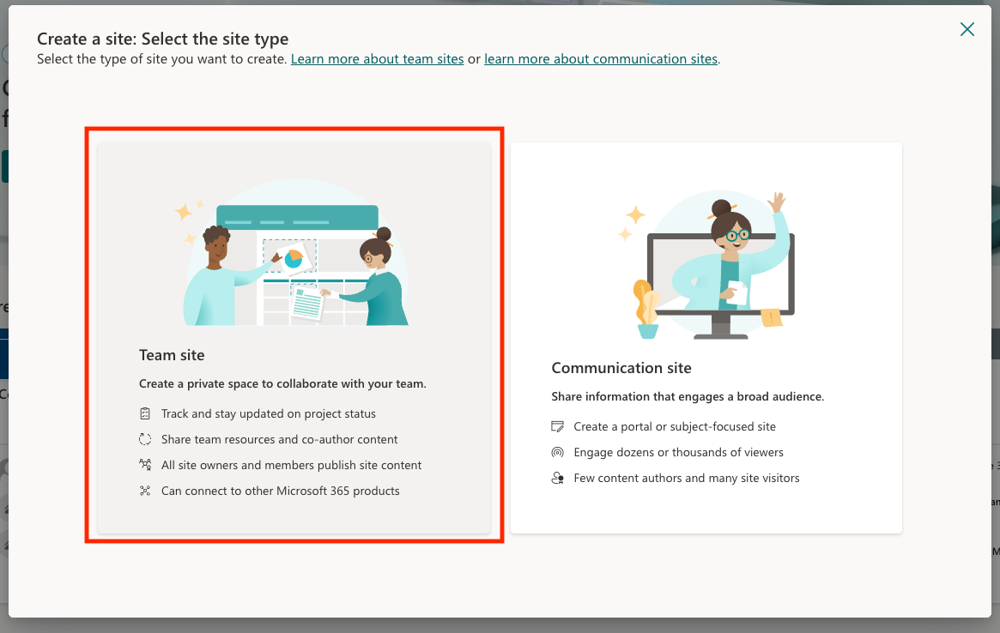
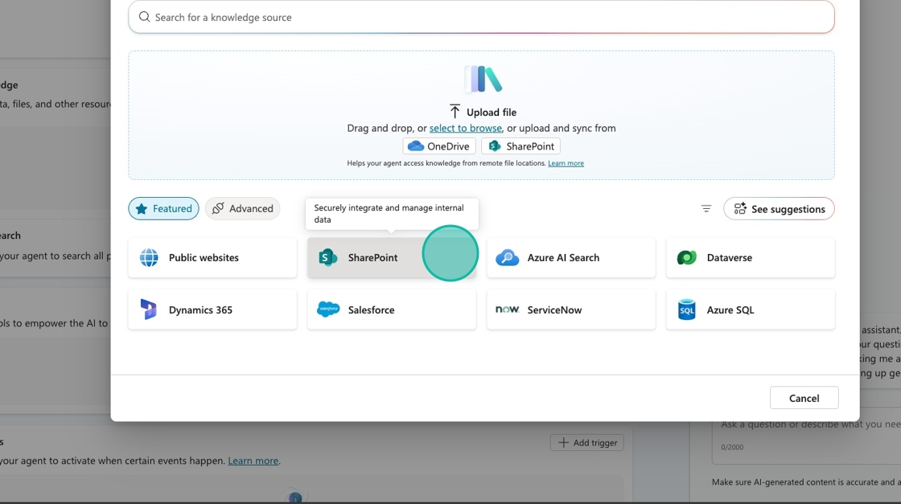
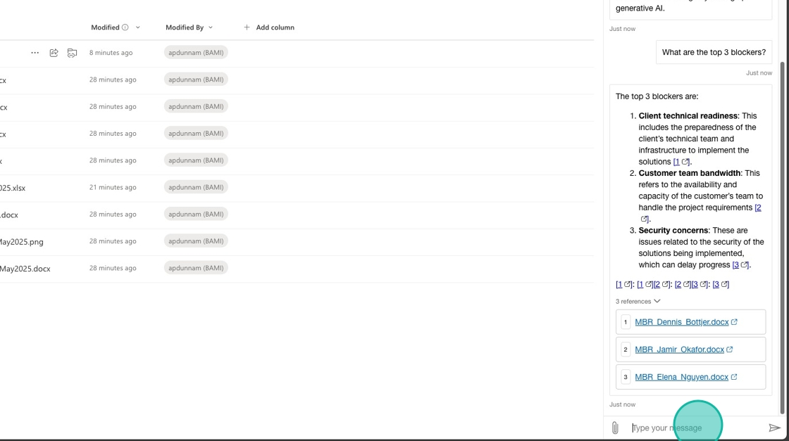

# Create a Monthly Business Review (MBR) Agent

This guide provides step-by-step instructions for creating an MBR (Monthly Business Review) Agent, which is designed to streamline the preparation process for MBRs. By following the guide, users will learn how to query resources and obtain quick answers, ultimately enhancing efficiency and organization for business reviews. It's a valuable tool for anyone looking to optimize their workflow and ensure they are well-prepared for important business discussions. 

---

## 🧭 Lab Details

| Level | Persona | Duration | Purpose |
| ----- | ------- | -------- | ------- |
| 100 | Maker/Developer | 20 minutes | After completing this lab, participants will be able to create a conversational agent hosted in SharePoint. You'll learn how to add knowledge sources, test and publish to SharePoint. |

---

## 📚 Table of Contents

- [Why This Matters](#-why-this-matters)
- [Introduction](#-introduction)
- [Core Concepts Overview](#-core-concepts-overview)
- [Documentation and Additional Training Links](#-documentation-and-additional-training-links)
- [Prerequisites](#-prerequisites)
- [Summary of Targets](#-summary-of-targets)
- [Use Cases Covered](#-use-cases-covered)
- [Instructions by Use Case](#️-instructions-by-use-case)
  - [Use Case #1: Create SharePoint site and upload MBR documents](#-use-case-1-create-sharepoint-site-and-upload-mbr-documents)
  - [Use Case #2: Build and deploy MBR agent](#-use-case-2-build-and-deploy-mbr-agent)
- [Summary of Learnings](#-summary-of-learnings)
- [Conclusions & Recommendations](#-conclusions--recommendations)

---

## 🤔 Why This Matters

**Managers and Team Leads** – Drowning in slide decks, scattered data, and last-minute scramble sessions before Monthly Business Reviews?

Think of a traditional MBR prep process:  
- **Without agents**: Leaders dig through dozens of decks, copy/paste insights, manually summarize risks and themes, and chase down team updates – all while trying to spot patterns across silos  
- **With agents**: AI reads files from SharePoint, extracts key themes (like at-risk deals or blockers), and delivers concise summaries you can act on – no digging required

**Common challenges solved by this lab:**
- "We waste hours each month trying to consolidate MBR decks from every team"
- "Leadership misses key risks or repetitive asks buried in PowerPoint files"
- "It's hard to spot trends across different teams without a data analyst"
- "We're reactive instead of proactive when it comes to business risks"

**In just 20 minutes, you’ll learn how to build an agent that helps leaders get to the ‘so what’ faster—turning static decks into actionable insights.**

## 🌐 Introduction

Monthly Business Reviews (MBRs) are critical for keeping leadership informed, identifying risks, and aligning on key initiatives. But the preparation process is often tedious and fragmented, requiring hours of manual effort to gather, review, and summarize insights from multiple teams.

**Real-world example:** A regional sales org prepares for its MBR by collecting slide decks from over 10 team leads. Each deck includes updates, at-risk deals, and escalations—buried across inconsistent formats and file names. A single director spends 4–6 hours manually scanning each one, summarizing recurring themes, and building a master summary for leadership.

After implementing an agent, the director simply prompts the system to scan the latest MBR files in SharePoint. Within seconds, the agent highlights common risks, summarizes recurring asks, and surfaces trends across teams. Now the director can focus on strategic insights—not file wrangling.

---

## 🎓 Core Concepts Overview

| Concept | Why it matters |
|---------|----------------|
| **Conversational Agent** | Powers natural, chat-like interactions so users can ask about MBR themes, risks, and takeaways without needing to dig through files manually |
| **Knowledge** | Enables the agent to read and understand content from past MBR decks stored in SharePoint, so it can extract relevant insights and patterns |
| **Testing in Copilot Studio** | Helps you validate that the agent understands user intent and returns accurate, useful responses before it's shared with others |
| **Publishing to SharePoint** | Makes the agent accessible to your team directly from a SharePoint site, so anyone preparing for an MBR can use it on demand |
| **SharePoint Agent Setup** | Seamlessly integrates with your existing file storage so your agent always has access to the latest MBR decks—no need to move files around |

---
## 📄 Documentation and Additional Training Links

* [Microsoft Copilot Studio Documentation](https://learn.microsoft.com/en-us/microsoft-copilot-studio/)

* [Copilot Studio Triggers and Tools](https://learn.microsoft.com/en-us/microsoft-copilot-studio/advanced-trigger-actions)

---
## ✅ Prerequisites

* Access to Microsoft Copilot Studio with appropriate licensing
* Microsoft 365 environment with SharePoint access

---
## 🎯 Summary of Targets

In this lab, you'll build a conversational MBR agent that streamlines how managers and leaders access insights across Monthly Business Review decks. By the end of the lab, you will:

* Create and configure a conversational agent using Copilot Studio
* Add knowledge sources by linking SharePoint-stored MBR files to the agent
* Test the agent to ensure it can accurately summarize risks, trends, and key themes
* Publish the agent to a SharePoint site so it's easily accessible to stakeholders
* Enable your team to ask questions like “What are the common risks this month?” and get immediate, actionable answers

---
## 🧩 Use Cases Covered

| Step | Use Case | Value added | Effort |
|------|----------|-------------|--------|
| 1 | [Create SharePoint site and upload MBR documents](#-use-case-1-create-sharepoint-site-and-upload-mbr-documents) | Establish centralized document repository for MBR data that the agent can access | 10 min |
| 2 | [Build and deploy MBR agent](#-use-case-2-build-and-deploy-mbr-agent) | Create intelligent agent that analyzes MBR documents and provides instant insights | 10 min |

---

## 🛠️ Instructions by Use Case

---

## 📁 Use Case #1: Create SharePoint site and upload MBR documents

Set up a dedicated SharePoint site with MBR documents that will serve as the knowledge source for your agent.

| Use case | Value added | Estimated effort |
|----------|-------------|------------------|
| Create SharePoint site and upload MBR documents | Establish centralized document repository for MBR data that the agent can access | 10 minutes |

**Summary of tasks**

In this section, you'll create a SharePoint team site and upload sample MBR documents that will serve as the knowledge base for your agent.

**Scenario:** Your organization needs a centralized location for Monthly Business Review documents that can be easily accessed by an AI agent to provide instant insights and summaries.

### Objective

Create a SharePoint site with MBR documents that will serve as the knowledge source for your conversational agent.

---

### Step-by-step instructions

#### Create SharePoint site

1. Go to [m365.cloud.microsoft/apps/](https://m365.cloud.microsoft/apps/?from=PortalHome&auth=2) and select **SharePoint**

2. Select **Create Site**

3. Select **Team Site**

4. Select **Standard team**

5. Select **Use Template**

6. Put `MBR - <Your User Name>` in the Site Name and Select **Next**

7. Click **Finish**

#### Upload MBR documents

> [!IMPORTANT]
> **For training participants:** If you are following this lab as part of a guided training session, the MBR documents have already been uploaded to SharePoint at the location specified in your **Lab Resources**. You can skip this use case and proceed directly to [Use Case #2](#-use-case-2-build-and-deploy-mbr-agent).

8. Navigate to the [sample files folder](./assets/) and download the sample files

9. Select `Documents` in the left navigation

10. Select `Upload`

11. Select all the sample files you just downloaded and click `Open`

---

###  🏅 Congratulations! You've set up your SharePoint site with MBR documents!

---

### Test your understanding

**Key takeaways:**

* **Centralized storage** – SharePoint provides a secure, accessible location for business documents
* **Document organization** – Proper file structure enables better agent knowledge extraction
* **Access permissions** – SharePoint security ensures only authorized users can access sensitive MBR data

**Challenge: Apply this to your own use case**

* What other business review documents could benefit from AI agent analysis?
* How would you organize files to make them more discoverable by agents?
* What security considerations are important for your organization's sensitive documents?

---

## 🤖 Use Case #2: Build and deploy MBR agent

Create an intelligent conversational agent that can analyze your MBR documents and provide instant insights.

| Use case | Value added | Estimated effort |
|----------|-------------|------------------|
| Build and deploy MBR agent | Create intelligent agent that analyzes MBR documents and provides instant insights | 10 minutes |

**Summary of tasks**

In this section, you'll create a Copilot Studio agent, connect it to your SharePoint documents, test its capabilities, and deploy it back to SharePoint for team access.

**Scenario:** Build an AI assistant that can instantly answer questions about MBR content, identify common risks and themes, and help leadership prepare for business reviews more efficiently.

### Objective

Create, configure, test, and deploy a conversational MBR agent that leverages SharePoint documents as its knowledge source.

---

### Step-by-step instructions

#### Create the agent in Copilot Studio

1. Open a new browser tab and navigate to [copilotstudio.microsoft.com](https://copilotstudio.microsoft.com). Select **Create**

2. Select **New agent**

3. Select the **Configure** tab

4. In the **Name** field type `MBR Agent`. In the **Description** field type,  `This agent helps in preparing for Monthly Business Reviews. It queries MBR resources and provides quick answers`

5. Select `...` to go into **Edit advanced settings**. Make sure the agent is created as part of one of your **solutions**.

6. Select **Create**

#### Add SharePoint knowledge source

7. Select **Add knowledge**

8. Select **SharePoint**

9. **Paste** the URL of your SharePoint site folder where the MBR documents are located in the text input

> [!IMPORTANT]
> If these files have already been uploaded for you, use the URL provided in **Lab Resources** (specific per training).

10. Select **Add**

11. Select **Add** again

#### Test the agent

12. Now we need to test our agent to see if it returns answers from our knowledge. 

13. Type `what deals are currently in the negotiation stage?` and send the message.

14. **Review** the answer in the test window and notice the logic in the Activity Pane on the left hand side

#### Publish and deploy to SharePoint

15. Now that we know the agent is working, we need to publish our changes by selecting the **Publish** button in the upper right hand corner.

16. Now it's time to deploy our agent to SharePoint. Select the **Channels** tab.

17. Select **SharePoint**

18. **Select** or **search** the SharePoint site you created in the previous steps from the list of options

> [!IMPORTANT] Only sites where the user has **Edit** permissions can be used. Otherwise, an error will be displayed.

19. Select **Deploy**

#### Test the deployed agent

20. Select the `...` next to the Deployed text and select **Copy Agent Url**. Open a new browser tab and paste in the URL.

21. Your agent will open up in SharePoint. Test it out by typing `What are the top 3 blockers?` in the text input and pressing `Return`

22. Review the answer and note that it provides links to the referenced documents.

23. Perform another test by typing `Which reps requested additional pre-sales support?` and pressing `Return`

24. Review your response. Congratulations! You've built and deployed your SharePoint MBR Agent!

---

###  🏅 Congratulations! You've built and deployed your SharePoint MBR Agent!

---

### Test your understanding

**Key takeaways:**

* **Knowledge integration** – Agents can directly access and analyze SharePoint documents for contextual responses
* **Testing importance** – Always validate agent responses before deployment to ensure accuracy
* **Deployment flexibility** – Agents can be deployed directly to SharePoint for seamless user access
* **Reference linking** – Well-configured agents provide source citations for transparency and verification

**Lessons learned & troubleshooting tips:**

* Test with various question types to ensure comprehensive knowledge coverage
* Check that agent responses include proper source citations
* Verify deployment permissions align with your organization's security requirements
* Remember that agents need time to index new documents after knowledge source updates

**Challenge: Apply this to your own use case**

* What other business processes could benefit from document-based AI agents?
* How would you customize the agent's instructions for different audiences (executives vs. managers)?
* What additional knowledge sources could enhance the agent's capabilities?
* How might you structure MBR documents to optimize agent performance?

---

## 🔁 Summary of Learnings

True learning comes from doing, questioning, and reflecting—so let's put your skills to the test.

To maximize the impact of your MBR Agent:

* **Document organization matters** – Well-structured SharePoint libraries enable better agent knowledge extraction and more accurate responses
* **Test comprehensively** – Validate agent performance with realistic business questions before deploying to stakeholders
* **Leverage source citations** – Agents that provide document references build trust and enable users to dive deeper into source material
* **Deploy strategically** – SharePoint deployment puts the agent where users naturally work with documents
* **Iterate based on feedback** – Monitor agent usage and refine knowledge sources based on common user questions and needs

---

## 📌 Conclusions & Recommendations

**MBR Agent golden rules:**

* Keep MBR documents in consistent formats and naming conventions for optimal agent understanding
* Test agent responses against known document content to ensure accuracy before deployment
* Use specific, business-relevant questions during testing to validate real-world usefulness
* Deploy agents to locations where users naturally work to maximize adoption
* Regularly update knowledge sources to keep agent responses current and relevant
* Monitor common user questions to identify knowledge gaps and improvement opportunities

By following these principles, you'll create MBR agents that not only provide accurate information but transform how leadership teams prepare for and conduct business reviews, turning hours of manual document review into minutes of intelligent conversation.

---
