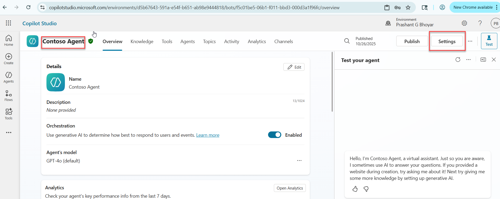
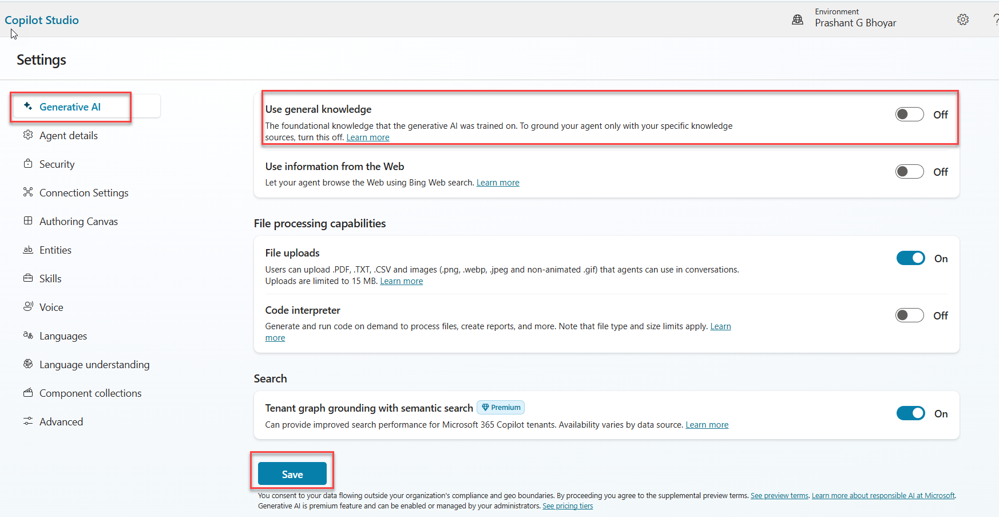
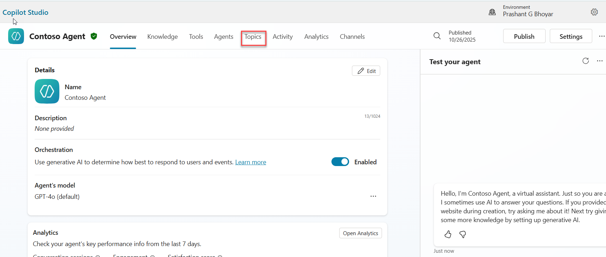
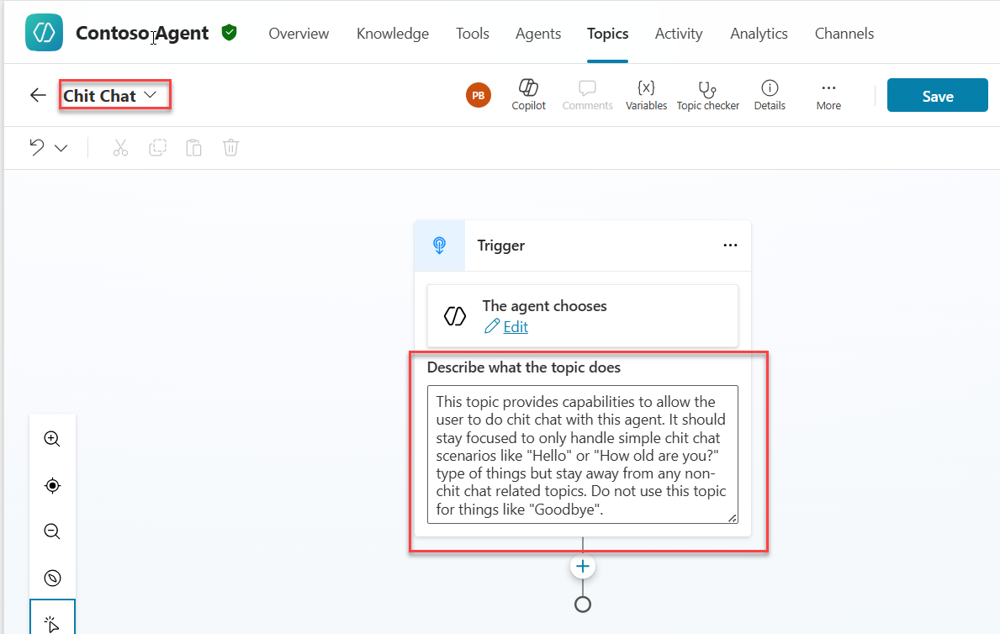
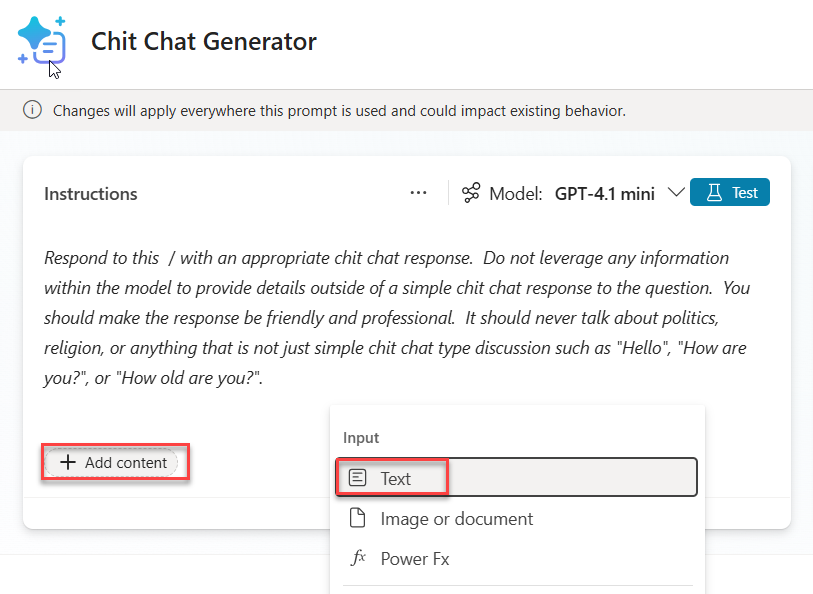
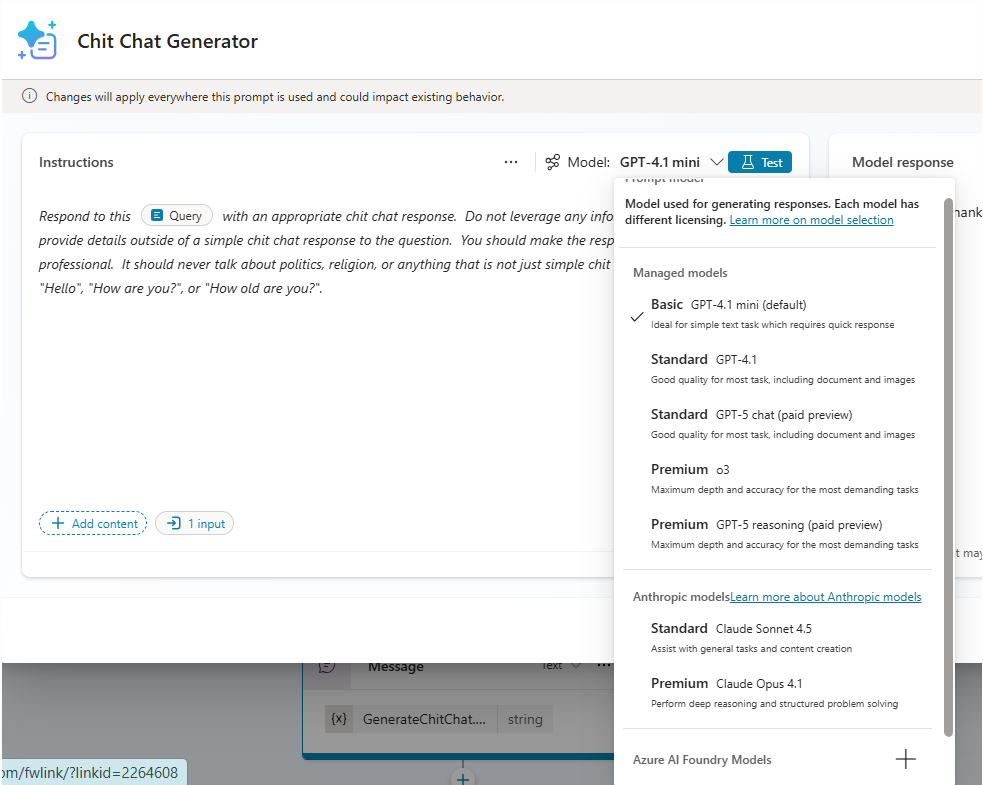
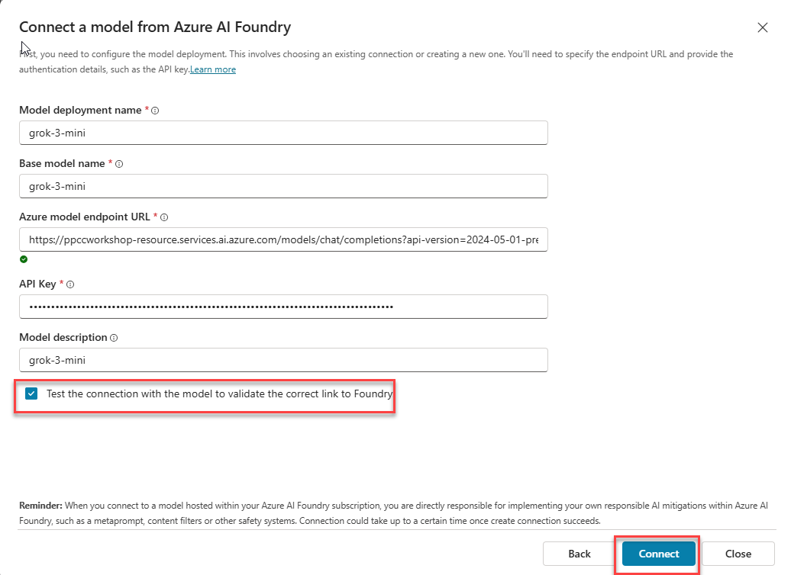
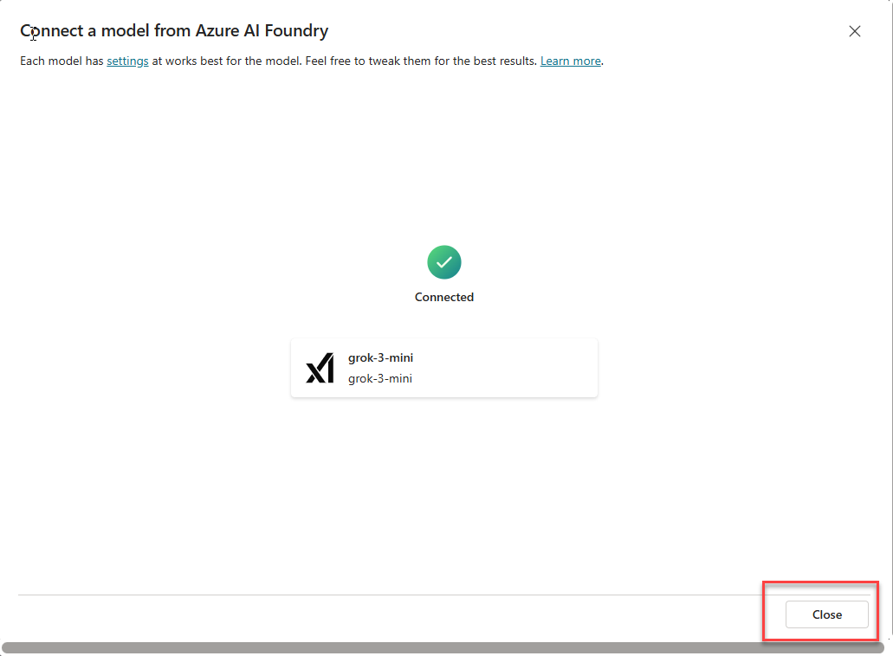
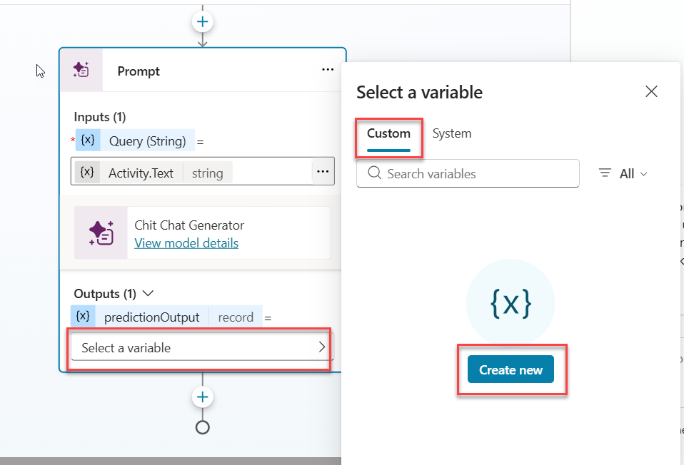
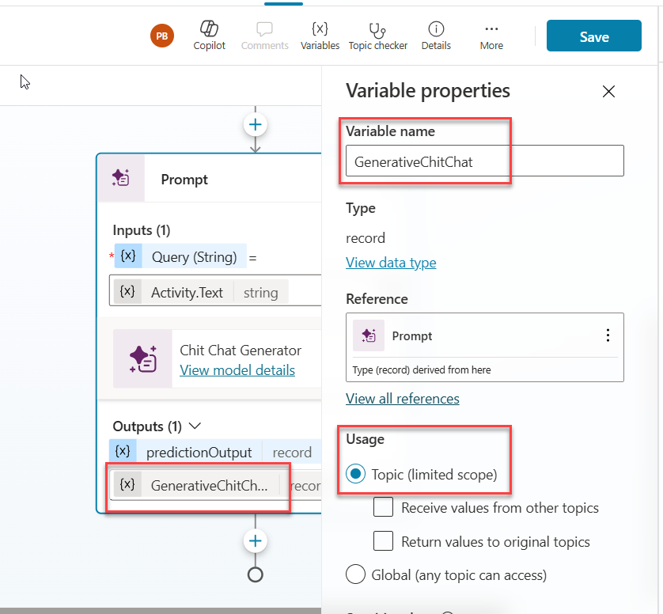

# 🤖 Bring Your Own Model (BYOM) Tool in Copilot Studio

*Unlock the power of Azure AI Foundry models in your Copilot Studio agents by integrating your own machine learning models, or by using off-the-shelf or fine-tuned models from Azure AI Foundry as conversational tools.*

---

## 🧭 Lab Details

| Level | Persona         | Duration   | Purpose                                                                                                                                                                                                 |
| ----- | --------------- | ---------- | ------------------------------------------------------------------------------------------------------------------------------------------------------------------------------------------------------- |
| 200   | Maker/Developer | 40 minutes | Learn how to integrate models from Azure AI Foundry into Copilot Studio agents using the Bring Your Own Model (BYOM) capability, enabling specialized AI functionality tailored to your business needs. |

---

## 📚 Table of Contents

- [🤖 Bring Your Own Model (BYOM) Tool in Copilot Studio](#-bring-your-own-model-byom-tool-in-copilot-studio)
  - [🧭 Lab Details](#-lab-details)
  - [📚 Table of Contents](#-table-of-contents)
  - [🤔 Why This Matters](#-why-this-matters)
  - [🌐 Introduction](#-introduction)
  - [🎓 Core Concepts Overview](#-core-concepts-overview)
  - [📄 Documentation and Additional Training Links](#-documentation-and-additional-training-links)
  - [✅ Prerequisites](#-prerequisites)
  - [🎯 Summary of Targets](#-summary-of-targets)
  - [🧩 Use Cases Covered](#-use-cases-covered)
  - [🛠️ Instructions by Use Case](#️-instructions-by-use-case)
  - [💬 Use Case #1: Chit Chat Generator](#-use-case-1-chit-chat-generator)
    - [Summary of tasks](#summary-of-tasks)
    - [Objective](#objective)
    - [Step-by-step instructions](#step-by-step-instructions)
      - [Lab 3A: Turn off General Knowledge and Add a topic Chit Chat](#lab-3a-turn-off-general-knowledge-and-add-a-topic-chit-chat)
    - [Testing Lab 3A](#testing-lab-3a)
    - [🏅 Congratulations! You have completed Chit Chat Generator](#-congratulations-you-have-completed-chit-chat-generator)
    - [Test your understanding](#test-your-understanding)
      - [Challenge: Apply this to your own use case](#challenge-apply-this-to-your-own-use-case)
  - [🔁 Summary of Learnings](#-summary-of-learnings)
  - [📌 Conclusions and Recommendations](#-conclusions-and-recommendations)
  - [🔧 Azure Setup (For Reference Only)](#-azure-setup-for-reference-only)
    - [Create Azure AI Foundry Resource](#create-azure-ai-foundry-resource)

---

## 🤔 Why This Matters

Using different AI models in Copilot Studio allows agents to leverage each model's strengths; such as reasoning, creativity, or precision for specific tasks. This ensures higher accuracy, efficiency, and adaptability across diverse use cases.

Azure AI Foundry brings the latest frontier models into your Copilot Studio prompts. You can access a diverse portfolio of AI models, including cutting-edge open-source solutions, industry-specific models, and task-based AI capabilities.

This lab demonstrates how Copilot Studio provides flexibility to integrate models from Azure AI Foundry into your Copilot Studio agents using the Bring Your Own Model (BYOM) capability---enabling specialized AI functionality tailored to your business needs and real-world automation scenarios.

**Think of your current contract management workflow:**

- **Without intelligent agents**, sales operations teams must manually identify key contract details---a slow, repetitive, and error-prone process that reduces efficiency and increases the chance of oversight.

- **With intelligent agents**, you can automatically extract key details and apply your company's specific rules and regulations to identify and categorize contract risks and other related tasks. For example, when a user asks the agent about potential risks, it considers all relevant factors and internal guidelines to deliver a more accurate and consistent risk assessment. While doing that often organization prefer that Agent should not use its General knowledge and only give information from the Companies data.

**Common challenges solved by this lab:**

- **How to enable chit-chat functionality in your agent without using the General knowledge.** When we turn off the General Knowledge in the Agent, it does not give answers to the questions which are not found in the Knowledge sources and tools.

**By bringing your own model from Azure AI Foundry, makers learn to:**

- Use a diverse portfolio of AI models, including cutting-edge open-source solutions, industry-specific models, and task-based AI capabilities.
- Apply an industry-specific model to a specific task within your agent.

---

## 🌐 Introduction

As organizations increasingly adopt AI agents, the demand for accurate, domain-specific solutions continues to grow. In areas like sales operations, teams often spend a lot of time manually identifying and extracting key contract details or assessing potential risks---a repetitive, time-consuming process that's prone to human error. This not only hurts efficiency but also raises the risk of compliance issues.

To solve these challenges, we can build agents in Copilot Studio that draw exclusively from a company's internal data. This ensures responses are precise, contextually relevant, and aligned with organizational knowledge, while general knowledge is turned off. Because the agent is intentionally designed to avoid using general knowledge, it won't engage in casual or "chit-chat" conversations---keeping the focus on delivering accurate, business-specific insights.

This lab focuses on using industry-specific and task-based AI models for targeted agent scenarios, such as chit-chat, through the Bring Your Own Model (BYOM) capability.

---

## 🎓 Core Concepts Overview

| Concept                              | Why it matters                                                                                                                                                                                                                                                                                                               |
| ------------------------------------ | ---------------------------------------------------------------------------------------------------------------------------------------------------------------------------------------------------------------------------------------------------------------------------------------------------------------------------- |
| **Using Prompts as Tool**            | In Copilot Studio, **Prompts** are instructions or templates that guide the Large Language Model (LLM), such as GPT, and small language models on how to think, respond, or generate content. They work like a smart script for your AI, helping it reason, retrieve information, and produce useful, context-aware answers. |
| **Create Reusable Prompt Templates** | In Copilot Studio, you can create reusable natural language instructions that harness both large and small language models to perform tasks such as summarization, reasoning, or data extraction.                                                                                                                            |

---

## 📄 Documentation and Additional Training Links

- [Bring your own model for your prompts | Microsoft Learn](https://learn.microsoft.com/en-us/ai-builder/byom-for-your-prompts)
- [Azure AI Foundry Models | Microsoft Azure](https://azure.microsoft.com/en-us/products/ai-foundry/models)

---

## ✅ Prerequisites

- Access to **Microsoft Copilot Studio**, with permissions to create, edit, and publish agents and agent flows.
- A **Contoso Agent** created in Lab 2 (or an equivalent Copilot Studio agent).
- **Connection details** provided for pre-deployed models in Azure AI Foundry, including endpoint URLs, access keys, and model names.
- **Power Platform environment** enabled for Copilot Studio.
- **Basic familiarity** with Copilot Studio concepts such as agent setup, knowledge sources, and flows.

---

## 🎯 Summary of Targets

By the end of this lab, you will:

- Use the **grok-3-mini from xAI** via **Bring Your Own Model (BYOM)** in Prompts to run predefined prompts, extract specific information, and perform lightweight reasoning or entity extraction.
- Understand how to **combine Low-Code tools with Azure AI Foundry services** to extend Microsoft Copilot Studio's functionality.
- Learn how to use **industry-specific and task-based AI models** for targeted agent tasks through the **Bring Your Own Model (BYOM)** capability.

---

## 🧩 Use Cases Covered

| Step | Use Case                                                  | Value Added                                                    | Effort     |
| ---- | --------------------------------------------------------- | -------------------------------------------------------------- | ---------- |
| 1    | [Chit Chat Generator](#-use-case-1-chit-chat-generator) | Enable intelligent responses based on predefined criteria | 30 minutes |

---

## 🛠️ Instructions by Use Case

---

## 💬 Use Case #1: Chit Chat Generator

Use **Bring Your Own Model (BYOM)** in **Prompts** to run predefined prompts that extract specific information, perform reasoning, and enable entity extraction.

| Use case            | Value added                                                   | Estimated effort |
| ------------------- | ------------------------------------------------------------- | ---------------- |
| Chit Chat Generator | Enable intelligent responses based on predefined criteria | 30 minutes       |

### Summary of tasks

In this section, you'll learn how to use **Bring Your Own Model (BYOM)** in Prompts for a specific task. In this lab, you'll create a custom Prompt designed for one purpose --- to handle general chit-chat or casual conversational questions without relying on the Agent's built-in knowledge.

Using this approach, you can create custom prompts tailored to specific scenarios. The Azure AI Foundry service provides a wide range of generative AI models, and depending on your business needs, latency requirements, and other factors, you can bring these models into Copilot Studio through custom prompts instead of relying on the default models.

This method also lets you use simpler, more focused instructions for your agents while handling specific tasks through prompts, making it easier and more efficient to manage both instructions and prompts.

**Scenario:** The user needs to turn off the Agent's general knowledge and add support for handling generic chit-chat or casual conversational questions.

### Objective

Create a reusable prompt template that leverages Azure AI Foundry models to handle chit-chat conversations when general knowledge is disabled.

---

### Step-by-step instructions

#### Lab 3A: Turn off General Knowledge and Add a topic Chit Chat

1. Open **Contoso Agent** that was built in Lab 2.

2. Click on **Settings**.

   

3. In the **Generative AI** section, scroll down, turn off **Use General Knowledge**, and then click **Save**.

   

4. Click on "X" to close.

   

5. On the Agent's overview page, click **Topics**, then select **+ Add a topic from blank**.

   

   

6. Enter the title **"Chit Chat"** and add the following text in the **Description** field:

   ```
   This topic provides capabilities to allow the user to do chit chat with this agent. It should stay focused to only handle simple chit chat scenarios like "Hello" or "How old are you?" type of things but stay away from any non-chit chat related topics. Do not use this topic for things like "Goodbye".
   ```

   

7. Then select **Add node** and click on **Add a Tool** and **New Prompt**.

   

   

8. Provide a unique name, for example: `Chit Chat Generator`

9. Add the following prompt:

    ```
    Respond to this **Query** with an appropriate chit chat response. Do not leverage any information within the model to provide details outside of a simple chit chat response to the question. You should make the response be friendly and professional. It should never talk about politics, religion, or anything that is not just simple chit chat type discussion such as "Hello", "How are you?", or "How old are you?".
    ```

10. Select the word **"Query"** on the first line of the prompt and then click on **+ Add Content** and select input as **text** and give it a name `Query`, add Sample data `"Hello, how are you today"` and click **Close**.

    

    

    

11. Click on the **Model** and click on **"+"** sign in the **Azure AI Foundry Models**.

    

12. Click on **Connect a new model**.

    

13. Use the provided Model Deployment Name, Base Model Name, Azure Model Endpoint URL, API Key, Model Description to connect to the Azure AI Foundry Model. Make sure the checkbox for "Test the connection with the model to validate the correct link to Foundry" is selected.

    - **Model Deployment Name**: `[PROVIDED IN LAB ENVIRONMENT]` / grok-3-mini
    - **Base Model Name**: `[PROVIDED IN LAB ENVIRONMENT]` / grok-3-mini
    - **Azure Model endpoint URL**: `[PROVIDED IN LAB ENVIRONMENT]`
    - **API Key**: `[PROVIDED IN LAB ENVIRONMENT]`
    - **Model Description**: `[PROVIDED IN LAB ENVIRONMENT]` / grok-3-mini

    

> [!NOTE]
> All connection details including endpoint URLs and API keys will be provided by your lab instructor or found in your lab environment documentation.

14. Click on **Connect**.

15. Click **Close** once the model is connected.

    

16. Once the model is added, make sure it is selected in the Model Dropdown and then click **Save**.

    

17. Select the input for Prompt as system variable **Activity.Text**.

    

    

18. Capture the output in the newly created variable. Click on the variable name and update it as `GenerativeChitChat` and make sure the scope is selected to **Topic**. Click on **X** to close the Variable Properties screen.

    

    

19. Click on **Add Node** and select **Send A Message**.

    

20. Click on **Insert Variable** and select **GenerativeChitChat.Text**.

    

21. To save the changes, click **Save**.

    

22. Click on the **Topics**.

    

23. Turn off the topics **"Greeting"** and **"Thank You"**.

    

---

### Testing Lab 3A

In your test window, send messages like:

```
How are you today?
```

```
Tell me a dad joke
```


---

### 🏅 Congratulations! You have completed Chit Chat Generator

---

### Test your understanding

**Key questions to validate your learning:**

1. What does "Bring Your Own Model" (BYOM) allow you to do in Copilot Studio?
2. Where do you select your custom BYOM model when creating a prompt in Copilot Studio?
3. Which service must your custom model be deployed in before using it as BYOM in Copilot Studio?

#### Challenge: Apply this to your own use case

- Consider what other assessment types in your organization could benefit from Bring Your Own Model capabilities.
- Explore how you could combine search results and use them to run assessments.

---

## 🔁 Summary of Learnings

> True learning comes from doing, questioning, and reflecting---so let's put your skills to the test.

Now that you've integrated Azure AI Foundry models into Copilot Studio, take a moment to evaluate your understanding and extend your thinking.

---

## 📌 Conclusions and Recommendations

**Copilot Agent and Bring Your Own Model golden rules:**

- **Always define clear agent instructions** that specify data sources and limitations.
- **Use structured prompts** to ensure consistent, valuable responses for business users.
- **Implement activity tracking** to monitor and optimize agent performance.
- **Implement proper error handling** and delays when integrating with external Azure services.
- **Design suggested prompts** that align with real user workflows and common tasks.
- **Test with realistic business scenarios** to validate agent functionality.
- **Consider different user personas** when designing prompts and response structures.

By following these principles, you'll create powerful, user-friendly agents that seamlessly integrate enterprise data into natural language workflows, improving productivity and decision-making across your organization.

---

## 🔧 Azure Setup (For Reference Only)

This section provides background on the Azure AI Foundry resource used to deploy an off-the-shelf model from the model catalog. **You don't need to perform these steps in the lab**, as the resources are already pre-created for you. This reference is meant to help you understand how each component fits into the overall solution architecture. You'll see how the Azure AI Foundry resource is created and how a model is deployed from the model catalog.

### Create Azure AI Foundry Resource

**Pre-requisites:**

- Azure Subscription

**Step-by-Step instructions:**

1. Login to **Azure AI Foundry Portal** at <https://ai.azure.com/>, click on **"Create New"**.

   

2. Select **Azure AI Foundry resource (recommended)**, then click **Next**.

   

3. Enter the **Project Name** and **Azure AI Foundry resource name**. Select the **Subscription**, **Resource Group**, and **Region**, then click **Create**.

   

4. Once the resource is created, you'll be redirected to the resource home page. Click **Model Catalog** in the left-hand navigation to view the list of available models in Azure AI Foundry.

   

5. Depending on which model you want to deploy, search for it in the catalog. For example, in this lab, we'll be using the **"grok-3-mini"** model from **xAI**.

   

6. Select the model (for example, **"grok-3-mini"**), then click **"Use this model."**

   > [!NOTE]
   > To see the Azure AI Foundry model in Copilot Studio Prompts, the model must be of type **Chat Completion**.

   

7. Enter the **deployment name**, then click **"Connect and Deploy"** to deploy the selected model.

   

---
