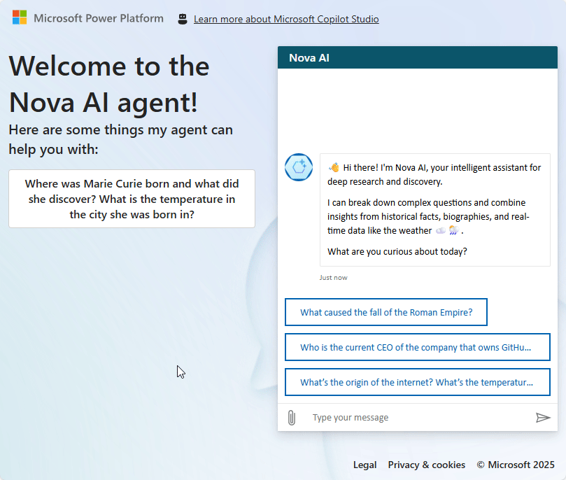

# Give your public website chatbot a brain and make it an agent

Create an intelligent agent that delivers contextual, multi-part answers using your content and real-time data.

---

## 🧭 Lab Details

| Level | Persona | Duration | Purpose |
| ----- | ------- | -------- | ------- |
| 100 | Basic Maker | 25 minutes | After completing this lab, attendees will be able to create and deploy an intelligent agent capable of answering complex, multi-part questions by combining information from their public website and uploaded files, using a tone and behavior that reflect their organization's brand. |

---

## 📚 Table of Contents

- [Why This Matters](#-why-this-matters)
- [Introduction](#-introduction)
- [Core Concepts Overview](#-core-concepts-overview)
- [Documentation and Additional Training Links](#-documentation-and-additional-training-links)
- [Prerequisites](#-prerequisites)
- [Summary of Targets](#-summary-of-targets)
- [Use Cases Covered](#-use-cases-covered)
- [Instructions by Use Case](#️-instructions-by-use-case)
  - [Use Case #1: Create a new agent and add knowledge](#-use-case-1-create-a-new-agent-and-add-knowledge)
  - [Use Case #2: Disable general knowledge and add connectors](#-use-case-2-disable-general-knowledge-and-add-connectors)
  - [Use Case #3: Fine-tune your AI assistant for smoother conversations](#-use-case-3-fine-tune-your-ai-assistant-for-smoother-conversations)
  - [Use Case #4: Make your agent public and publish it to the demo website](#-use-case-4-make-your-agent-public-and-publish-it-to-the-demo-website)

---

## 🤔 Why This Matters

**New to building intelligent agents?** You might think creating a sophisticated AI assistant requires complex coding or expensive tools, but Copilot Studio makes it accessible to anyone!

Think of building an agent like hiring a knowledgeable assistant:
- **Without an intelligent agent**: Users struggle with static FAQs, can't get contextual answers, and frequently contact support for information that should be self-service
- **With an intelligent agent**: Users get instant, accurate answers that combine your content with real-time data, reducing support tickets and improving satisfaction

**Common challenges solved by this lab:**
- "Our website visitors can't find the information they need quickly"
- "We get the same questions repeatedly that could be answered with existing content"
- "Our chatbot gives generic responses that don't reflect our brand or knowledge"
- "Users need answers that combine multiple sources of information"

**The 25 minutes you invest in this lab will transform how users interact with your content!**

---

## 🌐 Introduction

Modern users expect intelligent, contextual responses that go beyond simple keyword matching. This lab will guide you through creating Nova AI, an intelligent agent that can reason across multiple knowledge sources and perform real-time actions to deliver comprehensive, accurate answers.

**Real-world example:** Imagine a user asks: "Who founded your company, what's their background, and what's the weather like at their alma mater today?" A traditional chatbot would fail, but Nova AI can:
1. Search your knowledge sources for company history
2. Find biographical information about the founder
3. Look up their educational background
4. Check current weather at that location
5. Synthesize all this information into a coherent, helpful response

This level of intelligence transforms user experience from frustrating searches to delightful discoveries, while showcasing your organization's expertise and attention to detail.

---

## 🎓 Core Concepts Overview

| Concept | Why it matters |
|---------|----------------|
| **Agent** | A digital assistant powered by AI, capable of understanding and responding to user inputs with contextual intelligence rather than scripted responses. |
| **Conversational Creation** | A guided, natural-language setup process that defines your agent's name, tone, behavior, and capabilities without requiring technical expertise. |
| **Knowledge Sources** | Trusted data sources like websites and files that ground your agent's responses in accurate, relevant information instead of general AI knowledge. |
| **Generative Orchestration** | The ability to combine multiple knowledge sources and actions in real-time to answer complex, multi-step questions with synthesized responses. |
| **Connectors** | Integrations that enable your agent to perform real-time actions like checking weather, creating records, or calling APIs to enhance responses. |
| **Grounding** | The practice of basing AI responses on specific, trusted content rather than general training data to ensure accuracy and relevance. |

---

## 📄 Documentation and Additional Training Links

* [QuickStart: Create and deploy an agent](https://learn.microsoft.com/en-us/microsoft-copilot-studio/fundamentals-get-started?tabs=web)
* [Add a public website as a knowledge source](https://learn.microsoft.com/en-us/microsoft-copilot-studio/knowledge-add-public-website)
* [Orchestrate agent behavior with generative AI](https://learn.microsoft.com/en-us/microsoft-copilot-studio/advanced-generative-actions)
* [Use connectors in Copilot Studio](https://learn.microsoft.com/en-us/microsoft-copilot-studio/advanced-connectors)

---

## ✅ Prerequisites

* Ability to create a custom agent in Microsoft Copilot Studio.
* Environment with the following data loss prevention policies NOT blocked:
  - Chat without Microsoft Entra ID authentication in Copilot Studio
  - Direct Line channels in Copilot Studio
  - Knowledge source with public websites and data in Copilot Studio
  - MSN Weather connector

---

## 🎯 Summary of Targets

In this lab, you'll build Nova AI, an intelligent assistant that goes beyond simple Q&A to deliver contextual, multi-part responses. By the end of the lab, you will:

* Create an intelligent agent using the conversational creation experience.
* Configure agent tone, behavior, and instructions to reflect your brand.
* Add public websites like Wikipedia as knowledge sources for factual grounding.
* Disable general knowledge to reduce hallucinations and ensure accuracy.

---

## 🧩 Use Cases Covered

| Step | Use Case | Value added | Effort |
|------|----------|-------------|--------|
| 1 | [Create a new agent and add knowledge](#-use-case-1-create-a-new-agent-and-add-knowledge) | From idea to insight – Use the conversational experience to create an intelligent agent and enrich it with knowledge from websites like Wikipedia and your own files. | 8 min |
| 2 | [Disable general knowledge and add connectors](#-use-case-2-disable-general-knowledge-and-add-connectors) | Your agent isn't ChatGPT – Scope AI-generated answers on your data while adding real-time capabilities like weather lookup. | 7 min |
| 3 | [Fine-tune your AI assistant for smoother conversations](#-use-case-3-fine-tune-your-ai-assistant-for-smoother-conversations) | Fine-tune for a flawless experience – Customize system topics to enhance interactions and deliver a smoother user experience. | 5 min |
| 4 | [Make your agent public and publish it to the demo website](#-use-case-4-make-your-agent-public-and-publish-it-to-the-demo-website) | Go live and test drive – Remove authentication barriers and publish your agent to see it in action on the demo website. | 5 min |

---

## 🛠️ Instructions by Use Case

---

## 🧱 Use Case #1: Create a new agent and add knowledge

Build Nova AI using the conversational creation experience and ground it with trusted knowledge sources.

| Use case | Value added | Estimated effort |
|----------|-------------|------------------|
| Create a new agent and add knowledge | From idea to insight – Use the conversational experience to create an intelligent agent and enrich it with knowledge from websites like Wikipedia and your own files. | 8 minutes |

**Summary of tasks**

In this section, you'll use the conversational creation flow to define Nova AI, configure its tone and instructions, and connect it to websites and files to ground its answers in trusted data.

**Scenario:** Build the foundation of Nova AI, your intelligent agent designed to handle complex, contextual queries by drawing from reliable, grounded content.

### Objective

Create Nova AI with custom instructions and Wikipedia knowledge integration using Copilot Studio's conversational setup experience.

---

### Step-by-step instructions

#### Start the agent creation process

1. **Navigate** to [copilotstudio.microsoft.com](https://copilotstudio.microsoft.com).

2. Make sure you're in the correct environment by looking at the top right corner. In these labs, the environment name should start by **'DEV - '**.

2. Go to **Solutions** (under the `...` menu in the left-hand bar navigation). If you completed the setup lab, select the solution you had created. If you don't have a solution, create a new one. 

3. Once in your solution, select **+ New** and choose **Agent** > **Agent**.

#### Define your agent through conversation

> [!TIP]
> - You will be redirected to the conversational creation experience. It allows you to use natural language to help you configure your agent.
> - Note that this conversational experience only helps build and curate the agent title, description, instruction, and knowledge sources. 
> - The order or nature of questions may vary.

4. In the **Conversational creation experience** chat, paste the below answer to the initial question:

   ```
   An intelligent assistant that can answer multi-part questions by combining historical facts, biographical data, and real-time information like weather. Ideal for deep research, exploration, and knowledge synthesis.
   ```

5. When asked for more details, set:

   ```
   The assistant should answer complex, multi-step questions by combining data from public sources, performing real-time lookups like weather or conversions, and presenting clear, concise responses. When multiple questions are asked, do multiple knowledge searches.
   The assistant  should not speculate, provide information from unreliable sources, compare competitors, or answer personal, sensitive, or confidential questions.
   ```

6. When asked about a name for your agent, respond:

   ```
   Let's call it Nova AI
   ```

7. If asked about multi-part questions, set:

   ```
   Multi-layered questions should be broken down into multiple knowledge searches. 
   ```

8. When asked about how the agent should interact with users, set:

   ```
   Nova AI should interact in a friendly and professional manner, using clear language, helpful tone, and light emojis 😊 when appropriate. It should feel approachable, smart, and a bit curious—like a knowledgeable companion.
   ```

9. When asked about public website knowledge sources, set:
   ```
   Add https://en.wikipedia.org/ as a public data source for general knowledge and factual information.
   ```

> [!TIP]
> - Confirm website ownership for better search results - this allows Copilot Studio to access additional information from your webpages
> - URLs can have up to two levels of depth (subpaths with forward slash /)
> - Copilot Studio doesn't do real-time web crawling. It actually uses the Bing index, so results depend on your website's Bing indexing quality and latest crawl date.
> - You can add up to four public website URLs for knowledge search at a time

#### Finalize creation

10. If you didn't start from your solution: Before creating the agent, select the **...** menu, go to **Advanced Settings**, and choose the Solution you created.

11. Select **Create**.

---

###  🏅 Congratulations! You've created Nova AI!

---

### Test your understanding

**Key takeaways:**

* **Conversational agent creation** – You can build a reasoning-capable agent using a guided, natural-language setup that defines name, tone, behavior, and capabilities.
* **Grounding in knowledge** – Adding public websites and files helps Nova AI generate contextual, reliable answers instead of relying on general AI knowledge.
* **Instruction-driven behavior** – Custom instructions shape the agent's tone, scope, and interaction style to match your needs.

**Lessons learned & troubleshooting tips:**

* Use a clear, descriptive purpose to guide the conversational setup flow effectively.
* Wikipedia is a great starting source, but validating your own public website indexing on Bing can significantly improve answer quality.
* Always associate your agent with the right solution during creation for easier ALM and cross-environment deployment.

**Challenge: Apply this to your own use case**

* What knowledge sources would your agent need to best support your users?
* How would you adjust the tone or behavior to reflect your brand or scenario (e.g., internal support vs public info)?
* Could you replace static FAQ pages with a dynamic, grounded agent experience?

---

---

## 🔄 Use Case #2: Disable general knowledge and add connectors

Ensure accuracy by grounding responses in your data while adding real-time capabilities.

| Use case | Value added | Estimated effort |
|----------|-------------|------------------|
| Disable general knowledge and add connectors | Your agent isn't ChatGPT – Scope AI-generated answers on your data while adding real-time capabilities like weather lookup. | 7 minutes |

**Summary of tasks**

In this section, you'll disable general knowledge to reduce hallucinations, then add a weather connector to enable real-time data retrieval and test generative orchestration.

**Scenario:** Ensure Nova AI provides only fact-based, controlled responses while enabling it to perform real-time actions like weather lookups for comprehensive, multi-step answers.

### Step-by-step instructions

#### Test and disable general knowledge

1. **Navigate** to [copilotstudio.microsoft.com](https://copilotstudio.microsoft.com) and **open** the Nova AI agent.

2. **Test** your agent with this question to see general knowledge in action:

   ```
   Write a poem
   ```

3. **Observe** how the assistant generates an answer from general knowledge.

4. Go to **Settings** > **Generative AI**, and disable **Use general knowledge**, then **Save**.

5. **Close** settings, wait a minute, refresh the test pane, and test the same question again.

> [!IMPORTANT]
> It may take a few minutes for the setting to be fully disabled. You may need to refresh and retry several times.

#### Add weather connector

6. Go to the **Tools** tab and choose **+ Add a tool**.

7. Search for `MSN Weather` and select **Get current weather** action.

8. Select **Add and configure**.

> [!TIP]
> - You may need to select the connection so that the buttons are not grayed out.

9. Under **Additional details**, set **Authentication** to **Copilot author authentication**.

> [!CAUTION]
> - When using **Copilot author authentication**, the end-user of the agent isn't prompted to use its own context and connection to connect to the service. Instead, it's using the context and connection of the person who has configured the agent.
> - Only use author authentication for actions that don't need user-specific data, as using the credentials from someone else can expose to data exfiltration risks.
> - Use user authentication for role-based access scenarios
> - Always review security implications of authentication choices

11. Under **Inputs**, for **Units**, choose **Custom value** and select **Imperial** or **Metric**.

12. Under **Inputs**, for **Location**, customize the value and set description:

    ```
    The location for the weather query. Valid inputs are City, State, Country. 
    Always include city and country, and state only for locations where appropriate (e.g., in the US)
    ```

> [!TIP]
> - The description of inputs is used by the AI to determine what value to set as it will try to automatically identify them from the context or more the queries the end-user has typed in.

13. **Save** the configuration.

#### Test generative orchestration

14. Test your enhanced agent with this complex question:

    ```
    Who is the current CEO of the company that owns GitHub? Where did they earn their MBA? What's the average rent for a one-bedroom apartment near that campus? What's the air quality index in that area today?
    ```

15. Notice how generative orchestration performs multiple searches and triggers the weather connector to provide a comprehensive answer.


---

###  🏅 Congratulations! You've enhanced Nova AI with controlled knowledge and real-time capabilities!

---

### Test your understanding

* Do you understand why disabling general knowledge improves accuracy and reduces hallucinations?
* Can you see how connectors enable your agent to go beyond static information to provide real-time data?
* Have you observed how generative orchestration chains multiple knowledge sources and actions for comprehensive responses?

**Challenge: Apply this to your own use case**

* What types of information should always be grounded in approved sources rather than general knowledge?
* What real-time data could your agent retrieve to be more useful (currency, live KPIs, system integrations)?
* How might multi-step reasoning improve decision-making for your users?

---

## 💬 Use Case #3: Fine-tune your AI assistant for smoother conversations

Customize system topics to enhance interactions and deliver a smoother user experience.

| Use case | Value added | Estimated effort |
|----------|-------------|------------------|
| Fine-tune your AI assistant for smoother conversations | Fine-tune for a flawless experience – Customize system topics to enhance interactions and deliver a smoother user experience. | 5 minutes |

**Summary of tasks**

In this section, you'll customize built-in system topics to improve user interactions and create a more seamless experience beyond just knowledge sources.

**Scenario:** Customize your assistant's welcome message to make it more engaging, add suggested start prompts to guide users effectively, and refine system topics like Escalate to ensure they align with your organization's needs.

### Step-by-step instructions

#### Customize the welcome message

1. **Navigate** to [copilotstudio.microsoft.com](https://copilotstudio.microsoft.com) and **open** the Nova AI agent.

2. Go to your agent's **Topics** tab 

> [!TIP]
> - Topics are **scripted conversational building blocks** of an agent. Topics can be used to design how a conversation dialog should play out in a deterministic manner (as opposed to letting the AI be in charge of the conversation and generating text). Topics can contain messages, questions, conditions, variables, etc. 
> - Copilot Studio agents come with pre-created custom and system topics. The default **custom topics** offer fundamental conversational abilities, such as Greetings, Goodbye, Thank you, and Start Over. **System topics** are also natively available and help manage specific conversation events.

3. Select the **System** tab, and choose the **Conversation start** topic.

4. Select the message and replace the text with a more personalized welcome message:

   ```
   👋 Hi there! I'm Nova AI, your intelligent assistant for deep research and discovery.

   I can break down complex questions and combine insights from historical facts, biographies, and real-time data like the weather ☁️🌦️.
   
   What are you curious about today?
   ```

> [!TIP]
> - Be clear and direct – Avoid jargon and long sentences
> - Encourage interaction – Provide a natural way for users to start asking questions
> - Set expectations – Briefly indicate what the assistant can and cannot do
> - Keep it concise – Too much information up front can be overwhelming
> - Use Markdown – Most clients support Markdown for advanced formatting options

#### Add quick reply conversation starters

5. While still on the welcome message, select **+ Add**, then choose **Quick reply**. These serve as suggested conversation starters for the end-user:

   - `What caused the fall of the Roman Empire?`
   - `Who is the current CEO of the company that owns GitHub? Where did they earn their MBA? What's the average rent for a one-bedroom apartment near that campus? What's the air quality index in that area today?`
   - `What's the temperature in the city that hosted the last Olympic Games?`

    

> [!TIP]
> - You can test your changes in a topic without needing to save. Just refresh the test pane to get the latest experience.
> - Quick replies display as **buttons** to the user, by default, when selected, the message is sent back to the agent as if the user had typed it.
> - Notice in the **Quick replies properties** how the type can be changed from *Send a message* (default) to *Open URL*, *Make a call*, or *Send a hidden message*, effectively helping create more advanced button experiences.

6. Notice the **Speech variation available** note. Toggle the experience from **Text** to **Speech**, and delete the "Thanks for calling, how can I help" variation (unless you use a voice channel for your agent).

> [!TIP]
> - The Speech variation can be useful if you add a voice or telephony channel for your agent. Voice experiences should traditionally be shorter, and you can use Speech Synthesis Markup Language (SSML), an XML-based markup language, to customize text to speech outputs by adjusting pitch, adding pauses, improving pronunciation, changing speaking rate, etc.

7. **Save** your topic.

#### Customize the escalation experience

8. Go to your agent's **Topics** tab and select **System topics**.

9. Select the **Escalate** topic.

10. Update the text to options that will more meaningfully unblock the end user:

    ```
    I'm sorry, but I can't seem to be able to help you.

    I recommend reaching out to our [Microsoft Copilot Studio community](https://aka.ms/CopilotStudioCommunity) or submitting a [support request](https://learn.microsoft.com/en-us/power-platform/admin/get-help-support).
    ```

> [!TIP]
> - **Escalation Triggers** – The Escalate topic activates when the end-user asks to speak with someone or when the Fallback topic fails to provide an answer three times in a row
> - **Insights from Escalations** – The Escalate topic helps track conversations that lead to escalation, highlighting gaps where users seek alternatives
> - **Disabling the Escalate Topic** – If you disable it, ensure the Fallback topic no longer redirects to it to avoid errors

11. **Save** your topic.

---

###  🏅 Congratulations! You've fine-tuned Nova AI for smoother conversations!

---

### Test your understanding

* Do you understand how a well-crafted welcome message sets the tone and improves engagement?
* Can you see how quick replies guide users to relevant topics, making interactions smoother?
* Have you considered how customizing the Escalate topic provides meaningful next steps instead of default responses?

**Challenge: Apply this to your own use case**

* How can you adjust the welcome message to reflect your organization's branding?
* What quick replies would be most helpful for your users?
* If escalation is necessary, what alternative options can you provide beyond simply handing off to a live agent?

---

## 🌐 Use Case #4: Make your agent public and publish it to the demo website

Remove authentication barriers and publish your agent to see it in action on the demo website.

| Use case | Value added | Estimated effort |
|----------|-------------|------------------|
| Make your agent public and publish it to the demo website | Go live and test drive – Remove authentication barriers and publish your agent to see it in action on the demo website. | 5 minutes |

**Summary of tasks**

In this section, you'll remove authentication to make your agent publicly accessible, then publish it to the demo website for testing and sharing.

**Scenario:** Since Nova AI provides general information and doesn't handle private data, you'll disable authentication for a seamless user experience and publish it to the demo website to gather feedback before deploying to your real site.

### Step-by-step instructions

#### Remove authentication

1. **Navigate** to [copilotstudio.microsoft.com](https://copilotstudio.microsoft.com) and **open** the Nova AI agent.

2. Go to **Settings** > **Security** > **Authentication**.

3. Select **No authentication** and **Save**.

4. **Review** the warning before confirming.

> [!CAUTION]
> - **Enterprise Restrictions**: Your Power Platform administrator may have DLP policies that restrict deploying agents without authentication. Work with your admin to request an exception if needed.
> - **Content Review**: Before making your agent public, ensure no sensitive data is exposed through uploaded documents or system integrations.
> - **Integration Risks**: Verify that connectors don't use the maker's authentication context unless intended, as this could create data exfiltration risks.

#### Publish and test on demo website

5. Select **Publish** to make your changes live.

6. Go to the **Channels** tab.

7. Choose **Demo website** and customize:
   - Welcome message
   - Conversation starters (pre-defined messages users can click)

8. **Save** any changes you make.

9. **Copy** the demo website URL, open it in a new tab, and interact with your agent.



> [!TIP]
> - The demo website URL can be shared with others for quick feedback before deployment
> - The chat canvas design can be customized to align with your organization's brand
> - Check out the Web Chat customizer in the [Copilot Studio Kit](https://aka.ms/CopilotStudioKit) for advanced styling
> - The demo website is only available for unauthenticated agents or those using manual authentication. It is disabled when Web Channel security is enforced.

---

###  🏅 Congratulations! You've published Nova AI to the demo website!

---

### Test your understanding

* Do you understand why removing authentication improves user experience for public information agents?
* Can you see how the demo website enables rapid feedback collection before full deployment?
* Have you considered the security implications of making your agent publicly accessible?

**Challenge: Apply this to your own use case**

* What type of information should remain behind authentication versus being made public?
* How would you use the demo website to collect feedback before launch?
* What branding and UI changes would improve the chat experience for your users?

---

## 🏆 Summary of learnings

True learning comes from doing, questioning, and reflecting—so let's put your skills to the test.

To maximize the impact of your intelligent agent:

* **Create structured foundations** – Organize your work using solutions for better lifecycle management and deployment readiness.
* **Design intelligent agents** – Build agents using the conversational creation experience, defining tone, behavior, and purpose clearly.
* **Ground responses in data** – Add public websites and files as knowledge sources to ensure factual, relevant, and contextual answers.
* **Ensure reliability** – Disable general knowledge to reduce hallucinations and keep answers aligned with your trusted sources.

---

### Conclusions and recommendations

**Intelligent agent golden rules:**

* Keep knowledge fresh – Regularly review and update knowledge sources for accuracy and completeness.
* Monitor interactions – Analyze user queries to uncover gaps, refine instructions, and improve response quality.
* Align security with experience – Match authentication settings to your intended audience while adhering to security requirements.
* Test early and often – Validate behavior, tone, and accuracy before deploying publicly.
* Be intentional with orchestration – Use clear instructions and connectors to shape how your agent processes multi-part queries.
* Ground in trusted sources – Disable general knowledge when accuracy is more important than broad coverage.

By following these principles, you'll build intelligent agents that are not only useful but also delightful, trusted, and aligned with your organization's goals—transforming how users discover and interact with your content.

---
