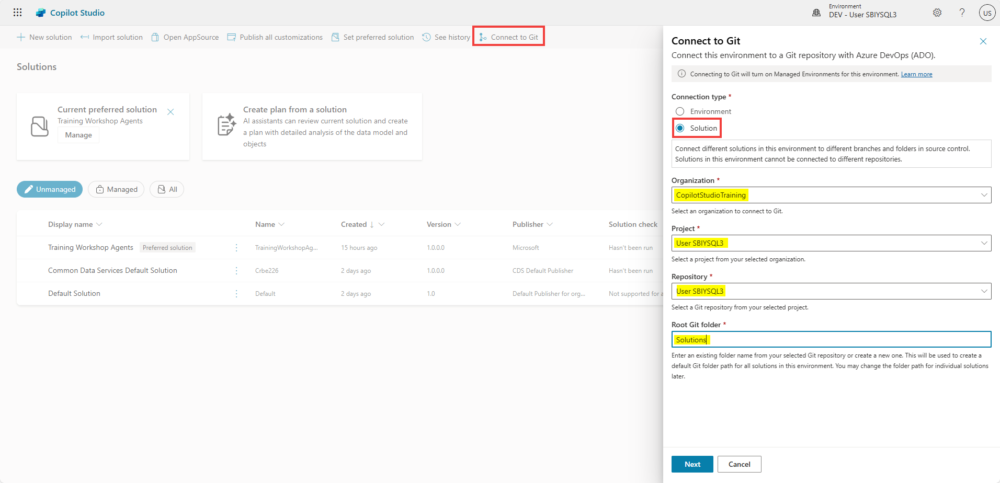

# Set yourself up for success & discover ALM best practices

Build agents with confidence. Deploy with control. Master the lifecycle of your Microsoft Copilot Studio agents with best practices.

---

## 🧭 Lab Details

| Level | Persona | Duration | Purpose |
| ----- | ------- | -------- | ------- |
| 200   | Maker   | 35 minutes | After completing this lab, participants will be able to apply Application Lifecycle Management (ALM) best practices to their Microsoft Copilot Studio solutions. They will know how to structure their work using solutions and publishers, configure environment variables and connection references for deployment readiness, and set up Git-based source control using Azure DevOps—all without writing code. |

---

## 📚 Table of Contents

- [Why Start with ALM?](#-why-start-with-alm)
- [Introduction](#-introduction)
- [Core Concepts Overview](#-core-concepts-overview)
- [Documentation and Additional Training Links](#-documentation-and-additional-training-links)
- [Prerequisites](#-prerequisites)
- [Summary of Targets](#-summary-of-targets)
- [Use Cases Covered](#-use-cases-covered)
- [Instructions by Use Case](#️-instructions-by-use-case)
  - [Use Case #1: Create a solution and custom publisher](#-use-case-1-create-a-solution-and-custom-publisher)
  - [Use Case #2: Create environment variables and connection references](#-use-case-2-create-environment-variables-and-connection-references)
  - [Use Case #3: Set up Git source control](#-use-case-3-set-up-git-source-control)

---

## 🤔 Why Start with ALM?

**New to Power Platform or Copilot Studio?** You might be eager to start building agents right away, but taking a few minutes to set up Application Lifecycle Management (ALM) first will save you hours of headaches later!

Think of ALM as preparing your kitchen before cooking a complex meal:
- **Without ALM**: Ingredients scattered across counters, no recipe plan, impromptu grocery trips mid-cooking
- **With ALM**: Ingredients organized, recipe prepared, everything measured and ready

**Common beginner challenges solved by ALM:**
- "I built something great in dev, but can't easily move it to production"
- "Someone changed my agent and now it's broken - who did it and how do I fix it?"
- "I need to update my agent but I'm afraid of breaking what works"
- "My team members keep overwriting each other's changes"

**The few minutes ALM setup in this lab prevents all these problems!**

---

## 🌐 Introduction

Application Lifecycle Management (ALM) ensures that your solutions evolve safely and efficiently as they move from development to production. This lab will walk you through the foundational best practices of ALM in Microsoft Copilot Studio—from structuring your solution to managing configurations and source control.

**Real-world example:** Imagine you've built a great customer service agent in your development environment. Without proper ALM:
1. Moving to production means manually recreating all your work
2. If something breaks, you can't easily roll back to a working version
3. When multiple team members make changes, work gets overwritten

With the ALM practices in this lab, you'll avoid these pitfalls and set yourself up for success!

---

## 🎓 Core Concepts Overview

| Concept | Why it matters |
|---------|----------------|
| **Solution** | A standard way in Microsoft Power Platform to package and ship components—including Microsoft Copilot Studio agent components like topics, knowledge sources, and tools—across environments alongside flows, prompts, environment variables, connection references, and any other solution-aware component types. |
| **Publisher** | A metadata element that identifies the creator of solution components. Using a custom publisher improves traceability and supports cleaner prefixes in naming conventions. |
| **Environment** | A workspace in Power Platform where no-code, low-code, or pro-code artifacts—such as agents, flows, and data—reside. ALM best practices typically involve multiple environments (e.g., dev, test, prod) to manage lifecycle stages. For admins, environments also provide governance controls to limit what makers can do, which connectors or knowledge sources can be used, and how assets are secured and deployed. |
| **Environment variable** | A reusable setting (like a URL, API key, or ID) that can vary between environments without modifying individual components. Supports automation and portability. For secrets, use the Secret data type to retrieve values securely from Azure Key Vault. |
| **Connection reference** | An abstraction that links connectors (e.g., SharePoint, Dataverse, ServiceNow, etc.) to credentials and environment-specific settings—allowing reuse and cleaner ALM processes. |
| **Managed solution** | A read-only version of a solution used for deployment to downstream environments. Managed solutions support clean, controlled, and incremental updates, can be uninstalled, and prevent direct modifications to components in the target environment. |
| **Unmanaged solution** | Editable solution used in development. Changes can be versioned and exported for deployment. Should not be used in test or production. |
| **Solution-aware** | A component or setting that is part of a solution and can be deployed with it across environments. Not all Copilot Studio settings are solution-aware. |
| **Source control** | The practice of tracking and managing changes to your assets over time. Git integration with Azure DevOps enables auditing, collaboration, and versioning. |
| **CI/CD** | Continuous Integration / Continuous Deployment. Automates the process of testing and deploying solutions using tools like Azure DevOps pipelines or GitHub Actions. |                                                                                          

---

## 📄 Documentation and Additional Training Links

* [ALM overview - Microsoft Power Platform](https://learn.microsoft.com/power-platform/alm/alm-overview)
* [Publish and deploy your agent](https://learn.microsoft.com/copilot-studio/publish-deploy)
* [Webinar: Microsoft Copilot Studio ALM](https://aka.ms/MCSALMWebinar)
* [Environment variables in solutions](https://learn.microsoft.com/power-apps/maker/data-platform/environmentvariables)
* [Connection references in a solution](https://learn.microsoft.com/power-apps/maker/data-platform/create-connection-reference)
* [Dataverse Git integration overview](https://learn.microsoft.com/power-platform/alm/git-version-control)

---

## ✅ Prerequisites

* Access to Microsoft Copilot Studio.
* A Microsoft Power Platform environment with at least an Environment Maker security role.
* Access to an Azure DevOps organization, project, and branch using the same tenant credentials as Microsoft Copilot Studio.

---

## 🎯 Summary of Targets

In this lab, you'll configure your ALM foundation for working with Microsoft Copilot Studio like a pro. By the end of the lab, you will:

* Create and configure a structured solution for your customizations.
* Set up a custom publisher to track ownership and maintain ALM hygiene.
* Add environment variables and connection references for better portability.
* Learn how to source control your Microsoft Copilot Studio project in a Git repo.
* Understand which Microsoft Copilot Studio settings require manual post-deployment steps.

---

## 🧩 Use Cases Covered

| Step | Use Case | Value added | Effort |
|------|----------|-------------|--------|
| 1 | [Create a solution and custom publisher](#-use-case-1-create-a-solution-and-custom-publisher) | Structure your success – Group, manage, and deploy all your agent components with clarity and control. | 5 min |
| 2 | [Create environment variables and connection references](#-use-case-2-create-environment-variables-and-connection-references) | Adapt with flexibility – Environment variables future-proof your agents for seamless multi-environment deployments. Manage credentials and services cleanly across dev, test, and prod. | 5 min |
| 3 | [Set up Git source control](#-use-case-3-set-up-git-source-control) | Track and evolve – Use Git to version, review, and automate deployment of your agent assets. | 10 min |

---

## 🛠️ Instructions by Use Case

---

## 🧱 Use Case #1: Create a solution and custom publisher

Use a structured container to group all agents components for better lifecycle management.

| Use case | Value added | Estimated effort |
|----------|-------------|------------------|
| Create a solution and custom publisher | Structure your success – Group, manage, and deploy all your agent components with clarity and control. | 10 minutes |

**Summary of tasks**

In this section, you'll learn how to access the Solutions area of Copilot Studio, create a new solution, new publisher, and set the solution as default.

**Scenario:** Properly setup your development environment so that you can later easily package and deploy your agents to other environments.

### Objective

Set up your development environment by creating a solution and custom publisher in Microsoft Copilot Studio.

---

### Step-by-step instructions

#### Open the Solutions area

1. Go to the [copilotstudio.microsoft.com](https://copilotstudio.microsoft.com/).

2. Confirm you are in the correct environment (top-right corner).

#### Create a solution

3. In the left navigation (under the `...` menu), select **Solutions**

    

4. Select **New solution**.

5. Enter a display name.

> [!TIP]
>  * Avoid names like `DEV`, `TEST`, `PROD`, `POC`, `MVP` or anything tied to a project lifecycle phase.
>  * Use a descriptive, project-based name.
>  * For example, if this is specific to this training and lab, use `Training Workshop Agents`

#### Create a publisher

6. If this is your first solution, click **+ New publisher** to create one.

> [!TIP]
>  * You may use your organization’s name.
>  * While the **Display name** may contain spaces, the **Name** can't contain special characters and spaces.
>  * Define a short prefix for use in technical names.

> [!IMPORTANT]
> Avoid using the default publisher or the default solution. Custom publishers ensure cleaner component names and better ALM hygiene.

#### Set and create

7. Check **Set as your preferred solution** (so any new component goes into it by default).
8. Click **Create**.

---

###  🏅 Congratulations! You've created your solution!

---

### Test your understanding

**Key takeaways:**

* **Solutions first** – Solutions help manage your agent and related components across environments.
* **Lifecycle readiness** – Structuring up front simplifies governance, updates, and deployment.
* **Naming matters** – Use clean, environment-agnostic names.

**Lessons learned & troubleshooting tips:**

* Avoid names like `Dev` or `Test` in your solution name—they’re misleading.
* If save fails, ensure publisher name is unique and valid.
* Keep solution names business-focused, not technical-phase focused.

**Challenge: Apply this to your own use case**

* What would you name your solution?
* How might you use solutions to organize future agent components?
* Try making another solution for a separate department or use case.

---

---

## 🧩 Use Case #2: Create environment variables and connection references

Use reusable variables and connection abstractions for seamless multi-environment deployments.

| Use case | Value added | Estimated effort |
|----------|-------------|------------------|
| Create environment variables and connection references | Adapt with flexibility – Environment variables future-proof your agents for seamless multi-environment deployments. Manage credentials and services cleanly across dev, test, and prod. | 15 minutes |

**Summary of tasks**

In this section, you'll learn how to create environment variables and connection references in your solution.

**Scenario:** Configure your environment by anticipating future elements that will need to be updated as your solution moves from development to production.

### Step-by-step instructions

1. Open the solution you created in Use Case #1.

2. Select **+ New**, then go to **More** and choose **Environment variable**.

3. In **Name**, enter: `Custom Knowledge Endpoint`

4. In **Data Type**, select **Text**.

5. Leave **Default Value** blank, but under **Current Value**, select **+ New Value**. 

> [!IMPORTANT]
>  * For configuration, use the provided values in the **Lab Resources** (specific per training).

> [!TIP]
>  * Notice how, under **Advanced**, you can set whether the current value can follow through with your solution deployment, or if it should be reset each time the solution is deployed to a new environment

6. Click **Save**.

> [!TIP]
>  * Environment variables can also be of type **Secret** to retrieve secure values like API keys from Azure Key Vault at runtime.

7. In the solution, select **New**, then go to **More** and choose **Connection reference**.

8. Use the connector name, `MSN Weather`, as the name. Optionally, prefix with your project name.

> [!TIP]
> In other locales, the connector name may be localized. For example, in French, it would be `MSN Météo`.

9. Select the connector **MSN Weather**.

10. In the connection dropdown, choose **New connection** if none exists.

11. Log in through Power Apps in a new tab if needed, then return to Copilot Studio.

12. Above the **Connection** dropdown, select **Refresh** and choose the newly created connection.

> [!TIP]
>  * If the **Create** button is grayed out, it's just because you pasted the display name. Type an extra character in the display name field and remove it to be able to create. 

13. Repeat steps for the following connectors:

    * `Microsoft Copilot Studio`
    * `Microsoft Dataverse` (note: there are 2 connectors named Microsoft Dataverse, pick the 2nd one in the list. When creating the connection, it should have a green logo, not grey).
    * `Microsoft Entra ID`
    * `Microsoft Teams`
    * `Office 365 Outlook`        
    * `ServiceNow`
    * `SharePoint`

> [!IMPORTANT]
>  * For **ServiceNow** configuration values, use the provided values in the **Lab Resources** (specific per training).
>  * For **ServiceNow**'s `Instance` configuration, be sure to scroll down in the connection screen.

#### Get a production environment

14. In anticipation of a future ALM lab where we will deploy customizations from `DEV` to `PROD`, **request** a production envrionment to be created for your user. Simply use the **Workshop Agent** (the same that provided user credentials at the beginning of the training) and ask `Get a production environment`. The environment will be automatically created for you. This will take a few minutes to provision and to show up, but you will be notified in your training tenant Outlook mailbox when it is ready.

> [!IMPORTANT]
> - Access the workshop agent in the same location as when you created your training user account.
> - You will need the workshop code and your training user's email address if you previously closed the agent.
> - You are limited to a single PROD environment for the duration workshop.

---

###  🏅 Congratulations! You've created environment variables and connection references!

---

### Test your understanding

* Do you understand the value of using **environment variables** instead of hardcoding values like URLs, API keys, or record IDs?
* Do you see the importance of using **descriptive, well-scoped names** for environment variables (e.g. `Base API URL`, `Support Team Email`)?
* Have you identified **which variables should change across environments** (e.g. dev, test, prod)?

**Challenge: Apply this to your own use case**

* List the environment variables your agent needs (e.g. external API base URLs, system emails, etc.).
* Define clear naming conventions to help your team manage them consistently.
* Try creating a **Secret**-type environment variable that securely references a value in Azure Key Vault (e.g. an API key or client secret).

---

---

## 🔄 Use Case #3: Set up Git source control

> [!TIP]
> This lab is optional and won't block your progress in future labs.

Connect your solution to Azure DevOps Git to track changes and prepare for CI/CD—no code required.

| Use case | Value added | Estimated effort |
|----------|-------------|------------------|
| Set up Git source control | Track and evolve – Use Git to version, review, and automate deployment of your agent assets. | 10 minutes |

**Summary of tasks**

In this section, you'll learn how to create a new project in Azure DevOps, how to instantiate the main branch, and how to connect it to your developer environment.

**Scenario:** You want to track changes to your Copilot Studio agents in source control, collaborate with your team, and prepare for automated deployment pipelines.

### Step-by-step instructions

<!--- Old instructions

### Setting up Azure DevOps

1. **Navigate** to the Azure DevOps organization that was created for the training, and log in.

> [!IMPORTANT]
> Find it in **Azure DevOps Organization** link in the **Lab Resources** (specific per training).

> [!TIP]
>  * First-time users may need to confirm their user’s fictitious name and country.

2. Create a new project by setting a **project name**. Use the same name as your fictitious user's name. Keep the options by default (e.g, Private).

3. Select **+ Create project**.

4. After project creation, go to **Repos** → **Branches**.

5. Select **Initialize** (at the bottom) to create the `main` branch with a README or .gitignore.

    
    
> 🎉 You’ve set up the Git repo! Now return to Microsoft Copilot Studio.

### Connecting Microsoft Copilot Studio to Git

6. Go back to [Microsoft Copilot Studio](https://aka.ms/MCSStart) and open the **Solutions** page (still behind the `...` menu).

7. In the menu, select **Connect to Git**.

8. Set **Connection type** to `Solution`.

9. Choose your **organization** and your newly created **project** and **repository**.

10. Set the **Root Git folder** to `Solutions`.

11. Select **Next**, then pick the solution created in Use Case #1.

12. When prompted for the branch, select **Create new branch** and name it `dev`.

13. Click **Save** and then **Connect**.

### Observing the Git integration from Microsoft Copilot Studio

14. Now, let's see this action. **Open the solution** you created in Use Case #1.

15. In the left-hand navigation, navigate to **Source control**.

16. **See** how the various components you have added to your solution are now ready to be committed to your source control. If don't see them all, select **Refresh** as they get detected and added.

17. When ready, select **Commit**, add a comment describing the changes you're introducing (e.g., `New environment variables and connection references`).

18. Once committed, you can **navigate** to your commit in Azure DevOps and see the introduced, updated, or deleted components.

   

-->

### Setting up Azure DevOps

1. **Navigate** to [my.visualstudio.com/subscriptions](https://my.visualstudio.com/subscriptions)

2. If not already signed in, **log in** with your fictitious user account.

3. Select **Join Visual Studio Dev Essentials**

4. **Confirm** 

5. Under **Subscription / Program**, select **Visual Studio Dev Essentials**

> [!IMPORTANT]
> If you're landing into a **Something went wrong!** error, follow these steps:
> 1. Go to [aex.dev.azure.com](https://aex.dev.azure.com/).
> 2. If prompted, create new organization (you can leave the default name) if prompted
> 3. Skip to step 6.

6. Select **Azure DevOps** to open the Azure DevOps portal.

7. In the **Benefits** tab, for **Azure DevOps**, select **Get started**.

8. When prompted, select **Continue**.

9. Name your organization (you can leave the default name) and select **Continue**.'

10. Create a new project by setting a **project name**. For example `Agents`

11. Select **+ Create project**.

12. After project creation, go to **Repos** → **Branches**.

13. Select **Initialize** (at the bottom) to create the `main` branch with a README or .gitignore.

    
    
> 🎉 You’ve set up the Git repo! Now return to Microsoft Copilot Studio.

### Connecting Microsoft Copilot Studio to Git

14. Go back to [Microsoft Copilot Studio](https://copilotstudio.microsoft.com) and open the **Solutions** page (still behind the `...` menu).

15. In the menu, select **Connect to Git**.

16. Set **Connection type** to `Solution`.

17. Choose your **organization** and your newly created **project** and **repository**.

18. Set the **Root Git folder** to `Solutions`.

19. Select **Next**, then pick the solution created in Use Case #1.

      

20. When prompted for the branch, select **Create new branch** and name it `dev`.

21. Click **Save** and then **Connect**.

### Observing the Git integration from Microsoft Copilot Studio

22. Now, let's see this action. **Open the solution** you created in Use Case #1.

23. In the left-hand navigation, navigate to **Source control**.

24. **See** how the various components you have added to your solution are now ready to be committed to your source control. If don't see them all, select **Refresh** as they get detected and added.

25. When ready, select **Commit**, add a comment describing the changes you're introducing (e.g., `New solution and environment variable`).

26. Once committed, you can **navigate** to your commit in Azure DevOps and see the introduced, updated, or deleted components.

---

###  🏅 Congratulations! You've set up Git source control!

---

### Test your understanding

* Can you see your solution files in Azure DevOps?
* Can you track history and commit changes?
* Can you create new branches for testing changes?

**Challenge: Apply this to your own use case**

* Explore branching strategies (e.g., main/dev/feature).
* How will your team review and merge changes?
* How could this integrate with deployment pipelines later?

---

## 🏆 Summary of learnings

True learning comes from doing, questioning, and reflecting—so let's put your skills to the test.

To maximize the impact of your ALM setup in Copilot Studio:

* **Use solutions as your foundation** – Keep all your components within a solution to simplify lifecycle management and ensure clean deployment.
* **Name wisely** – Adopt a consistent naming convention and always use a custom publisher to avoid default clutter.
* **Plan for portability** – Use environment variables and connection references to ensure your agent configurations adapt across dev, test, and production.
* **Document post-deployment steps** – Track settings that aren't part of the solution (e.g., authentication, channels, sharing) so nothing is missed.
* **Leverage source control** – Use Git integration to track, audit, and collaborate—setting the stage for CI/CD without complex tooling.
* **Automate where it counts** – Consider using pipelines with Azure DevOps or GitHub for streamlined, repeatable deployments.

---

### Conclusions and recommendations

**ALM golden rules:**

* Work in the context of solutions.
* Create separate solutions only if you need to deploy components independently.
* Use a custom publisher and prefix to maintain clarity and traceability.
* Use environment variables for settings and secrets that change across environments.
* Export and deploy solutions as managed, unless you're setting up a dev environment.
* Avoid customizing outside of dev.
* Consider automating ALM for source control and CI/CD pipelines.

By following these principles, you'll establish a robust, scalable foundation for managing Copilot agents and Power Platform assets across their full lifecycle.

---
