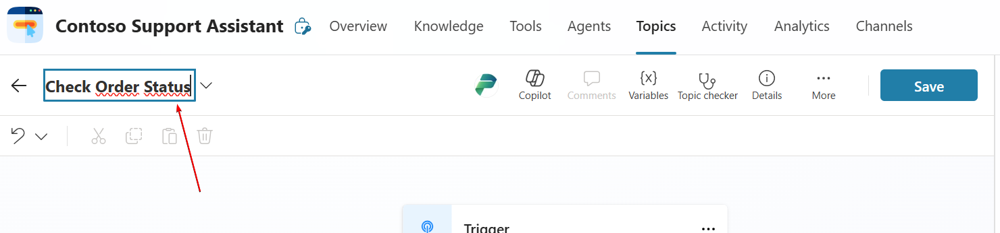
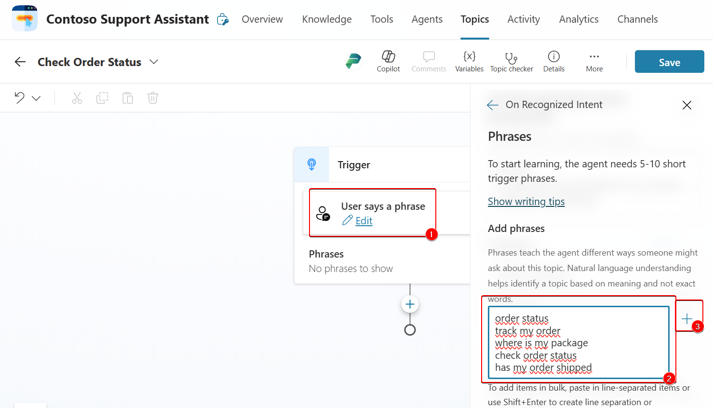

# Create Your First Agent in Microsoft Copilot Studio

Create and publish your first intelligent copilot using Microsoft Copilot Studio.

---

## 🌝 Lab Details

| Level | Persona | Duration   | Purpose                                                                                                                                                                                                                                                                                                                            |
| ----- | ------- | ---------- | ---------------------------------------------------------------------------------------------------------------------------------------------------------------------------------------------------------------------------------------------------------------------------------------------------------------------------------- |
| 100   | Maker   | 40 minutes | After completing this lab, participants will be able to create their first agent in Microsoft Copilot Studio, manually author topics, test the bot, and publish it for external testing. Participants will learn the fundamentals of Copilot Studio including topic creation, message and question nodes, testing, and deployment. |

---

## 📚 Table of Contents

- [Create Your First Agent in Microsoft Copilot Studio](#create-your-first-agent-in-microsoft-copilot-studio)
  - [🌝 Lab Details](#-lab-details)
  - [📚 Table of Contents](#-table-of-contents)
  - [🤔 Why This Matters](#-why-this-matters)
  - [🌐 Introduction](#-introduction)
  - [🎓 Core Concepts Overview](#-core-concepts-overview)
  - [📄 Documentation and Additional Training Links](#-documentation-and-additional-training-links)
  - [✅ Prerequisites](#-prerequisites)
  - [🎯 Summary of Targets](#-summary-of-targets)
  - [🧰 Use Cases Covered](#-use-cases-covered)
  - [🛠️ Instructions by Use Case](#️-instructions-by-use-case)
  - [🧱 Use Case #1: Create an agent and topic](#-use-case-1-create-an-agent-and-topic)
    - [Objective](#objective)
    - [Step-by-step instructions](#step-by-step-instructions)
      - [Sign in and create an agent](#sign-in-and-create-an-agent)
      - [Define your agent through conversation](#define-your-agent-through-conversation)
      - [🏅 Congratulations! You've created *Contoso Support Assistant* !](#-congratulations-youve-created-contoso-support-assistant-)
      - [Finalize creation](#finalize-creation)
      - [Manually create your first topic](#manually-create-your-first-topic)
      - [Create a topic using Copilot](#create-a-topic-using-copilot)
    - [🏅 Congratulations! You've completed Use Case 1!](#-congratulations-youve-completed-use-case-1)
    - [Test your understanding](#test-your-understanding)
  - [🔄 Use Case #2: Publish your agent to the demo site](#-use-case-2-publish-your-agent-to-the-demo-site)
    - [Step-by-step instructions](#step-by-step-instructions-1)
      - [Modify the agent settings to enable access from external users](#modify-the-agent-settings-to-enable-access-from-external-users)
      - [Validate your agent's behavior on an external testing website](#validate-your-agents-behavior-on-an-external-testing-website)
    - [🏅 Congratulations! You've completed Use Case 2!](#-congratulations-youve-completed-use-case-2)
    - [Test your understanding](#test-your-understanding-1)
  - [🏆 Summary of learnings](#-summary-of-learnings)
    - [Conclusions and recommendations](#conclusions-and-recommendations)


---

## 🤔 Why This Matters

**For new Copilot Studio makers:** You might feel unsure about where to start or how much time it will take to create something valuable.

Think of building a bot like assembling a LEGO set:

* **Without Copilot Studio**: Tedious setup, disconnected tools, high learning curve.
* **With Copilot Studio**: Guided experience, intuitive UI, faster time to value.

**Common challenges solved by this lab:**

* "I don't know how to start a copilot."
* "The interface is overwhelming."
* "I want a quick win to show value."
* "I’m not a developer—can I still build a bot?"

**You’ll get value fast—just 40 minutes to build your first functional agent.**

---

## 🌐 Introduction

Microsoft Copilot Studio simplifies the creation of intelligent bots by providing a unified canvas for conversational logic, AI integration, and publishing.

**Real-world example:** A customer support team wants to automate responses to order status inquiries. Instead of relying solely on human agents, they create a copilot that responds to common order-related questions 24/7, improving customer satisfaction and freeing up employee time.

**This lab gives you the skills to build such a bot from scratch, test it, and publish it for feedback—all without writing code.**

---

## 🎓 Core Concepts Overview

| Concept                       | Why it matters                                                                         |
| ----------------------------- | -------------------------------------------------------------------------------------- |
| **Agent**                     | A container for all your topics and configurations—a digital assistant you can deploy. |
| **Topic**                     | Defines how the agent responds to user input; it's the unit of conversation logic.     |
| **Message Node**              | Sends information to the user—key for communication.                                   |
| **Question Node**             | Captures user input and stores it in variables—enables dynamic conversations.          |
| **Generative AI Integration** | Speeds up topic creation and orchestration using LLMs.                                 |
| **Publishing**                | Makes your agent available for users via web or Teams.                                 |

---

## 📄 Documentation and Additional Training Links

* [Microsoft Copilot Studio Overview](https://learn.microsoft.com/en-us/microsoft-copilot-studio/overview)
* [Copilot Studio Authoring Guide](https://learn.microsoft.com/en-us/microsoft-copilot-studio/authoring)
* [Power Platform Documentation](https://learn.microsoft.com/en-us/power-platform/)
* [Publish and Share Copilots](https://learn.microsoft.com/en-us/microsoft-copilot-studio/publish)

---

## ✅ Prerequisites

* A computer with internet access
* Access to a Microsoft tenant with Copilot Studio (trial or licensed)
* Generative AI setting must be set to "[Classic](https://learn.microsoft.com/microsoft-copilot-studio/advanced-generative-actions#turn-off-generative-orchestration-for-an-agent)"

---

## 🎯 Summary of Targets

In this lab, you'll build a complete agent and publish it for testing. By the end of the lab, you will:

* Sign in and create a new agent
* Understand the UI of Copilot Studio
* Manually create a topic with triggers, questions, and messages
* Use Copilot to auto-generate topics with AI
* Test and publish your agent to a demo site

---

## 🧰 Use Cases Covered

| Step | Use Case                                                                                | Value added                                                 | Effort |
| ---- | --------------------------------------------------------------------------------------- | ----------------------------------------------------------- | ------ |
| 1    | [Create an agent and topic](#-use-case-1-create-an-agent-and-topic)                     | Build a usable agent with AI-augmented and manual authoring | 30 min |
| 2    | [Publish your agent to the demo site](#-use-case-2-publish-your-agent-to-the-demo-site) | Deploy your agent and gather feedback from test users       | 10 min |

---

## 🛠️ Instructions by Use Case

---

## 🧱 Use Case #1: Create an agent and topic

Build your first copilot and create a topic to handle customer order status.

| Use case                  | Value added                                                 | Estimated effort |
| ------------------------- | ----------------------------------------------------------- | ---------------- |
| Create an agent and topic | Build a usable agent with AI-augmented and manual authoring | 30 minutes       |

**Summary of tasks**

In this section, you'll:

* Sign in to Copilot Studio
* Create an agent using the guided interface
* Explore the UI
* Manually create a topic and use the AI to create another
* Test your agent

**Scenario:** You work for Contoso and want a copilot to help customers check order status and open support tickets.

### Objective

Create a fully functioning agent with one manually authored topic and one AI-generated topic.

---

### Step-by-step instructions

#### Sign in and create an agent

1. **Navigate** to [copilotstudio.microsoft.com](https://copilotstudio.microsoft.com).

2. Make sure you're in the correct environment by looking at the top right corner. In these labs, the environment name should start by **'DEV - '**.
#### Define your agent through conversation
3. From the Microsoft Copilot Studio Home page, describe your agent to create it. 

   ```
   I want to build an agent for my customer support. It is an assistant for Contoso customers, helping to answer common questions and help with common tasks, like checking an order status
   ```

   

4. When asked about a name for your agent, respond:
   ```
   Let's go
   ```

5. You will get redirected to a conversational experience to further customize your agent. You can provide further details to the description (you can **decline** to do so), and you will also be prompted for a **tone of voice**.
   ``````
   Playful tone, joyful, customer focus, but professional
   ``````

6. You will also get asked for **publicly accessible websites** to get information from.
   ``````
   Information should come from https://learn.microsoft.com/microsoft-copilot-studio and from https://www.microsoft.com/microsoft-copilot
   ``````

7. Don’t forget to **confirm** the utilization of the website in the chat panel.
   

8. You will also get asked **topics or tasks** the agent **shouldn’t help with or talk about**.
   ``````
   We don't want to discuss other brands like Fabrikam. Never provide product comparisons with competitor technologies.
   ``````

9. Go to **Solutions** (under the `...` menu in the left-hand bar navigation). If you completed the setup lab, select the solution you had created. If you don't have a solution, create a new one. 
    

10. After attach your agent to the right Solution, select **Create** button.

---

####  🏅 Congratulations! You've created *Contoso Support Assistant* !

---

#### Finalize creation

11. **Disable** the *Generative AI Orchestration* feature to switch back to manual topic triggering.
    

12. Test your copilot with **Standard Orchestration**.

    > [!NOTE]
    >
    > The **Test agent** pane shows that a message has already been sent to you from the copilot. This message was sent from the **Conversation Start topic**, which begins automatically. At the **Ask a question or describe what you need** prompt, at the bottom of the **Test agent pane**, enter `Hello` and then select the **Send** button.

#### Manually create your first topic

1. Navigate to **Topics** tab

2. Create **From blank**, name it `Check Order Status`
   

3. **Add** trigger phrases:

   ```text
   order status
   track my order
   where is my package
   check order status
   has my order shipped
   ```

   

   > [!TIP]
   >
   > - The **Display name** is used in case of **disambiguation** (for example, when multiple topics match a user utterance, the user is prompted to choose between two or three recognized topics, in a “*Did you mean…*” question.
   > - When **generative AI orchestration** is used instead of the built-in natural language understanding for topic triggering, the display name is called the Model display name and is used in addition to the **Model description** as part of the **intent detection process**.
   > - The **Details pane** is also where you can configure topic **input** and **output** variables. This is useful when the topic is invoked by another topic, or when generative AI orchestration is turned on, effectively using a large language model to slot fill the necessary variables and automatically prompting the user for missing inputs.

4. Select **Save**.

5. Add a **Question node**
   ``````
   What would you like to do with your order?
   ``````

   in the field and then set the Identify value to **User's entire response**. This node is asking the question after the topic is triggered about what the user wants to do. The Publish demo exercise extends this task to using entities and slot filling.

6. Save user response to variable `OrderRequest`

   

   > [!TIP]
   >
   > - It is a best practice to **always properly name variables** so they can be clearly identified when you reference them in your logic, and it also adds clarity when doing tests and checking the variable values at runtime.
   > - Customers and partners can **define and follow naming conventions** for their variables, for consistency and ease of maintenance.

7. Add a **Message node**

   ``````
   Thank you for your question!
   ``````

8. Add **Go to another topic** > **End of conversation**

   

9. **Save** your topic

10. Reinitialize your **Test pane**

11. **Test** with `I'd like to check the status of my order`

#### Create a topic using Copilot

1. Go to **Topics** > **Add a topics** > **Create from description with Copilot**

2. Name: `Support Ticket`

3. Description:

   ``````
   Create a support ticket, including a title, severity (high / medium / low), description and an email address to send update notifications to. Define variables following this naming pattern: Topic.TicketTitle.
   ``````

4. Click **Create**

5. Click **Copilot** icon and ask Copilot :

   ``````
   Ask a question to find out the preferred contact method, choosing from email, phone or SMS.
   ``````

6. **Save** and **Test** with `I have an issue with my laptop and need to open a support ticket`

---

### 🏅 Congratulations! You've completed Use Case 1!

---

### Test your understanding

**Key takeaways:**

* **Unified UI** – Central place for authoring, testing, and publishing
* **Manual + AI authoring** – Combine both for speed and control
* **Variables and nodes** – Enable dynamic, personalized flows

**Lessons learned & troubleshooting tips:**

* If your bot doesn’t respond, make sure you clicked **Save**
* Refresh the test pane to reset the conversation
* Use clearly named variables

**Challenge: Apply this to your own use case**

* What is one process in your company you could automate?
* What trigger phrases would users likely type?
* Try creating a topic for it using Copilot

---

## 🔄 Use Case #2: Publish your agent to the demo site

Let external users test your agent before going live.

| Use case                            | Value added                                           | Estimated effort |
| ----------------------------------- | ----------------------------------------------------- | ---------------- |
| Publish your agent to the demo site | Deploy your agent and gather feedback from test users | 10 minutes       |

**Summary of tasks**

In this section, you'll:

* Change authentication to public
* Publish your bot
* Share and test via demo website

**Scenario:** You want to share your bot with colleagues or stakeholders for feedback without requiring sign-in.

### Step-by-step instructions

#### Modify the agent settings to enable access from external users

1. Go to **Settings** > **Security** > **Authentication**

2. Set to **No authentication**

3. **Save** settings
   

4. Close **setting** panel

5. Go to **Channels** tab > click **Publish**
   

6. Wait for green confirmation banner

   > [!TIP]
   >
   > - When you've created your real copilot, you'll publish whenever you want to make updated topics
   >   available in your deployed channels.
   > - You may disregard the **risk warning**, as it is triggered by the **deactivation of authentication**.

   #### Validate your agent's behavior on an external testing website

7. Select **Demo Website** channel

8. Click the Copy button to copy the demo website URL
   

9. **Open** the demo **URL** in a **private** browsing session
   

10. **Test** with `I have an issue with my laptop and need to open a support ticket`

---

### 🏅 Congratulations! You've completed Use Case 2!

---

### Test your understanding

* What’s the difference between publishing and saving?
* Why might you use the demo site versus a Teams deployment?
* How would you collect feedback from testers?

**Challenge: Apply this to your own use case**

* Think of an internal pilot you could run
* Who are your first testers?
* Share the demo site and gather feedback

---

## 🏆 Summary of learnings

To maximize your Copilot Studio experience:

* **Start simple** – One topic can already solve a business problem
* **Use variables** – Make your bot interactive and context-aware
* **Leverage Copilot** – Let AI handle repetitive steps
* **Test often** – Use the pane to quickly iterate
* **Publish to share** – Gather real feedback early

---

### Conclusions and recommendations

**Copilot Studio golden rules:**

* Name agents and topics clearly
* Save and test often
* Use AI to accelerate, not replace design
* Avoid unnecessary complexity early on
* Always end conversations properly
* Use demo site before full deployment

By following these principles, you'll be well on your way to building intelligent, useful agents that drive real value.

---
